<h1 align="center"><i>GENE-NIE DEVELOPER GUIDE</i></h1>

## Table of Contents

- [Introduction](#introduction)
- [Acknowledgements](#acknowledgements)
- [Setting up, getting started](#setting-up-getting-started)
- [Design](#design)
    - [Architecture](#architecture)
    - [UI component](#ui-component)
    - [Logic component](#logic-component)
    - [Model component](#model-component)
        - [Model component - Person](#model-component---person)
        - [Model component - Attribute](#model-component---attribute)
        - [Model component - Relationship](#model-component---relationship)
    - [Storage component](#storage-component)
    - [Common classes](#common-classes)
- [Implementation](#implementation)
    - [Proposed Undo/redo feature](#proposed-undoredo-feature)
    - [Proposed Implementation](#proposed-implementation)
    - [Design considerations](#design-considerations)
- [Documentation, logging, testing, configuration, dev-ops](#documentation-logging-testing-configuration-dev-ops)

--------------------------------------------------------------------------------------------------------------------
## Introduction

This is the developer guide for Gene-nie, a desktop application for managing family members and their relationships. It is optimized for use via a Command Line Interface (CLI) while still having the benefits of a Graphical User Interface (GUI). If you are a developer, this guide will help you understand the architecture of Gene-nie and how to extend its features.

--------------------------------------------------------------------------------------------------------------------

## Acknowledgements

Some code generated using GitHub Copilot, where commented as such in the code.

--------------------------------------------------------------------------------------------------------------------

## Setting up, getting started

Refer to the guide [_Setting up and getting started_](SettingUp.md).

--------------------------------------------------------------------------------------------------------------------

## Design

 **Tip:** The `.puml` files used to create diagrams in this document `docs/diagrams` folder. Refer to the [_PlantUML Tutorial_ at se-edu/guides](https://se-education.org/guides/tutorials/plantUml.html) to learn how to create and edit diagrams.

### Architecture

The ***Architecture Diagram*** given above explains the high-level design of the App.

Given below is a quick overview of main components and how they interact with each other.

**Main components of the architecture**

**`Main`** (consisting of classes [`Main`](https://github.com/se-edu/addressbook-level3/tree/master/src/main/java/seedu/address/Main.java) and [`MainApp`](https://github.com/se-edu/addressbook-level3/tree/master/src/main/java/seedu/address/MainApp.java)) is in charge of the app launch and shut down.
* At app launch, it initializes the other components in the correct sequence, and connects them up with each other.
* At shut down, it shuts down the other components and invokes cleanup methods where necessary.

The bulk of the app's work is done by the following four components:

* [**`UI`**](#ui-component): The UI of the App.
* [**`Logic`**](#logic-component): The command executor.
* [**`Model`**](#model-component): Holds the data of the App in memory.
* [**`Storage`**](#storage-component): Reads data from, and writes data to, the hard disk.

[**`Commons`**](#common-classes) represents a collection of classes used by multiple other components.

**How the architecture components interact with each other**

The *Sequence Diagram* below shows how the components interact with each other for the scenario where the user issues the command `delete 0000`, assuming that `0000` corresponds to a valid Person UUID.

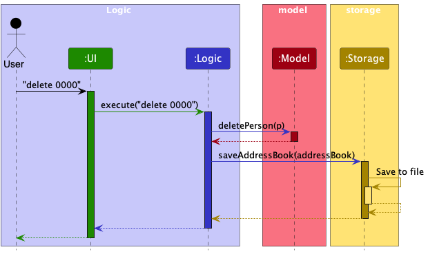

Each of the four main components (also shown in the diagram above),

* defines its *API* in an `interface` with the same name as the Component.
* implements its functionality using a concrete `{Component Name}Manager` class (which follows the corresponding API `interface` mentioned in the previous point.

For example, the `Logic` component defines its API in the `Logic.java` interface and implements its functionality using the `LogicManager.java` class which follows the `Logic` interface. Other components interact with a given component through its interface rather than the concrete class (reason: to prevent outside component's being coupled to the implementation of a component), as illustrated in the (partial) class diagram below.

The sections below give more details of each component.

[Back to Table of Contents](#table-of-contents)

--------------------------------------------------------------------------------------------------------------------

### UI component

The **API** of this component is specified in [`Ui.java`](https://github.com/se-edu/addressbook-level3/tree/master/src/main/java/seedu/address/ui/Ui.java)

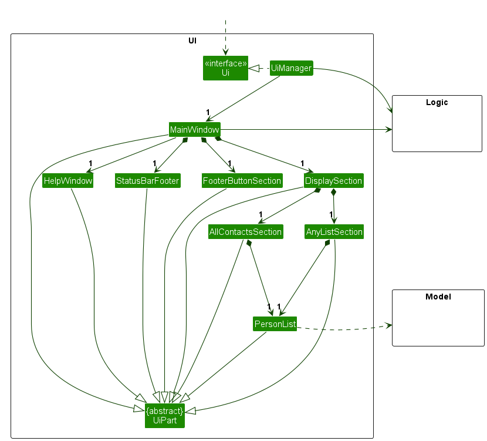

The UI consists of a `MainWindow` that is made up of parts e.g. `StatusBarFooter`, `HelpWindow`, `DisplaySection`, `FooterButtonSection` etc. All these, including the `MainWindow`, inherit from the abstract `UiPart` class which captures the commonalities between classes that represent parts of the visible GUI.

The `UI` component uses the JavaFx UI framework. The layout of these UI parts are defined in matching `.fxml` files that are in the `src/main/resources/view` folder. For example, the layout of the [`MainWindow`](https://github.com/se-edu/addressbook-level3/tree/master/src/main/java/seedu/address/ui/MainWindow.java) is specified in [`MainWindow.fxml`](https://github.com/se-edu/addressbook-level3/tree/master/src/main/resources/view/MainWindow.fxml)

The `UI` component,

* executes user commands using the `Logic` component.
* listens for changes to `Model` data so that the UI can be updated with the modified data.
* keeps a reference to the `Logic` component, because the `UI` relies on the `Logic` to execute commands.
* depends on some classes in the `Model` component, as it displays `Person` and `Relationship` objects residing in the `Model`.

[Back to Table of Contents](#table-of-contents)

--------------------------------------------------------------------------------------------------------------------

### Logic component

**API** : [`Logic.java`](https://github.com/se-edu/addressbook-level3/tree/master/src/main/java/seedu/address/logic/Logic.java)

Here's a (partial) class diagram of the `Logic` component:

The sequence diagram below illustrates the interactions within the `Logic` component, taking `execute("delete /0000")` API call as an example (assuming that `0000` is a valid UUID).

**Note** : The lifeline for `DeleteCommandParser` should end at the destroy marker (X) but due to a limitation of PlantUML, the lifeline continues till the end of diagram.

How the `Logic` component works:

1. When `Logic` is called upon to execute a command, it is passed to an `AddressBookParser` object which in turn creates a parser that matches the command (e.g., `DeleteCommandParser`) and uses it to parse the command.
2. This results in a `Command` object (more precisely, an object of one of its subclasses e.g., `DeleteCommand`) which is executed by the `LogicManager`.
3. The command can communicate with the `Model` when it is executed (e.g. to delete a person). 
*Note that although this is shown as a single step in the diagram above (for simplicity), in the code it can take several interactions (between the command object and the `Model`) to achieve.*
4. The result of the command execution is encapsulated as a `CommandResult` object which is returned back from `Logic`.

Here are the other classes in `Logic` (omitted from the class diagram above) that are used for parsing a user command:

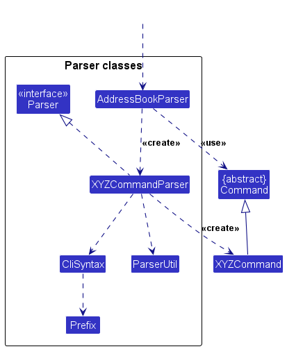

How the parsing works:
* When called upon to parse a user command, the `AddressBookParser` class creates an `XYZCommandParser` (`XYZ` is a placeholder for the specific command name e.g., `AddCommandParser`) which uses the other classes shown above to parse the user command and create a `XYZCommand` object (e.g., `AddCommand`) which the `AddressBookParser` returns back as a `Command` object.
* All `XYZCommandParser` classes (e.g., `AddCommandParser`, `DeleteCommandParser`, ...) inherit from the `Parser` interface so that they can be treated similarly where possible e.g, during testing.

[Back to Table of Contents](#table-of-contents)

--------------------------------------------------------------------------------------------------------------------

### Model component

**API** : [`Model.java`](https://github.com/se-edu/addressbook-level3/tree/master/src/main/java/seedu/address/model/Model.java)

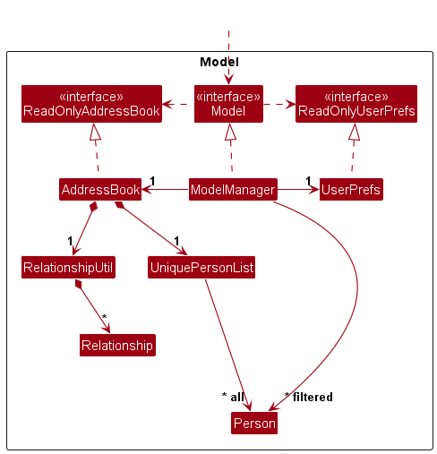

The `Model` component,

* stores the address book data where
    * `Person` objects are contained in a `UniquePersonList` object.
    * `Relationship` objects are contained in a `RelationshipUtil` object.
* stores the currently 'selected' `Person` and `Relationship` objects (e.g., results of a search query) as a separate _filtered_ list which is exposed to outsiders as an unmodifiable `ObservableList<Person>` and `ObservableList<Relationship>` respectively that can be 'observed' i.e. the UI can be bound to these lists so that the UI automatically updates when the data in the list change.
* stores a `UserPref` object that represents the user’s preferences. This is exposed to the outside as a `ReadOnlyUserPref` objects.
* does not depend on any of the other three components (as the `Model` represents data entities of the domain, they should make sense on their own without depending on other components)

#### Model component - Person

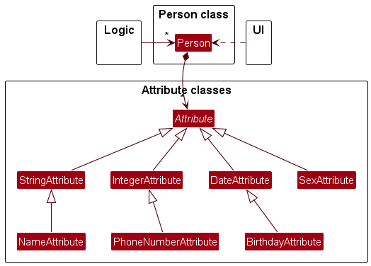

The `Person` component,

* contains details about the person, stored as `Attribute` objects.
    * The `Person` component,
        * stores the Unique User ID or UUID of the person
        * stores any number of `Attribute` objects in the `Person` object in the hash map
        * does not require to have any `Attribute` objects
    * The `Unique User ID` component,
        * acts as the unique identifier for a person
        * the UUID is generated by the system and is unique for each person
        * it is used for identifying the person in the system whenever calls are made to the system
        * does not depend on the other components (as the `Unique User ID` is a standalone store of details about the `Person`)

#### Model component - Attribute

* The `Attribute` component,
  * is used to store details about a `Person`
  * each attribute has a `name` and a `value`
  * stores the `Attribute` objects in the `Person` object in the hash map.
  * Has general types of attributes (`StringAttribute`, `IntegerAttribute`, `DateAttribute`) which allows for the user to instantiate their own attributes with a name and string value
    * `StringAttribute` - stores a string value
    * `IntegerAttribute` - stores an integer value
    * `DateAttribute` - stores a date value
  * Has specific types of attributes (e.g. `NameAttribute`, `PhoneNumberAttribute`) with unique constraints relevant to their validity
    * `NameAttribute` - stores the name of the person
    * `PhoneNumberAttribute` - stores the phone number of the person and must be an integer of less than 10 digits
    * `GenderAttribute` - stores the gender of the person and must be either `Male` or `Female`
  * does not depend on the other components (as the `Attribute` are standalone stores of details about the `Person`)
#### Model component - Relationship

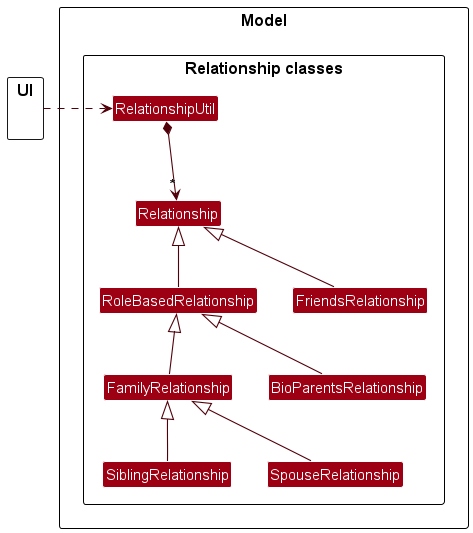

The `Relationship` component,

* contains details about a relationship between two persons.
* has a `relationType` that defines the type of relationship.
* stores UUIDs of `Person` objects that are connected by the `Relationship` object.
* can be a general `Relationship` which allows the user to define their own `relationType` or a specific one that has a predefined `RelationType`.
    * `FriendsRelationship` is a relationship class that has a predefined `relationType` of `friends`.
* can be a general `RoleBasedRelationship` which allows the user to define their own `RelationType` and roles for each Person or a specific one that has those predefined.
    * `FamilyRelationship` is a abstract class that extends from `RoleBasedRelationship`. It is the superclass of `BioParentsRelationship`, `SpousesRelationship` and `SiblingsRelationship`.
      * `BioParentsRelationship` is a relationship class that has a predefined `relationType` of `bioparents` and has predefined roles `parent` and `child`.
      * `SpousesRelationship` is a relationship class that has a predefined `relationType` of `spouses` and has predefined roles `husband` and `wife`.
      * `SiblingRelationship` is a relationship class that has a predefined `relationType` of `siblings` and has predefined roles `brother` and `sister`.

[Back to Table of Contents](#table-of-contents)

--------------------------------------------------------------------------------------------------------------------

### Storage component

**API** : [`Storage.java`](https://github.com/se-edu/addressbook-level3/tree/master/src/main/java/seedu/address/storage/Storage.java)

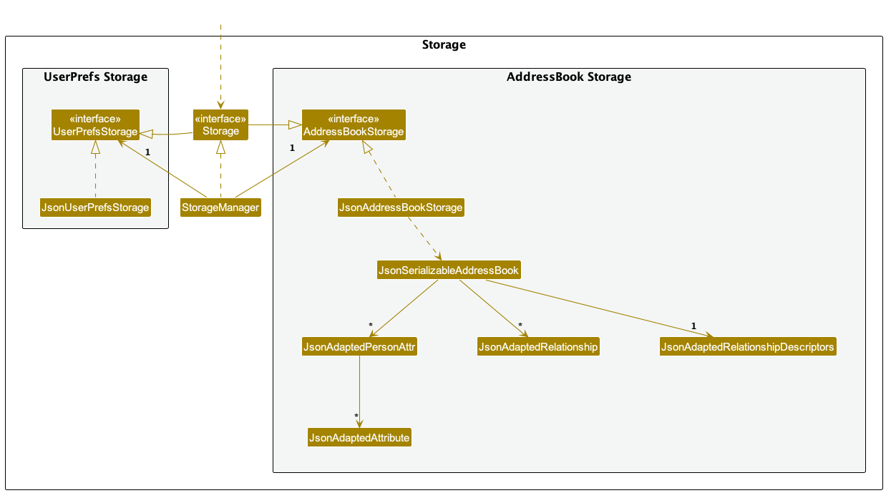

The `Storage` component,
* can save both Gene-nie data and user preference data in JSON format, and read them back into corresponding objects.
* inherits from both `AddressBookStorage` and `UserPrefStorage`, which means it can be treated as either one (if only the functionality of only one is needed).
* depends on some classes in the `Model` component (because the `Storage` component's job is to save/retrieve objects that belong to the `Model`)

[Back to Table of Contents](#table-of-contents)

--------------------------------------------------------------------------------------------------------------------

### Common classes

Classes used by multiple components are in the `seedu.addressbook.commons` package.

[Back to Table of Contents](#table-of-contents)

--------------------------------------------------------------------------------------------------------------------

## Implementation

This section describes some noteworthy details on how certain features are implemented.

### \[Proposed\] Undo/redo feature

#### Proposed Implementation

The proposed undo/redo mechanism is facilitated by `VersionedAddressBook`. It extends `AddressBook` with an undo/redo history, stored internally as an `addressBookStateList` and `currentStatePointer`. Additionally, it implements the following operations:

* `VersionedAddressBook#commit()` — Saves the current address book state in its history.
* `VersionedAddressBook#undo()` — Restores the previous address book state from its history.
* `VersionedAddressBook#redo()` — Restores a previously undone address book state from its history.

These operations are exposed in the `Model` interface as `Model#commitAddressBook()`, `Model#undoAddressBook()` and `Model#redoAddressBook()` respectively.

Given below is an example usage scenario and how the undo/redo mechanism behaves at each step.

Step 1. The user launches the application for the first time. The `VersionedAddressBook` will be initialized with the initial address book state, and the `currentStatePointer` pointing to that single address book state.

Step 2. The user executes `delete 5` command to delete the 5th person in the address book. The `delete` command calls `Model#commitAddressBook()`, causing the modified state of the address book after the `delete 5` command executes to be saved in the `addressBookStateList`, and the `currentStatePointer` is shifted to the newly inserted address book state.

Step 3. The user executes `add n/David …​` to add a new person. The `add` command also calls `Model#commitAddressBook()`, causing another modified address book state to be saved into the `addressBookStateList`.

:information_source: **Note:** If a command fails its execution, it will not call `Model#commitAddressBook()`, so the address book state will not be saved into the `addressBookStateList`.

Step 4. The user now decides that adding the person was a mistake, and decides to undo that action by executing the `undo` command. The `undo` command will call `Model#undoAddressBook()`, which will shift the `currentStatePointer` once to the left, pointing it to the previous address book state, and restores the address book to that state.

:information_source: **Note:** If the `currentStatePointer` is at index 0, pointing to the initial AddressBook state, then there are no previous AddressBook states to restore. The `undo` command uses `Model#canUndoAddressBook()` to check if this is the case. If so, it will return an error to the user rather
than attempting to perform the undo.

The following sequence diagram shows how an undo operation goes through the `Logic` component:

:information_source: **Note:** The lifeline for `UndoCommand` should end at the destroy marker (X) but due to a limitation of PlantUML, the lifeline reaches the end of diagram.

Similarly, how an undo operation goes through the `Model` component is shown below:

The `redo` command does the opposite — it calls `Model#redoAddressBook()`, which shifts the `currentStatePointer` once to the right, pointing to the previously undone state, and restores the address book to that state.

:information_source: **Note:** If the `currentStatePointer` is at index `addressBookStateList.size() - 1`, pointing to the latest address book state, then there are no undone AddressBook states to restore. The `redo` command uses `Model#canRedoAddressBook()` to check if this is the case. If so, it will return an error to the user rather than attempting to perform the redo.

Step 5. The user then decides to execute the command `list`. Commands that do not modify the address book, such as `list`, will usually not call `Model#commitAddressBook()`, `Model#undoAddressBook()` or `Model#redoAddressBook()`. Thus, the `addressBookStateList` remains unchanged.

Step 6. The user executes `clear`, which calls `Model#commitAddressBook()`. Since the `currentStatePointer` is not pointing at the end of the `addressBookStateList`, all address book states after the `currentStatePointer` will be purged. Reason: It no longer makes sense to redo the `add n/David …​` command. This is the behavior that most modern desktop applications follow.

The following activity diagram summarizes what happens when a user executes a new command:

#### Design considerations:

**Aspect: How undo & redo executes:**

* **Alternative 1 (current choice):** Saves the entire address book.
  * Pros: Easy to implement.
  * Cons: May have performance issues in terms of memory usage.

* **Alternative 2:** Individual command knows how to undo/redo by
  itself.
  * Pros: Will use less memory (e.g. for `delete`, just save the person being deleted).
  * Cons: We must ensure that the implementation of each individual command are correct.

_{more aspects and alternatives to be added}_

### Edit Relationship feature

#### Implementation

The Edit relationship mechanism is facilitated by the `EditRelationshipCommand` and `EditRelationshipCommandParser`.
The `EditRelationshipCommand` class extends the `Command` class and implements the following operation:
* `EditRelationshipCommand#execute()` — Edits a relationship between two persons.

#### Scenario 1: Editing a roleless relationship

Given below is an example usage scenario and how editing a roleless relationship behaves at each step.

Step 1: The user executes `editRelation /1234 /5678 /friends /colleagues` to edit a roleless relationship.

Step 2: When `LogicManager` is called upon to execute this command, it will pass it to an `AddressBookParser` object.

Step 3: The `AddressBookParser` recognizes the `editRelation` keyword and creates a new `EditRelationshipCommandParser`. The `EditRelationshipCommandParser#parse` method is then called on the object to parse the rest of the command `/1234 /5678 /friends /colleagues`.

Step 4: `ParserUtil#getRelationshipHashMapEdit(details)`is then called to parse the relationship details into a hashmap. This method checks that the relationship details are provided in the correct format and that the UUIDs and relationship descriptors are valid. It then returns a `LinkedHashMap<String, String>` containing the relationship details.

Step 5: `ParserUtil#relationKeysAndValues(linkedHashmap, index, boolean)` is then called to extract the key/value according to the `boolean`(`true`: get value, `false`: get key) from the `LinkedHashMap<String, String>` at the specified index and boolean according to the provided relationship details. It then returns a `String` containing the result. This method will be called multiple times to extract the correct `originUuid`, `targetUuid`, `oldRelationshipDescriptor` and `newRelationshipDescriptor`.

Step 6: `EditRelationshipCommandParser#parse` then returns a new `EditRelationshipCommand` object with the parsed relationship details.

Step 7: `EditRelationshipCommand#execute` calls the following methods from `Model`:

* `Model#getFullUuid(String)` It retrieves the full UUID of the person passed into the `EditRelationship` command. This is called twice to get the full UUIDs of both persons in the relationship.
* `Model#hasRelationshipWithDescriptor(toEditOff)` It checks whether the relationship to be edited between the two persons exists.
* `Model#hasRelationshipWithDescriptor(toEditIn)` It checks whether the relationship to be edited to between the two persons already exists. If it does, an exception is thrown stating that the relationship already exists.
* `Model#isRelationRoleBased(newRelationshipDescriptor)` It checks whether the `newRelationshipDescriptor` is a existing role-based relationshipDescriptor. If it is, an exception is thrown stating that the `newRelationshipDescriptor` already exists, and can't be added as a roleless relationshipDescriptor.
* `Model#addRelationship(toEditIn)` It communicates with the `Model` to add the new relationship.
* `Model#addRolelessDescriptor(newRelationshipDescriptor)` It communicates with the `Model` to add the `newRelationshipDescriptor`.
* `Model#deleteRelationship(toEditOff)` It communicates with the `Model` to delete the old relationship .

Step 8: `EditRelationshipCommand#execute` returns the `CommandResult` object to the `LogicManager` component.

The following sequence diagram shows how editing a roleless relationship works:

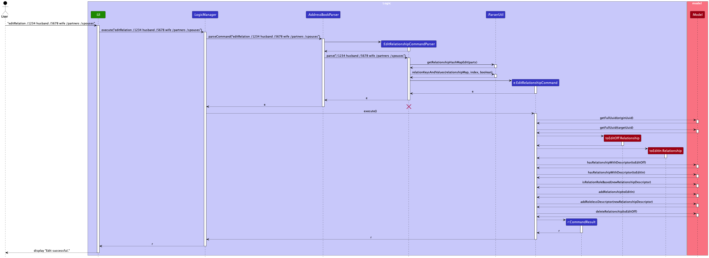

:information_source: **Note:**
* The lifeline for EditRelationshipCommandParser should end at the destroy marker (X) but due to a limitation of PlantUML, the lifeline reaches the end of diagram.

#### Scenario 2: Editing a relationship with roles

Given below is an example usage scenario and how editing a relationship with roles behaves at each step.

Step 1: The user executes `editRelation /1234 husband /5678 wife /partners /spouses` to edit a relationship with roles.

Step 2: When `LogicManager` is called upon to execute this command, it will pass it to an `AddressBookParser` object.

Step 3: The `AddressBookParser` recognizes the `editRelation` keyword and creates a new `EditRelationshipCommandParser`. The `EditRelationshipCommandParser#parse` method is then called on the object to parse the rest of the command `/1234 husband /5678 wife /partners /spouses`.

Step 4: `ParserUtil#getRelationshipHashMapEdit(details)`is then called to parse the relationship details. This method checks that the relationship details are provided in the correct format and that the UUIDs and relationship descriptors are valid. It then returns a `LinkedHashMap<String, String>` containing the relationship details.

Step 5: `ParserUtil#relationKeysAndValues(linkedHashmap, index, boolean)` is then called to extract the key/value according to the `boolean`(`true`: get value, `false`: get key) from the `LinkedHashMap<String, String>` at the specified index and boolean according to the provided relationship details. It then returns a `String` containing the result. This method will be called multiple times to extract the correct `originUuid`, `targetUuid`, `oldRelationshipDescriptor` and `newRelationshipDescriptor`.

Step 6: `EditRelationshipCommandParser#parse` then returns a new `EditRelationshipCommand` object with the parsed relationship details.

Step 7: `EditRelationshipCommand#execute` calls the following methods from `Model`:

* `Model#getFullUuid(String)` It retrieves the full UUID of the person passed into the `EditRelationship` command. This is called twice to get the full UUIDs of both persons in the relationship.
* `Model#hasRelationshipWithDescriptor(toEditOff)` It checks whether the relationship to be edited between the two persons exists.
* `Model#hasRelationshipWithDescriptor(toEditIn)` It checks whether the relationship to be edited to between the two persons already exists. If it does, an exception is thrown stating that the relationship already exists.
* `Model#hasAttribute(Uuid, "Sex")` It checks whether the attribute `Sex` exists for the person with the given Uuid.
* `Model#genderMatch(role, UuidString, Uuid)` It checks whether the role gender matches with the gender of the "Sex" attribute of the person with the given Uuid. This method is only called if the "Sex" attribute exists for the person.
* `Model#isRelationRoleBased(newRelationshipDescriptor)` It checks whether the `newRelationshipDescriptor` is a existing role-based relationshipDescriptor.
* `Model#getRoles(newRelationshipDescriptor)` It communicates with the `Model` to retrieve the roles of the relationship with the provided `newRelationshipDescriptor`.
* `Model#addRelationship(toEditIn)` It communicates with the `Model` to add the new relationship.
* `Model#addRoleBasedDescriptor(newRelationshipDescriptor, role1, role2)` It communicates with the `Model` to add the new relationship descriptor with the provided roles.
* `Model#deleteRelationship(toEditOff)` It communicates with the `Model` to delete the old relationship.

Step 8: `EditRelationshipCommand#execute` returns the `CommandResult` object to the `LogicManager` component.

The following sequence diagram shows how editing a relationship with roles works:

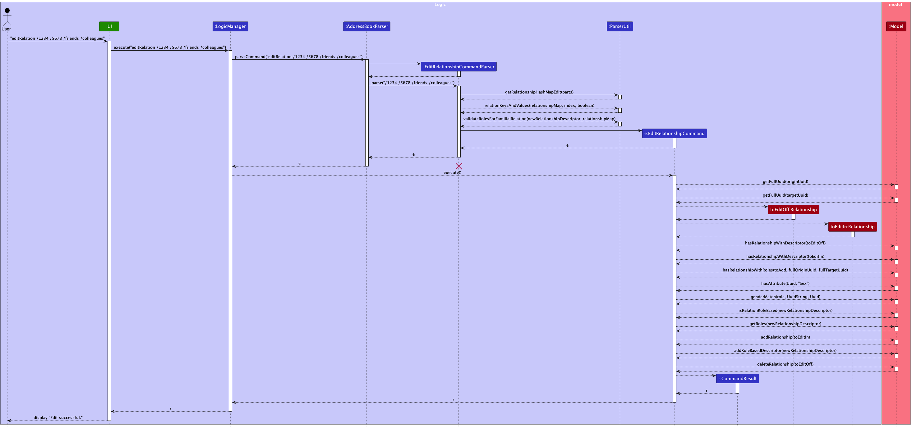

:information_source: **Note:**
* The lifeline for EditRelationshipCommandParser should end at the destroy marker (X) but due to a limitation of PlantUML, the lifeline reaches the end of diagram.

The following activity diagram sheds more light on exactly what happens a user executes the `editrelation` command:

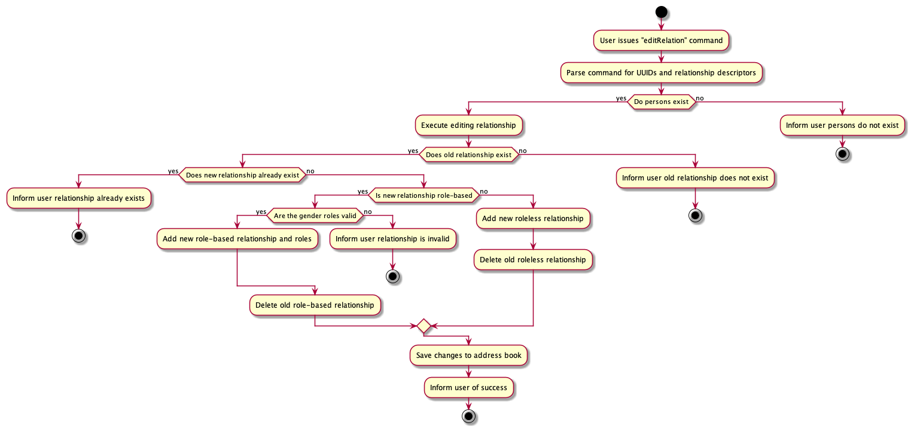

#### Design considerations

**Aspect: How the relationship is edited:**

* **Alternative 1 (current choice):** The `EditRelationshipCommand` deletes the old relationship and adds the new relationship.
    * Pros: Straightforward implementation.
    * Cons: May cause performance issues if the person has a large number of relationships.
* **Alternative 2:** The `EditRelationshipCommand` updates the old relationship with the new relationship.
    * Pros: More efficient as it does not require deleting and adding relationships.
    * Cons: More complex implementation.

[Back to Table of Contents](#table-of-contents)

--------------------------------------------------------------------------------------------------------------------

### Delete Relationship feature

#### Implementation

The Delete relationship mechanism is facilitated by the `DeleteRelationshipCommand` and `DeleteRelationshipCommandParser`.
The `DeleteRelationshipCommand` class extends the `Command` class and implements the following operation:
* `DeleteRelationshipCommand#execute()` — Deletes a relationship between two persons.

#### Scenario 1: Deleting a relationship

Given below is an example usage scenario and how deleting a relationship behaves at each step.

Step 1: The user executes `deleteRelation /1234 /5678 /friends` to delete a relationship.

Step 2: When `LogicManager` is called upon to execute this command, it will pass it to an `AddressBookParser` object.

Step 3: The `AddressBookParser` recognizes the `deleteRelation` keyword and creates a new `DeleteRelationshipCommandParser`. The `DeleteRelationshipCommandParser#parse` method is then called on the object to parse the rest of the command `/1234 /5678 /friends`.

Step 4: `ParserUtil#getRelationshipHashMapDelete(details, hasUuids)`is then called to parse the relationship details. This method checks that the relationship details are provided in the correct format and that the UUIDs and relationship descriptors are valid. It then returns a `LinkedHashMap<String, String>` containing the relationship details.

Step 5: `ParserUtil#relationKeysAndValues(linkedHashmap, index, boolean)` is then called to extract the keys and values from the `LinkedHashMap<String, String>` at the specified index and boolean according to the provided relationship details. It then returns a `String` containing the key or value of the relationship details. This method is called once to extract the `relationshipDescriptor`.

Step 6: `DeleteRelationshipCommandParser#parse` then returns a new `DeleteRelationshipCommand` object with the parsed relationship details.

Step 7: `DeleteRelationshipCommand#execute` calls the following methods from `Model`:

* `Model#getFullUuid(String)` It retrieves the full UUID of the person passed into the `DeleteRelationship` command. This is called twice to get the full UUIDs of both persons in the relationship.
* `Model#hasRelationshipWithDescriptor(toDelete)` It checks whether the relationship to be deleted between the two persons exists. If it does not, the method throws an exception stating that the relationship does not exist and cannot be deleted.
* `Model#deleteRelationship(toDelete)` It communicates with the `Model` to delete the relationship.

Step 8: `DeleteRelationshipCommand#execute` returns the `CommandResult` object to the `LogicManager` component.

The following sequence diagram shows how deleting a relationship works:

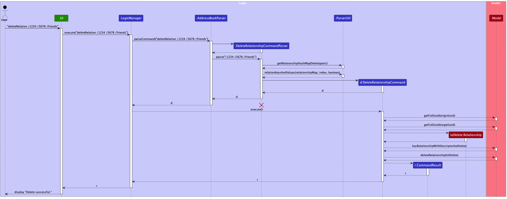

:information_source: **Note:**
* The lifeline for DeleteRelationshipCommandParser should end at the destroy marker (X) but due to a limitation of PlantUML, the lifeline reaches the end of diagram.

#### Scenario 2: Deleting a relationType

Given below is an example usage scenario and how deleting a relationType behaves at each step.

Step 1: The user executes `deleteRelation /colleagues` to delete a relationType.

Step 2: When `LogicManager` is called upon to execute this command, it will pass it to an `AddressBookParser` object.

Step 3: The `AddressBookParser` recognizes the `deleteRelation` keyword and creates a new `DeleteRelationshipCommandParser`. The `DeleteRelationshipCommandParser#parse` method is then called on the object to parse the rest of the command `/friends`.

Step 4: `ParserUtil#getRelationshipHashMapDelete(details, hasUuids)`is then called to parse the relationship details. This method checks that the relationship details are provided in the correct format and that the relationship descriptor is valid. It then returns a `LinkedHashMap<String, String>` containing the relationship Descriptor.

Step 5: `ParserUtil#relationKeysAndValues(linkedHashmap, index, boolean)` is then called to extract the keys and values from the `LinkedHashMap<String, String>` at the specified index and boolean according to the provided relationship details. It then returns a `String` containing the key or value of the relationship details. This method is called once to extract the `relationshipDescriptor`.

Step 6: `DeleteRelationshipCommandParser#parse` then returns a new `DeleteRelationshipCommand` object with the parsed relationship details.

Step 7: `DeleteRelationshipCommand#execute` calls the following methods from `Model`:

* `Model#deleteRelationType(toDelete)` It communicates with the `Model` to delete the relationType. If the relationType does not exist, an exception is thrown stating that the relationType does not exist and cannot be deleted.

Step 8: `DeleteRelationshipCommand#execute` returns the `CommandResult` object to the `LogicManager` component.

The following sequence diagram shows how deleting a relationType works:

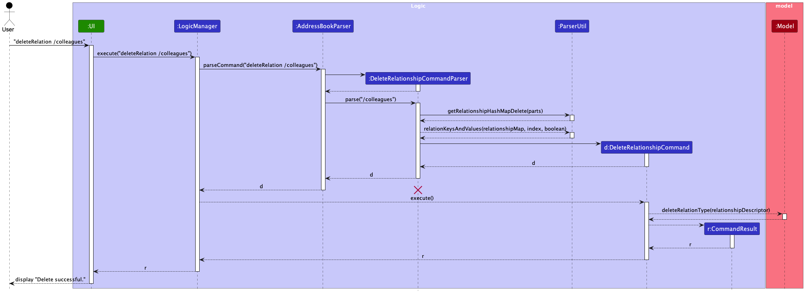

:information_source: **Note:**
* The lifeline for DeleteRelationshipCommandParser should end at the destroy marker (X) but due to a limitation of PlantUML, the lifeline reaches the end of diagram.

The following activity diagram sheds more light on exactly what happens a user executes the `deleterelation` command:

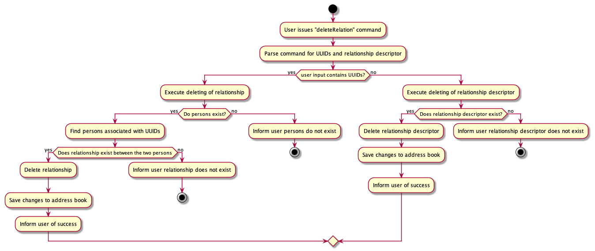

#### Design considerations

**Aspect: How the relationship vs relationType is deleted:**

* **Alternative 1 (current choice):** The `DeleteRelationshipCommand` deletes the relationship/relationType based on whether the user provides the UUIDs of the persons.
    * Pros: Straightforward implementation.
    * Cons: May cause confusion for the user whether the relationship or relationType is being deleted.
* **Alternative 2:** Have a separate command for deleting the relationType specifically.
    * Pros: More explicit for the user.
    * Cons: More commands to implement, resulting in a more complex overall system.

[Back to Table of Contents](#table-of-contents)

--------------------------------------------------------------------------------------------------------------------

## Documentation, logging, testing, configuration, dev-ops

* [Documentation guide](Documentation.md)
* [Testing guide](Testing.md)
* [Logging guide](Logging.md)
* [Configuration guide](Configuration.md)
* [DevOps guide](DevOps.md)

[Back to Table of Contents](#table-of-contents)

--------------------------------------------------------------------------------------------------------------------

## Appendix: Requirements

### Product scope

**Target user profile**:

* Has many family members to keep track off
* Wants to keep various information about these different family members
* Wants to visualize connections between family members
* Often only has provisional or partial information about their family members

**Value proposition**: Gene-nie puts connections between people at the forefront. It allows users to easily visualize and understand the relationships between people in their lives. It also allows users to store personal information about each individual, making it a one-stop solution for managing relationships.

### User stories

Priorities: High (must have) - `* * *`, Medium (nice to have) - `* *`, Low (unlikely to have) - `*`

| Priority | As a …​ | I want to …​                                                                         | So that I can…​                                        |
|----------|---------|--------------------------------------------------------------------------------------|--------------------------------------------------------|
| `* * *`  | user    | Create a new person with a Unique User ID                                            | Ensure every person in my address book is distinct     |
| `* * *`  | user    | Add custom attributes to each person                                                 | Store personal information relevant to each individual |
| `* * *`  | user    | Establish and record relationships between people                                    | Visualize connections between people                   |
| `* * *`  | user    | Find the relationship path between people                                            | Understand how everyone is connected                   |
| `* *`    | user    | Have clear success or failure messages after actions                                 | Ensure that the intended action has taken place        |
| `* *`    | user    | Sort and search a person by their attributes                                         | Find specific individuals more easily                  |
| `* * *`  | user    | Have my data automatically saved once i exit the app and loaded once i start the app | Seamless experience across different sessions          |

*{More to be added}*

### Use cases

(For all use cases below, the **System** is the `Gene-nie` and the **Actor** is the `user`, unless specified otherwise)

**Use case: Assessing help page**

**MSS**

1. User requests to view the help page.
2. Gene-nie displays a message with a link to the help page.

    Use case ends.

**Use case: Listing all persons**

**MSS**

1. User requests to view the list of persons.
2. Gene-nie displays a list of all students along with their details.

    Use case ends.

**Use case: Add a new person**

**MSS**

1. User requests to add a new person with their attributes to Gene-nie.
2. Gene-nie adds the person with the provided attributes.
3. Gene-nie displays new person added and confirmation message.

    Use case ends.

**Extensions**

* 1a. User enters an invalid command format.
    * 1a1. Gene-nie shows an error message.

      Use case ends.
* 1b. User enters an invalid attribute.
    * 1b1. Gene-nie shows an error message.

      Use case ends.

**Use case: Delete a person**

**MSS**

1. User selects a specific person in the list to delete by providing the person’s UUID.
2. Gene-nie deletes the person.
3. Gene-nie displays confirmation message.

    Use case ends.

**Extensions**

* 1a. Given UUID is invalid or does not exist.
    * 1a1. Gene-nie shows an error message.

      Use case ends.

**Use case: Add an attribute to a person**

**MSS**

1. User requests to add an attribute to a person by providing the person's UUID and new attribute.
2. Gene-nie adds attribute details to specific person’s profile.
3. Gene-nie displays attribute in person’s profile and confirmation message.

    Use case ends.

**Extensions**

* 1a. Attribute details are invalid.
    * 1a1. Gene-nie shows an error message.

      Use case ends.

* 1b. Given UUID is invalid or does not exist.
    * 1b1. Gene-nie shows an error message.

      Use case ends.

**Use case: Edit an attribute of a person**

**MSS**

1. User requests to edit an attribute of a person by providing the person's UUID and the attribute they want to edit, along with the new attribute value.
2. Gene-nie updates attribute details to specific person’s profile.
3. Gene-nie updates the new attribute in person’s profile and confirmation message.

    Use case ends.

**Extensions**

* 1a. Attribute details are invalid.
    * 1a1. Gene-nie shows an error message.

      Use case ends.

* 1b. Given UUID is invalid or does not exist.
    * 1b1. Gene-nie shows an error message.

      Use case ends.

**Use case: Delete an attribute of a person**

**MSS**

1. User requests to delete an attribute of a person by providing the person's UUID and the attribute they want to delete.
2. Gene-nie deletes the attribute from the specified person's profile.

    Use case ends.

**Extensions**

* 1a. Attribute details are invalid.
    * 1a1. Gene-nie shows an error message.

      Use case ends.

* 1b. Given UUID is invalid or does not exist.
    * 1b1. Gene-nie shows an error message.

      Use case ends.

**Use case: Find persons by attribute**

**MSS**

1. User requests to find persons by attribute by entering the attribute name/value.
2. Gene-nie displays list of persons with each of the specified attribute name/value.

    Use case ends.

**Extensions**

* 1a. Attribute details are invalid or does not exist.
    * 1a1. Gene-nie shows an error message.

      Use case ends.

**Use case: List all valid relationTypes**

**MSS**

1. User requests to list all valid relationTypes.
2. Gene-nie displays list of all current relationTypes.

    Use case ends.

**Use case: Add a relationship between two persons**

**MSS**

1. User requests to add a relationship between two persons by providing both persons UUID and the relationship type.
2. Gene-nie creates a relationship with the provided details.
3. Gene-nie displays new relationship added under both persons’ profiles and confirmation message.

    Use case ends.

**Extensions**

* 1a. Relationship type is invalid.
    * 1a1. Gene-nie shows an error message.

      Use case ends.

* 1b. Given UUIDs are invalid or does not exist.
    * 1b1. Gene-nie shows an error message.

      Use case ends.

**Use case: Edit a relationship between two persons**

**MSS**

1. User requests to edit a specific relationship between two persons by providing both persons UUID, the existing and new relationship type.
2. Gene-nie edits the specified relationship with the provided details.
3. Gene-nie displays edited relationship under both persons’ profiles and confirmation message.

    Use case ends.

**Extensions**

* 1a. Relationship types are invalid.
    * 1a1. Gene-nie shows an error message.

      Use case ends.

* 1b. Given UUIDs are invalid or does not exist.
    * 1b1. Gene-nie shows an error message.

      Use case ends.

**Use case: Delete a relationship between two persons**

**MSS**

1. User requests to delete a specific relationship between two persons by providing both persons UUID and the relationship type.
2. Gene-nie deletes the specified relationship.
3. Gene-nie displays confirmation message.

    Use case ends.

**Extensions**

* 1a. Relationship type is invalid.
    * 1a1. Gene-nie shows an error message.

      Use case ends.

* 1b. Given UUIDs are invalid or does not exist.
    * 1a1. Gene-nie shows an error message.

      Use case ends.

**Use case: Search a relationship pathway between two persons**

**MSS**

1. User requests to search for a relationship pathway between two persons by providing both persons UUID and the relationship type.
2. Gene-nie displays the relationship pathway.

    Use case ends.

**Extensions**

* 1a. Given UUIDs are invalid or does not exist.
    * 1a1. Gene-nie shows an error message.

      Use case ends. 

* 1b. No relationship pathway exists between the two persons.
    * 1a1. Gene-nie says that there is no relationship pathway found.

    Use case ends.

**Use case: Deleting all persons**

**MSS**

1. User requests to delete all persons from Gene-nie.
2. Gene-nie deletes all persons and displays the updated view.

    Use case ends.

**Use case: Clearing command history**

**MSS**

1. User requests to clear command history
2. Gene-nie clears the whole command history.

    Use case ends.

**Use case: Exit Gene-nie**

**MSS**

1. User requests to exit Gene-nie.
2. Gene-nie saves current data.
3. Gene-nie closes the application window.

    Use case ends.

*{More to be added}*

### Non-Functional Requirements

1.  Should work on any _mainstream OS_ as long as it has Java `11` or above installed.
2.  Should be able to hold up to 1000 persons and relationships without a noticeable sluggishness in performance for typical usage.
3.  A user with above average typing speed for regular English text (i.e. not code, not system admin commands) should be able to accomplish most of the tasks faster using commands than using the mouse.
4.  User actions should prompt responses within 5 seconds, maintaining acceptable performance standards.
5.  The user interface must be intuitive for users of varying technical proficiency levels, enhancing usability.
6.  The codebase should be well-documented and maintainable to facilitate future updates and enhancements.
7.  Comprehensive documentation should be provided for developers, administrators, and end-users, supporting ease of use.
8.  The system should be able to handle data corruption or loss gracefully, minimizing the impact on users.
9.  The system architecture should support future extensions or customizations, allowing for easy addition of new features.
10. Interoperability with other systems should be supported through standard protocols and formats, promoting seamless integration.
11. The system should be designed with testability in mind, allowing for comprehensive testing of all components, features, and scenarios.

### Glossary

* **Mainstream OS**: Windows, Linux, Unix, MacOS
* **Private contact detail**: A contact detail that is not meant to be shared with others
* **Command Line Interface (CLI)**: A text-driven user interface used for program execution, file management, and overall computer interaction.
* **Graphical User Interface (GUI)**: An operating system interface reliant on graphics, utilising icons, menus, and a mouse for user interaction.
* **Main Success Scenario (MSS)**: Describes the most direct interaction path for a given use case, assuming no errors or complications.
* **Actor**: Within use cases, an actor represents the role a person assumes while interacting with the system.
* **Application Programming Interface(API)**: Facilitates communication between distinct components of a program.
* **Architecture**: In the realm of software, architecture illustrates the systematic organization of the entire system.
* **Framework**: Comprises pre-written code with predefined classes and functions, aiding developers in constructing software.

--------------------------------------------------------------------------------------------------------------------

## **Appendix: Instructions for manual testing**

Given below are instructions to test the app manually.

:information_source: **Note:** These instructions only provide a starting point for testers to work on;
testers are expected to do more *exploratory* testing.

### Launch and shutdown

1. Initial launch

   1. Download the jar file and copy into an empty folder
   2. Double-click the jar file.   If nothing happens after double-clicking the jar file, run `java -jar Gene-nie.jar` in the folder containing the jar file.  
      **Expected Outcome**: Shows the GUI with a set of sample contacts. The window size may not be optimum.

2. Saving window preferences

    1. Resize the window to an optimum size. Move the window to a different location.
    2. Close the window.
    3. Re-launch the app by double-clicking the jar file. 
        **Expected Outcome**: The most recent window size and location is retained.

### Listing all persons
**Prerequisites**: There should be at least one person in Gene-nie.
1. Listing all persons:
    1. **Test case:** `list`  
       **Expected Outcome:** A list of all persons with their details is shown.

### Help
1. Seeking help:
    1. **Test case:** `help`  
       **Expected Outcome:** A new window is opened with a link to the help page.

### Adding a person
1. Adding a person with no attributes:
    1. **Test case:** `addperson`  
       **Expected Outcome:** A new person with a random UUID shown on the left panel of the PersonCard is added to Gene-nie. Attributes panel displays "No attributes found".

   
2. Adding a person with one attribute:
    1. **Test case:** `addperson /Name John`  
       **Expected Outcome:** A new person with a random UUID shown on the left panel of the PersonCard is added to Gene-nie. Attributes panel displays the attribute added.

3. Adding a person with multiple attributes:
    1. **Test case:** `addperson /Name John /Phone 98765432 /Email John@example.com`  
       **Expected Outcome:** A new person with a random UUID shown on the left panel of the PersonCard is added to Gene-nie. Attributes panel displays all the attributes added.

4. Adding a person with duplicate attributes:
    1. **Test case:** `addperson /Name John /Name Chad`  
       **Expected Outcome:** The last attribute value is taken. A new person with a random UUID shown on the left panel of the PersonCard is added to Gene-nie. Attributes panel displays "Name: Chad".

5. Adding a person with an invalid attribute:
    1. **Test case:** `addperson /Name`  
       **Expected Outcome:** Error message highlighted in red is shown. The command format and an example is also shown in the error message.
    2. **Test case:** `addperson /Sex dhdkag`  
       **Expected Outcome:** Error message highlighted in red is shown. It reads "Sex must only be male or female for Sex."

### Deleting a person
**Prerequisites**: There should be at least one person in Gene-nie.

1. Deleting a person with a valid uuid:
    1. **Additional Prerequisites**: Replace the UUID in the test case with a valid UUID (e.g. 0001) from your list of persons.  
       **Test case:** `delete /UUID`  
       **Expected Outcome:** The person with the given UUID is removed from Gene-nie. Details of the deleted person is shown in the status message.

2. Deleting a person with an invalid uuid:
    1. **Test case:** `delete /!!!!`  
       **Expected Outcome:** No person is deleted. An error message is shown, indicating that the UUID provided is invalid.

3. Deleting a person with no uuid provided:
    1. **Test case:** `delete`  
       **Expected Outcome:** No person is deleted. An error message is shown, indicating that the command format is invalid.

### Adding attributes to existing persons
**Prerequisites**: There should be at least one person in Gene-nie.

1. Adding an attribute to a person with a valid uuid:
    1. **Additional Prerequisites**: Replace the UUID in the test case with a valid UUID (e.g. 0001) from your list of persons.  
       **Test case:** `addattribute /UUID /Phone 12345678`  
       **Expected Outcome:** The attribute is added to the person with the given UUID. The new attribute is shown in the attributes panel of the person.

2. Adding multiple attributes to a person with a valid uuid:\
    1. **Additional Prerequisites**: Replace the UUID in the test case with a valid UUID (e.g. 0001) from your list of persons.  
       **Test case:** `addattribute /UUID /Phone 12345678 /Email john@example.com`  
       **Expected Outcome:** The attributes are added to the person with the given UUID. The new attributes are shown in the attributes panel of the person.

3. Adding an attribute to a person with an invalid uuid:
    1. **Test case:** `addattribute /!!!! /Phone 12345678`  
       **Expected Outcome:** No attribute is added. An error message is shown, saying "Person not found."

4. Adding an attribute with no uuid provided:
    1. **Test case:** `addattribute /Phone 12345678`  
       **Expected Outcome:** No attribute is added. An error message is shown, indicating that the command format is invalid.

5. Adding a duplicate attribute to a person:
    1. **Additional Prerequisites**: Replace the UUID in the test case with a valid UUID (e.g. 0001) from your list of persons.  
       **Test case:** `addattribute /UUID /Phone 12345678 /Phone 87654321`  
       **Expected Outcome:** No attribute is added. An error message is shown, indicating that the attribute is a duplicate.

### Editing attributes of existing persons
**Prerequisites**: There should be at least one person in Gene-nie, and that person should have at least one attribute.

1. Editing an attribute of a person with a valid uuid and valid attribute:
    1. **Additional Prerequisites**: Replace the UUID in the test case with a valid UUID (e.g. 0001) from your list of persons. Person must also have the attribute `Phone`.  
       **Test case:** `editattribute /UUID /Phone 12345678`  
       **Expected Outcome:** The attribute is edited for the person with the given UUID. The new attribute is shown in the attributes panel of the person.

2. Editing an attribute of a person with an invalid uuid:
    1. **Test case:** `editattribute /!!!! /Phone 12345678`  
       **Expected Outcome:** No attribute is edited. An error message is shown, saying "Person not found."

3. Editing an attribute of a person without the attribute provided:
    1. **Additional Prerequisites**: Replace the UUID in the test case with a valid UUID (e.g. 0001) from your list of persons. The person must NOT have the attribute `Email`.  
       **Test case:** `editattribute /UUID /Email john@example.com`  
       **Expected Outcome:** No attribute is edited. An error message is shown, indicating that the attribute does not exist and cannot be edited.

4. Editing an attribute of a person with no uuid provided:
    1. **Test case:** `editattribute /Phone 12345678`  
       **Expected Outcome:** No attribute is edited. An error message is shown, indicating that the command format is invalid.

### Deleting attributes of existing persons
**Prerequisites**: There should be at least one person in Gene-nie, and that person should have at least one attribute.

1. Deleting an attribute of a person with a valid uuid and valid attribute:
    1. **Additional Prerequisites**: Replace the UUID in the test case with a valid UUID (e.g. 0001) from your list of persons. Person must also have the attribute `Phone`.  
       **Test case:** `deleteattribute /UUID /Phone`  
       **Expected Outcome:** The attribute is deleted for the person with the given UUID. The attribute is removed from the attributes panel of the person.

2. Deleting multiple attributes of a person with a valid uuid and valid attributes:
    1. **Additional Prerequisites**: Replace the UUID in the test case with a valid UUID (e.g. 0001) from your list of persons. Person must also have the attributes `Phone` and `Email`.  
       **Test case:** `deleteattribute /UUID /Phone /Email`  
       **Expected Outcome:** The attributes are deleted for the person with the given UUID. The attributes are removed from the attributes panel of the person.

3. Deleting an attribute of a person with an invalid uuid:
    1. **Test case:** `deleteattribute /!!!! /Phone`  
       **Expected Outcome:** No attribute is deleted. An error message is shown, saying that the UUID provided is invalid.

4. Deleting an attribute of a person without the attribute provided:
    1. **Additional Prerequisites**: Replace the UUID in the test case with a valid UUID (e.g. 0001) from your list of persons. The person must NOT have the attribute `Email`.  
       **Test case:** `deleteattribute /UUID /Email`  
       **Expected Outcome:** No attribute is deleted. An error message is shown, indicating that the attribute is not found.

### Finding persons
**Prerequisites**: There should be at least one person in Gene-nie.

1. Finding persons by attribute name:
    1. **Additional Prerequisites**: The persons should have the attribute `Name`.  
       **Test case:** `find /Name`  
       **Expected Outcome:** A list of persons with the specified attribute name `Name` is shown.

2. Finding persons by attribute value:
    1. **Additional Prerequisites**: The persons should have an attribute with the value `John`.  
       **Test case:** `find /John`  
       **Expected Outcome:** A list of persons with the specified attribute containing the value `John` is shown.

3. Finding persons by uuid:
    1. **Additional Prerequisites**: Replace the UUID in the test case with a valid UUID (e.g. 0001) from your list of persons.  
       **Test case:** `find /UUID`  
       **Expected Outcome:** The person with the specified UUID is shown.

4. Finding persons using an attribute name/value that does not exist:
    1. **Additional Prerequisites**: All persons do not have the attribute `Country` and do not have any attribute with the value `Singapore`.  
       **Test case:** `find /Country`  
       **Expected Outcome:** The left panel is empty, with no person found.
    2. **Test case:** `find /Singapore`  
       **Expected Outcome:** The left panel is empty, with no person found.

5. Finding persons using an invalid uuid:
    1. **Test case:** `find /!!!!`  
       **Expected Outcome:** The left panel is empty, with no person found.

### Listing all valid relationship types

1. Listing all valid relationship types:
    1. **Test case:** `listrelations`  
       **Expected Outcome:** A list of all valid relationship types is shown.

### Adding relationships between persons
**Prerequisites**: There should be at least two persons in Gene-nie.

1. Adding a roleless relationship between two persons with valid uuids:
    1. **Additional Prerequisites**: Replace the UUIDs in the test case with valid UUIDs (e.g. 0001 and 0002) from your list of persons.  
       **Test case:** `addrelation /UUID1 /UUID2 /friends`  
       **Expected Outcome:** A relationship of type `friends` is added between the two persons with the given UUIDs. The relationship is shown in the relationships panel of both persons.

2. Adding a role-based relationship between two persons with valid uuids:
    1. **Additional Prerequisites**: Replace the UUIDs in the test case with valid UUIDs (e.g. 0001 and 0002) from your list of persons.  
       **Test case:** `addrelation /UUID1 husband /UUID2 wife /spouses`  
       **Expected Outcome:** A relationship of type `spouses` is added between the two persons with the given UUIDs. The relationship is shown in the relationships panel of both persons, each with their respective role.

3. Adding a relationship between two persons with an invalid uuid:
    1. **Test case:** `addrelation /!!!! /UUID2 /friends`  
       **Expected Outcome:** No relationship is added. An error message is shown, indicating that the UUID provided is invalid.

4. Adding a relationship between two persons with no relationship type provided:
    1. **Additional Prerequisites**: Replace the UUIDs in the test case with valid UUIDs (e.g. 0001 and 0002) from your list of persons.  
       **Test case:** `addrelation /UUID1 /UUID2`  
       **Expected Outcome:** No relationship is added. An error message is shown, indicating that the command format is invalid.

5. Adding a relationship between two persons with an invalid relationship type:
    1. **Additional Prerequisites**: Replace the UUIDs in the test case with valid UUIDs (e.g. 0001 and 0002) from your list of persons.  
       **Test case:** `addrelation /UUID1 /UUID2 /!!!!`  
       **Expected Outcome:** No relationship is added. An error message is shown, indicating that the relationship type provided is invalid.

### Editing relationships between persons
**Prerequisites**: There should be at least two persons in Gene-nie, and they should have at least one relationship between them.

1. Editing a relationship between two persons with valid uuids and valid relationship type from a roleless relationship to a roleless relationship:
    1. **Additional Prerequisites**: Replace the UUIDs in the test case with valid UUIDs (e.g. 0001 and 0002) from your list of persons. The persons must have a relationship of type `friends`.  
       **Test case:** `editrelation /UUID1 /UUID2 /friends /colleagues`  
       **Expected Outcome:** The relationship type is edited for the two persons with the given UUIDs. The relationship is shown in the relationships panel of both persons with the new relationship type.

2. Editing a relationship between two persons with valid uuids and valid relationship type from a role-based relationship to a role-based relationship:
    1. **Additional Prerequisites**: Replace the UUIDs in the test case with valid UUIDs (e.g. 0001 and 0002) from your list of persons. The persons must have a relationship of type `siblings` with roles `brother` and `sister` respectively.  
       **Test case:** `editrelation /UUID1 husband /UUID2 wife /siblings /spouses`  
       **Expected Outcome:** The relationship type is edited for the two persons with the given UUIDs. The relationship is shown in the relationships panel of both persons with the new relationship type and roles.

3. Editing a relationship between two persons with an invalid uuid:
    1. **Test case:** `editrelation /!!!! /UUID2 /friends /colleagues`  
       **Expected Outcome:** No relationship is edited. An error message is shown, indicating that the UUID provided is invalid.

4. Editing a relationship between two persons with an invalid relationship type:
    1. **Additional Prerequisites**: Replace the UUIDs in the test case with valid UUIDs (e.g. 0001 and 0002) from your list of persons.  
       **Test case:** `editrelation /UUID1 /UUID2 /friends /!!!!`  
       **Expected Outcome:** No relationship is edited. An error message is shown, indicating that the relationship type provided is invalid.

5. Editing a relationship between two persons with the old relationship type not present:
    1. **Additional Prerequisites**: Replace the UUIDs in the test case with valid UUIDs (e.g. 0001 and 0002) from your list of persons. The persons must NOT have a relationship of type `colleagues`.  
       **Test case:** `editrelation /UUID1 /UUID2 /colleagues /friends`  
       **Expected Outcome:** No relationship is edited. An error message is shown, indicating that the relationship `colleagues` does not exist.

### Deleting relationships between persons
**Prerequisites**: There should be at least two persons in Gene-nie, and they should have at least one relationship between them.

1. Deleting a relationship between two persons with valid uuids and valid relationship type:
    1. **Additional Prerequisites**: Replace the UUIDs in the test case with valid UUIDs (e.g. 0001 and 0002) from your list of persons. The persons must have a relationship of type `friends`.  
       **Test case:** `deleterelation /UUID1 /UUID2 /friends`  
       **Expected Outcome:** The relationship is deleted for the two persons with the given UUIDs. The relationship is removed from the relationships panel of both persons.

2. Deleting a relationship between two persons with an invalid uuid:
    1. **Test case:** `deleterelation /!!!! /UUID2 /friends`  
       **Expected Outcome:** No relationship is deleted. An error message is shown, indicating that the UUID provided is invalid.

3. Deleting a relationship between two persons without the relationship present:
    1. **Additional Prerequisites**: Replace the UUIDs in the test case with valid UUIDs (e.g. 0001 and 0002) from your list of persons. The persons must NOT have a relationship of type `colleagues`.  
       **Test case:** `deleterelation /UUID1 /UUID2 /colleagues`  
       **Expected Outcome:** No relationship is deleted. An error message is shown, indicating that the relationship `colleagues` does not exist.

4. Deleting a relationship between two persons with no relationship type provided:
    1. **Additional Prerequisites**: Replace the UUIDs in the test case with valid UUIDs (e.g. 0001 and 0002) from your list of persons.  
       **Test case:** `deleterelation /UUID1 /UUID2`  
       **Expected Outcome:** No relationship is deleted. An error message is shown, indicating that the command format is invalid.

### Finding the relationship path between two persons
**Prerequisites**: There should be at least two persons in Gene-nie, and they should have at least one relationship between them.

1. Finding the general relationship path between two persons with valid uuids:
    1. **Additional Prerequisites**: Replace the UUIDs in the test case with valid UUIDs (e.g. 0001 and 0002) from your list of persons. The persons must have at least one relationship between them, or be indirectly related through multiple relationships.  
       **Test case:** `anySearch /UUID1 /UUID2`  
       **Expected Outcome:** The relationship path between the two persons with the given UUIDs is shown.

2. Finding the family relationship path between two persons with valid uuids:
    1. **Additional Prerequisites**: Replace the UUIDs in the test case with valid UUIDs (e.g. 0001 and 0002) from your list of persons. The persons must have at least one family relationship between them, or be indirectly related through multiple family relationships. These family relationships types include "bioparents", "spouses" and "siblings".  
       **Test case:** `familySearch /UUID1 /UUID2`  
       **Expected Outcome:** The family relationship path between the two persons with the given UUIDs is shown.

3. Finding the family relationship path between two persons with no valid path between them:
    1. **Additional Prerequisites**: Replace the UUIDs in the test case with valid UUIDs (e.g. 0001 and 0002) from your list of persons. The persons must NOT have a valid relationship path between them.  
       **Test case:** `anySearch /UUID1 /UUID2`  
       **Expected Outcome:** The left panel is empty, with no relationship path found.

4. Finding the relationship path between two persons with a uuid that does not exist in Gene-nie:
    1. **Test case:** `anySearch /!!!! /UUID2`  
       **Expected Outcome:** An error message is shown, saying "You have not added the contacts of the people you are looking for!"

### Deleting all persons
**Prerequisites**: There should be at least one person in Gene-nie.

1. Deleting all persons:
    1. **Test case:** `deleteallpersons`  
       **Expected Outcome:** All persons are deleted. The left panel is empty, with no persons found.

### Clearing command responses

1. Clearing the command responses:
    1. **Test case:** `clear`  
       **Expected Outcome:** All command responses are cleared from the command box.

### Issues with saving data

1. Dealing with missing data file:  

   **Test case:** Remove the data file to simulate a missing file
    1. Go to the location of the data file indicated in the bottom left corner of the application.
    2. Delete the file named `addressbook.json`.
    3. Relaunch Gene-nie.  
       **Expected Outcome:** A new file with sample person data is created. Sample person data is shown in the application.

2. Dealing with corrupted file:  
   **Test case:** Modify the data file to simulate a corrupted data file
    1. Go to the location of the data file indicated in the bottom left corner of the application.
    2. Open the file named `addressbook.json`.
    3. Modify the file. For example, you could remove the first few lines of the file.
    4. Relaunch Gene-nie.  
       **Expected Outcome:** The left panel is now empty. No person records are shown in the application.
