## Table of Contents

- [Introduction](#introduction)
- [Acknowledgements](#acknowledgements)
- [Setting up, getting started](#setting-up-getting-started)
- [Design](#design)
    - [Architecture](#architecture)
    - [UI component](#ui-component)
    - [Logic component](#logic-component)
    - [Model component](#model-component)
        - [Model component - Person](#model-component---person)
        - [Model component - Attribute](#model-component---attribute)
        - [Model component - Relationship](#model-component---relationship)
    - [Storage component](#storage-component)
    - [Common classes](#common-classes)
- [Implementation](#implementation)
    - [Add Person feature](#add-person-feature)
    - [Delete Person feature](#delete-person-feature)
    - [Add Attribute feature](#add-attribute-feature)
    - [Edit Attribute feature](#edit-attribute-feature)
    - [Delete Attribute feature](#delete-attribute-feature)
    - [Find Attribute or UUID feature](#find-attribute-or-uuid-feature)
    - [Add relationship feature](#add-relationship-feature)
        - [Adding a roleless relationship](#scenario-1---adding-a-roleless-relationship)
        - [Adding a role-based relationship](#scenario-2---adding-a-role-based-relationship)
    - [Edit Relationship feature](#edit-relationship-feature)
        - [Editing a roleless relationship](#scenario-1---editing-a-roleless-relationship)
        - [Editing a relationship with roles](#scenario-2---editing-a-relationship-with-roles)
    - [Delete Relationship feature](#delete-relationship-feature)
        - [Deleting a relationship](#scenario-1---deleting-a-relationship)
        - [Deleting a relationType](#scenario-2---deleting-a-relationtype)
    - [Clear Terminal feature](#clear-terminal-feature)
    - [Delete All Persons feature](#delete-all-persons-feature)
    - [AnySearch feature](#anysearch-feature)
- [Documentation, logging, testing, configuration, dev-ops](#documentation-logging-testing-configuration-dev-ops)
- [Appendix: Requirements](#appendix-requirements)
  - [Product Scope](#product-scope)
  - [User Stories](#user-stories)
  - [Use Cases](#use-cases)
  - [Non-Functional Requirements](#non-functional-requirements)
  - [Glossary](#glossary)
- [Appendix: Instructions for manual testing](#appendix-instructions-for-manual-testing)
  - [Launch and shutdown](#launch-and-shutdown)
  - [Listing all persons](#listing-all-persons)
  - [Help](#help)
  - [Adding a person](#adding-a-person)
  - [Deleting a person](#deleting-a-person)
  - [Adding attributes to existing persons](#adding-attributes-to-existing-persons)
  - [Editing attributes of existing persons](#editing-attributes-of-existing-persons)
  - [Deleting attributes of existing persons](#deleting-attributes-of-existing-persons)
  - [Finding persons](#finding-persons)
  - [Listing all valid relationship types](#listing-all-valid-relationship-types)
  - [Adding relationships between persons](#adding-relationships-between-persons)
  - [Editing relationships between persons](#editing-relationships-between-persons)
  - [Deleting relationships between persons](#deleting-relationships-between-persons)
  - [Finding the relationship path between two persons](#finding-the-relationship-path-between-two-persons)
  - [Deleting all persons](#deleting-all-persons)
  - [Clearing command responses](#clearing-command-responses)
  - [Issues with saving data](#issues-with-saving-data)
- [Appendix: Planned Enhancements](#appendix-planned-enhancements)
  - [Display results of find commands in Search Results tab](#c1---display-results-of-find-command-in-search-results-tab)
  - [Improve error handling for invalid commands](#c2---improve-error-handling-for-invalid-commands)
  - [Improve saving of valid relationship descriptors](#c3---improve-saving-of-valid-relationship-descriptors)
  - [Improve error handling for duplicate relationship types](#c4---improve-error-handling-for-duplicate-relationship-types)
  - [Improve display result for UUIDs in certain error messages](#c5---improve-display-result-for-uuids-in-certain-error-messages)
  - [Add support for extendable roles for relationships](#c6---add-support-for-extendable-roles-for-relationships)
  - [Improve changing of roles for a specific relationship type](#c7---improve-changing-of-roles-for-a-specific-relationship-type)
  - [Improve the checking of valid roles with respect to the relationType](#c8---improve-the-checking-of-valid-roles-with-respect-to-the-relationtype)

--------------------------------------------------------------------------------------------------------------------
## Introduction

This is the developer guide for Gene-nie, a desktop application for managing family members and their relationships. It is optimized for use via a Command Line Interface (CLI) while still having the benefits of a Graphical User Interface (GUI). If you are a developer, this guide will help you understand the architecture of Gene-nie and how to extend its features.

--------------------------------------------------------------------------------------------------------------------

## Acknowledgements

Some code generated using GitHub Copilot, where commented as such in the code.

--------------------------------------------------------------------------------------------------------------------

## Setting up, getting started

Refer to the guide [_Setting up and getting started_](SettingUp.md).

--------------------------------------------------------------------------------------------------------------------

## Design

 **Tip:** The `.puml` files used to create diagrams in this document `docs/diagrams` folder. Refer to the [_PlantUML Tutorial_ at se-edu/guides](https://se-education.org/guides/tutorials/plantUml.html) to learn how to create and edit diagrams.

### Architecture

The ***Architecture Diagram*** given above explains the high-level design of the App.

Given below is a quick overview of main components and how they interact with each other.

**Main components of the architecture**

**`Main`** (consisting of classes [`Main`](https://github.com/se-edu/addressbook-level3/tree/master/src/main/java/seedu/address/Main.java) and [`MainApp`](https://github.com/se-edu/addressbook-level3/tree/master/src/main/java/seedu/address/MainApp.java)) is in charge of the app launch and shut down.
* At app launch, it initializes the other components in the correct sequence, and connects them up with each other.
* At shut down, it shuts down the other components and invokes cleanup methods where necessary.

The bulk of the app's work is done by the following four components:

* [**`UI`**](#ui-component): The UI of the App.
* [**`Logic`**](#logic-component): The command executor.
* [**`Model`**](#model-component): Holds the data of the App in memory.
* [**`Storage`**](#storage-component): Reads data from, and writes data to, the hard disk.

[**`Commons`**](#common-classes) represents a collection of classes used by multiple other components.

**How the architecture components interact with each other**

The *Sequence Diagram* below shows how the components interact with each other for the scenario where the user issues the command `delete /0001`, assuming that `0001` corresponds to a valid Person UUID.

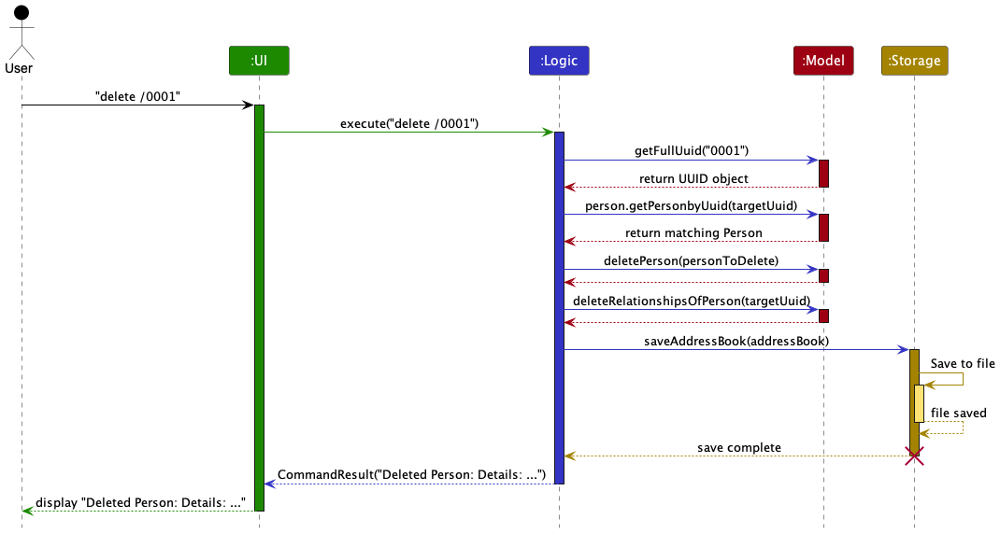

Each of the four main components (also shown in the diagram above),

* defines its *API* in an `interface` with the same name as the Component.
* implements its functionality using a concrete `{Component Name}Manager` class which follows the corresponding API `interface` mentioned in the previous point.

For example, the `Logic` component defines its API in the `Logic.java` interface and implements its functionality using the `LogicManager.java` class which follows the `Logic` interface. Other components interact with a given component through its interface rather than the concrete class (reason: to prevent outside component's being coupled to the implementation of a component), as illustrated in the (partial) class diagram below.

The sections below give more details of each component.

[Back to Table of Contents](#table-of-contents)

--------------------------------------------------------------------------------------------------------------------

### UI component

The **API** of this component is specified in [`Ui.java`](https://github.com/se-edu/addressbook-level3/tree/master/src/main/java/seedu/address/ui/Ui.java)

The `UI` component uses the JavaFx UI framework. The layout of these UI parts are defined in matching `.fxml` files that
are in the `src/main/resources/view` folder. For example, the layout of the [`MainWindow`]
(https://github.com/se-edu/addressbook-level3/tree/master/src/main/java/seedu/address/ui/MainWindow.java) is specified
in [`MainWindow.fxml`](https://github.com/se-edu/addressbook-level3/tree/master/src/main/resources/view/MainWindow.fxml)

The UI consists of a `MainWindow` that is made up of parts e.g. `CommandSection`, `StatusBarFooter`, `HelpWindow`, `DisplaySection`, 
`NavBar`. All these, including the `MainWindow`, inherit from the abstract `UiPart` class which 
captures the commonalities between classes that represent parts of the visible GUI.

Let's briefly dive into each component in `UI` and their respective functions:
1. The `CommandSection` receives user commands and the `UI` then executes user commands using the  `Logic` component,
explaining the dependency between  `CommandSection` and the `Logic` components. The string output of the commands
will then be displayed on the CommandSection.
2. For All Person Contacts Information will be displayed in the `AllContactsSection` which is composed of a `PersonList`
which is in turn composed of 0 or more `PersonCard` where the Person's information will be rendered explaining the dependency
on the `Model` component.
3. For SearchResults from `anySearch` and `familySearch` commands will be rendered on the `SearchResultSection` composed 
of a `PersonList` similar to `AllContactsSection` explained above, however with the addition of a `TreeMapFlowPane` 
which renders the relationship pathway between 2 Persons explaing the dependency on the `Model` component.
4. Lastly, `NavBar` is solely a `UI` component, does not depend on other components, and it is composed of 0 or more
`NavBarButtons` which serves the sole purpose of navigating between pages on the `UI`.

[Back to Table of Contents](#table-of-contents)

--------------------------------------------------------------------------------------------------------------------

### Logic component

**API** : [`Logic.java`](https://github.com/se-edu/addressbook-level3/tree/master/src/main/java/seedu/address/logic/Logic.java)

Here's a (partial) class diagram of the `Logic` component:

The sequence diagram below illustrates the interactions within the `Logic` component, taking `execute("delete /0000")` API call as an example (assuming that `0000` is a valid UUID).

**Note** : The lifeline for `DeleteCommandParser` should end at the destroy marker (X) but due to a limitation of PlantUML, the lifeline continues till the end of diagram.

How the `Logic` component works:

1. When `Logic` is called upon to execute a command, it is passed to an `AddressBookParser` object which in turn creates a parser that matches the command (e.g., `DeleteCommandParser`) and uses it to parse the command.
2. This results in a `Command` object (more precisely, an object of one of its subclasses e.g., `DeleteCommand`) which is executed by the `LogicManager`.
3. The command can communicate with the `Model` when it is executed (e.g. to delete a person). 
*Note that although this is shown as a single step in the diagram above (for simplicity), in the code it can take several interactions (between the command object and the `Model`) to achieve.*
4. The result of the command execution is encapsulated as a `CommandResult` object which is returned back from `Logic`.

Here are the other classes in `Logic` (omitted from the class diagram above) that are used for parsing a user command:

How the parsing works:
* When called upon to parse a user command, the `AddressBookParser` class creates an `XYZCommandParser` (`XYZ` is a placeholder for the specific command name e.g., `AddCommandParser`) which uses the other classes shown above to parse the user command and create a `XYZCommand` object (e.g., `AddCommand`) which the `AddressBookParser` returns back as a `Command` object.
* All `XYZCommandParser` classes (e.g., `AddCommandParser`, `DeleteCommandParser`, ...) inherit from the `Parser` interface so that they can be treated similarly where possible e.g, during testing.

[Back to Table of Contents](#table-of-contents)

--------------------------------------------------------------------------------------------------------------------

### Model component

**API** : [`Model.java`](https://github.com/se-edu/addressbook-level3/tree/master/src/main/java/seedu/address/model/Model.java)

The `Model` component,

* stores the address book data where
    * `Person` objects are contained in a `UniquePersonList` object.
    * `Relationship` objects are contained in a `RelationshipUtil` object.
* stores the currently 'selected' `Person` and `Relationship` objects (e.g., results of a search query) as a separate _filtered_ list which is exposed to outsiders as an unmodifiable `ObservableList<Person>` and `ObservableList<Relationship>` respectively that can be 'observed' i.e. the UI can be bound to these lists so that the UI automatically updates when the data in the list change.
* stores a `UserPref` object that represents the user’s preferences. This is exposed to the outside as a `ReadOnlyUserPref` objects.
* does not depend on any of the other three components (as the `Model` represents data entities of the domain, they should make sense on their own without depending on other components)

#### Model component - Person

The `Person` component,

* contains details about the person, stored as `Attribute` objects.
    * The `Person` component,
        * stores the Unique User ID or UUID of the person
        * stores any number of `Attribute` objects in the `Person` object in the hash map
        * is not required to have any `Attribute` objects
    * The `Unique User ID` component,
        * acts as the unique identifier for a person
        * the UUID is generated by the system and is unique for each person
        * it is used for identifying the person in the system whenever calls are made to the system
        * does not depend on the other components (as the `Unique User ID` is a standalone store of details about the `Person`)

#### Model component - Attribute

**Attribute** is an abstract class that represents a detail about a `Person`. All other attribute classes extend from this class.

* The `Attribute` component,
  * is used to store details about a `Person`
  * each attribute has a `name` and a `value`
  * stores `Attribute` objects in the `Person` object in the hash map
  * Has general types of attributes (`StringAttribute`, `IntegerAttribute`, `DateAttribute`)
    * `StringAttribute` - stores a string value
    * `IntegerAttribute` - stores an integer value
    * `DateAttribute` - stores a date value
  * Users are able to create their own attributes using the `StringAttribute` class
    * They will have their own `String` name and `String` value
  * Has specific types of attributes (e.g. `NameAttribute`, `PhoneNumberAttribute`) with unique constraints relevant to their validity
    * `NameAttribute` - stores the name of the person
    * `PhoneNumberAttribute` - stores the phone number of the person and must be an integer of less than 10 digits
    * `SexAttribute` - stores the gender of the person and must be either `Male` or `Female`
  * does not depend on the other components (as the `Attribute` are standalone stores of details about the `Person`)

#### Model component - Relationship

The `Relationship` component,

* contains details about a relationship between two persons.
* has a `relationType` that defines the type of relationship.
* stores UUIDs of `Person` objects that are connected by the `Relationship` object.
* can be a general `Relationship` which allows the user to define their own `relationType` or a specific one that has a predefined `RelationType`.
    * `FriendsRelationship` is a relationship class that has a predefined `relationType` of `friends`.
* can be a general `RoleBasedRelationship` which allows the user to define their own `RelationType` and roles for each Person or a specific one that has those predefined.
    * `FamilyRelationship` is a abstract class that extends from `RoleBasedRelationship`. It is the superclass of `BioParentsRelationship`, `SpousesRelationship` and `SiblingsRelationship`.
      * `BioParentsRelationship` is a relationship class that has a predefined `relationType` of `bioparents` and has predefined roles `parent` and `child`.
      * `SpousesRelationship` is a relationship class that has a predefined `relationType` of `spouses` and has predefined roles `husband` and `wife`.
      * `SiblingRelationship` is a relationship class that has a predefined `relationType` of `siblings` and has predefined roles `brother` and `sister`.

[Back to Table of Contents](#table-of-contents)

--------------------------------------------------------------------------------------------------------------------

### Storage component

**API** : [`Storage.java`](https://github.com/se-edu/addressbook-level3/tree/master/src/main/java/seedu/address/storage/Storage.java)

The `Storage` component,
* can save both Gene-nie data and user preference data in JSON format, and read them back into corresponding objects.
* inherits from both `AddressBookStorage` and `UserPrefStorage`, which means it can be treated as either one (if only the functionality of only one is needed).
* depends on some classes in the `Model` component (because the `Storage` component's job is to save/retrieve objects that belong to the `Model`)

[Back to Table of Contents](#table-of-contents)

--------------------------------------------------------------------------------------------------------------------

### Common classes

Classes used by multiple components are in the `seedu.addressbook.commons` package.

[Back to Table of Contents](#table-of-contents)

--------------------------------------------------------------------------------------------------------------------

## Implementation

This section describes some noteworthy details on how certain features are implemented.

### Add Person feature

This feature is the `Add` command that allows users to add a person to the address book.
This feature creates a person with 0 or more attributes, and then adds that person to the address book.

#### Implementation

Adding a person is carried out using `AddCommand` and `AddCommandParser`.
The `AddCommand` class extends the `Command` class.
The `AddCommandParser` class extends the `Parser` class.

Given below is an example usage scenario and how adding a person works.

Step 1: The user enters a command to add a person with `Name` attribute to their family tree in Gene-nie.
For example: `add /Name Bob`.

Step 2: The `LogicManager` component receives this command as a string and passes it to the `AddressBookParser`.

Step 3: The `AddressBookParser` recognizes the `add` keyword and creates a new `AddCommandParser`.

Step 4: The `AddCommandParser` parses the rest of the command `/Name Bob`.
It creates a `HashMap` containing the attribute `Name` with value `Bob`.
It then creates a new `AddCommand` with this `HashMap`.
In this step, duplicate attribute names are also checked for, as part of the HashMap creation process in ParserUtil.

Step 5: The `AddCommand` is executed.

Step 6: `AddCommand#execute` continues by calling the following method from `Model`:
* `Model#addPerson(Person)` It adds a given person to the address book.

Step 7: The `AddCommand#execute` method returns the `CommandResult` object to the `LogicManager` component.

The following sequence diagram shows how adding a person works:

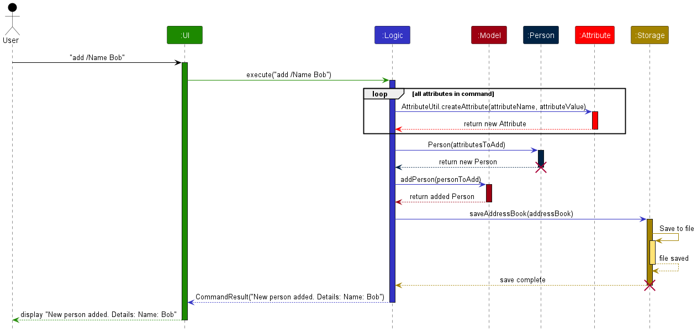

:information_source: **Note:** The lifelines should end at the destroy marker (X) but due to a limitation of PlantUML, the lifeline reaches the end of diagram.

The following activity diagram sheds more light on exactly what happens when a user executes the 'add' command:

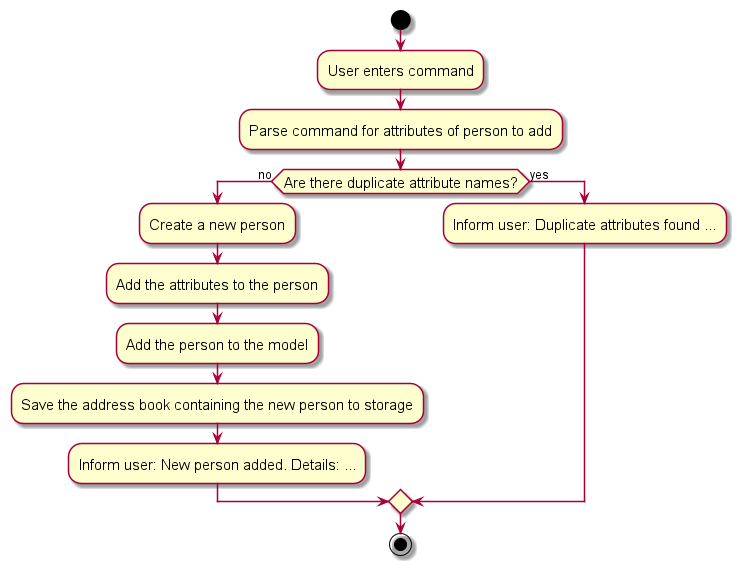

#### Design Considerations

##### Aspect: When to check for duplicate attributes
* Alternative 1 (current choice): `AddCommand#execute` checks for duplicates before adding the person to the addressbook.
  * Pros: Makes the command more atomic - if there is an error, no changes are made.
  * Cons: Less efficient as the program iterates through all attributes twice.
* Alternative 2: `AddCommand#execute` adds an empty person to the address book and then checks for duplicates while appending attributes to that person.
  * Pros: Shorter code, less repetition of actions.
  * Cons: Duplicate attributes would halt command and leave the address book in a partially edited state. Fixing this would result in less readable code.

[Back to Table of Contents](#table-of-contents)

--------------------------------------------------------------------------------------------------------------------
### Delete Person feature

This feature is the `Delete` command that allows users to remove a person from the address book.

#### Implementation

Deleting a person is carried out using `DeleteCommand` and `DeleteCommandParser`.
The `DeleteCommand` class extends the `Command` class.
The `DeleteCommandParser` class extends the `Parser` class.

Given below is an example usage scenario and how deleting a person works.

Step 1: The user enters a command to delete a person with the UUID `0001`.
For example: `delete /0001`.

Step 2: The `LogicManager` component receives this command as a string and passes it to the `AddressBookParser`.

Step 3: The `AddressBookParser` recognizes the `delete` keyword and creates a new `DeleteCommandParser`.

Step 4: The `DeleteCommandParser` parses the rest of the command `/0001`.
It then creates a new `DeleteCommand` with the UUID `0001`.

Step 5: The `DeleteCommand` is executed.

Step 6: `DeleteCommand#execute` continues by calling the following method from `Model`:
* `Model#getFullUuid(String)` It takes in the partial 4-character UUID provided by the user and converts it to the `UUID` object representative of the person to delete.
* `Model#getPersonByUuid(UUID)` It takes the full UUID obtained earlier and returns the corresponding `Person` object.
* `Model#deletePerson(Person)` It deletes the provided person from the address book.
* `Model#deleteRelationshipsOfPerson(UUID)` It deletes all relationships associated with the person being deleted.

Step 7: The `DeleteCommand#execute` method returns the `CommandResult` object to the `LogicManager` component.

The following sequence diagram shows how deleting a person works:

:information_source: **Note:** The lifelines should end at the destroy marker (X) but due to a limitation of PlantUML, the lifeline reaches the end of diagram.

The following activity diagram sheds more light on exactly what happens when a user executes the 'delete' command:

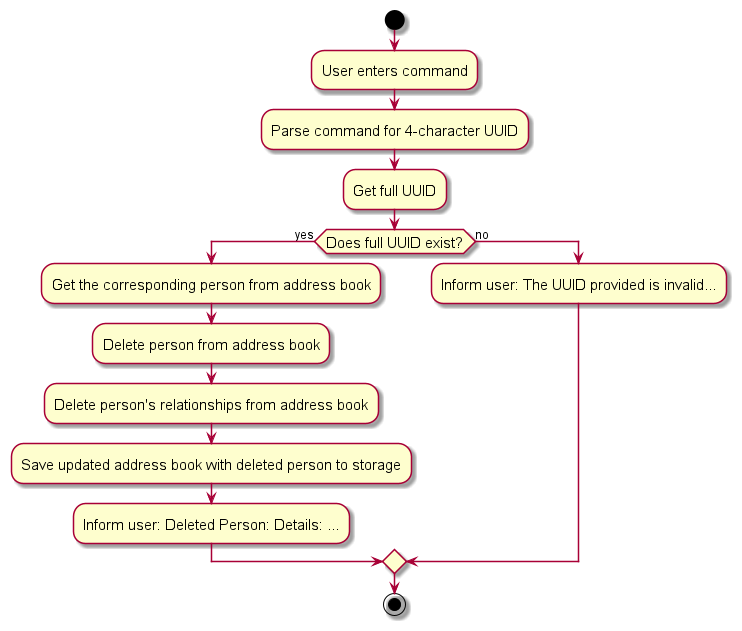

[Back to Table of Contents](#table-of-contents)

--------------------------------------------------------------------------------------------------------------------
### Add Attribute feature

An `AddAttribute` feature that allows users to add attributes to a person in the address book. This feature ensures that only unique attributes are added to a person, maintaining data integrity.

#### Implementation

The Add Attribute mechanism is facilitated by the `AddAttributeCommand` and `AddAttributeParser`.
The `AddAttributeCommand` class extends the `Command` class.

Given below is an example usage scenario and how adding attributes to a person works.

Step 1: The user enters a command to add an attribute to a person, for example: `addattribute /1234 /Phone 12345678`.

Step 2: The `LogicManager` component receives this command as a string and passes it to the `AddressBookParser`.

Step 3: The `AddressBookParser` recognizes the `addattribute` keyword and creates a new `AddAttributeParser`.

Step 4: The `AddAttributeParser` parses the rest of the command `/1234 /Phone 12345678` and creates a new `AddAttributeCommand` with the provided UUID and attribute.

Step 5: The `AddAttributeCommand` is executed.

Step 6: `AddAttributeCommand#execute` calls the following methods from `Model`:

* `Model#getFullUuid(String)` It retrieves the full UUID of the person passed into the `AddAttribute` command.
* `Model#getPersonByUuid(UUID)` It retrieves the person with the provided `UUID` from the `Model`.
* `Model#hasAttribute(String, String)` It checks whether the person given already has the attribute that we are adding.

Step 7: If the person does not have the attribute, the `AddAttributeCommand` adds the attribute to the person object by calling the following methods from `AttributeUtil`:
* `AttributeUtil#createAttribute(String, String)` It creates a new attribute with the provided name and value.

Step 8: `AddAttributeCommand#execute` returns the `CommandResult` object to the `LogicManager` component.

The following sequence diagram shows how the `AddAttribute` command works:

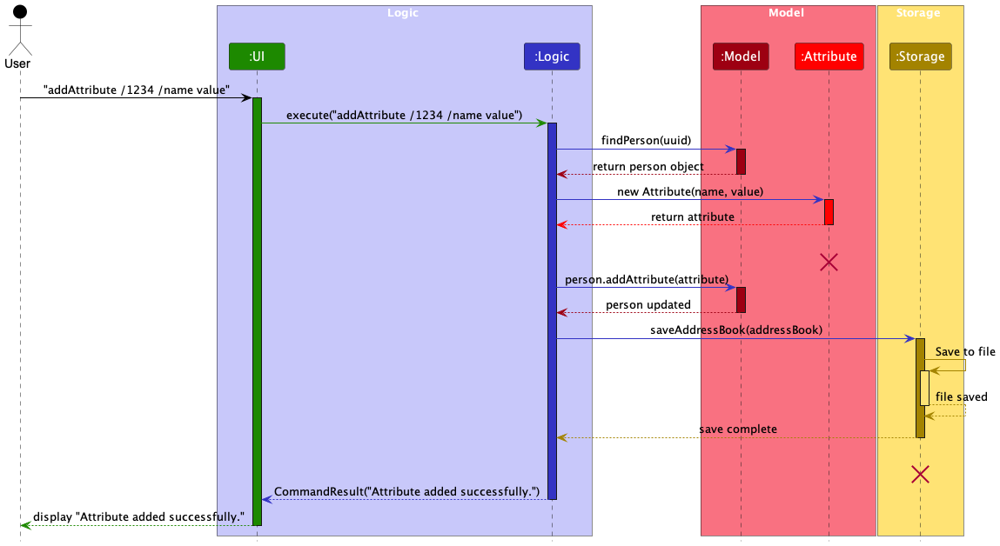

:information_source: **Note:** The lifeline for `Attribute` and `Storage` should end at the destroy marker (X) but due to a limitation of PlantUML, the lifeline reaches the end of diagram.

The following activity diagram sheds more light on exactly what happens a user executes the `addattribute` command:

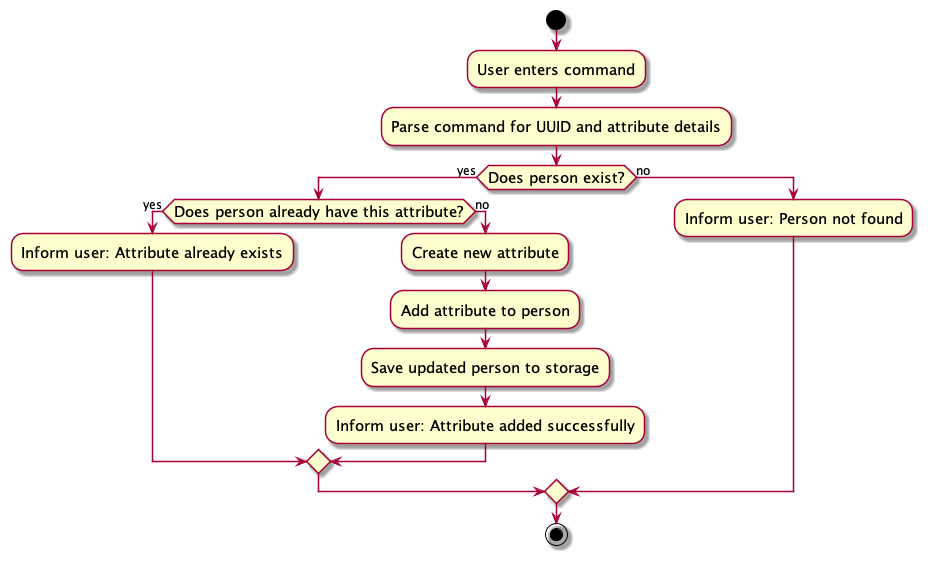

#### Design considerations

**Aspect: How the attribute is created:**

* **Alternative 1 (current choice):** The `AttribueteUtil` class is responsible for creation of the object during the execution of the command.
  * Pros: Modular approach. Easy to extend and change the implementation of the attribute creation in the future.
  * Cons: Might be over engineering for a simple task.
* **Alternative 2:** The `AddAttributeCommand` class is responsible for creation of the object during the execution of the command.
  * Pros: Simple and straightforward.
  * Cons: Might lead to a bloated class.

**Aspect: Addition of existing attribute to a person:**

* **Alternative 1 (current choice):** The `Model` component checks if the person already has the attribute before adding it.
  * Pros: Ensures that the person does not have duplicate attributes.
  * Cons: Might cause performance issues if the person has a large number of attributes.
* **Alternative 2:** The `Model` class does not check if the person already has the attribute before adding it.
  * Pros: Straightforward implementation where the attribute rewrites over all existing data.
  * Cons: Might cause confusion for the user when adding an attribute that already exists.

[Back to Table of Contents](#table-of-contents)

--------------------------------------------------------------------------------------------------------------------
### Edit Attribute feature

An `EditAttribute` feature that allows users to edit attributes of a person in the address book. This feature ensures that only existing attributes are edited, maintaining data integrity.

#### Implementation

The Edit Attribute mechanism is facilitated by the `EditAttributeCommand` and `EditCommandParser`.
The `EditAttributeCommand` class extends the `Command` class.

Step 1: The user inputs a command to edit an attribute of a person, such as: `editattribute /4000 /Name John Doe /Phone 12345678`.

Step 2: The `LogicManager` component receives this command as a string and forwards it to the `AddressBookParser`.

Step 3: The `AddressBookParser` identifies the command keyword `editattribute` and initializes a new `EditAttributeParser`.

Step 4: The `EditAttributeParser` processes the rest of the command `/4000 /Name John Doe /Phone 12345678` and generates a new `EditAttributeCommand` with the specified `UUID` and `attributes` to be edited.

Step 5: The `EditAttributeCommand` is executed.

Step 6: `EditAttributeCommand#execute` performs the following actions through the `Model`:

* It calls `Model#getFullUuid(String)` to fetch the complete `UUID` for the person specified in the `EditAttributeCommand`.
* It retrieves the `person` associated with the provided `UUID` by calling `Model#getPersonByUuid(UUID)`.
* For each `attribute` to be edited, it checks if the person already has the attribute with `Person#hasAttribute(String)`. If the attribute does not exist, an exception is thrown indicating that the attribute cannot be edited because it does not exist.

Step 7: If the person does have the attribute, `EditAttributeCommand` updates the person's attribute by calling:

* `AttributeUtil#createAttribute(String, String)` to create a new `attribute` object with the new value.
* `Person#updateAttribute(Attribute)` to update the existing `attribute` with the new one.

Step 8: After successfully editing the attributes, `EditAttributeCommand#execute` returns a `CommandResult` object to the `LogicManager`, indicating that the attributes were edited successfully.

The following sequence diagram illustrates how the `EditAttribute` command functions:

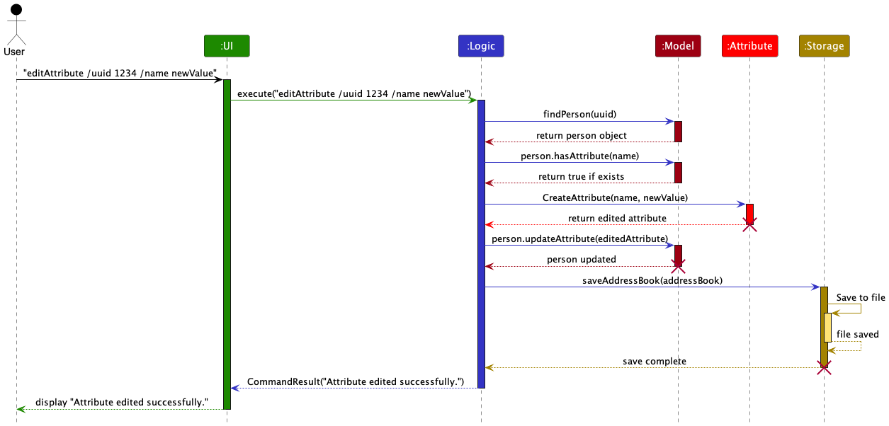

:information_source: **Note:** The lifeline for `Attribute` and `Storage` should end at the destroy marker (X) but due to a limitation of PlantUML, the lifeline reaches the end of diagram.

The following activity diagram provides a more detailed view of what happens when a user executes the `editattribute` command:

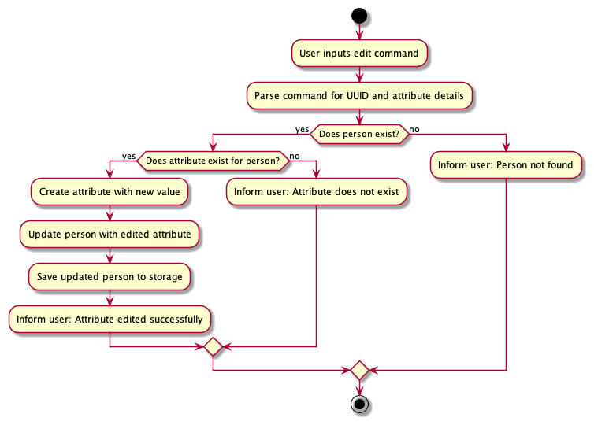

#### Design considerations

**Aspect: How the attribute is updated:**

* **Alternative 1 (current choice):** The `AttributeUtil` class is responsible for creating the object during the command execution.
  * Pros: Modular approach. Easy to extend and change the implementation of the attribute creation in the future.
  * Cons: Might be over engineering for a simple task.
* **Alternative 2:** The `EditAttributeCommand` class is responsible for creating the object during the command execution.
  * Pros: Simple and straightforward.
  * Cons: Might lead to a bloated class.

**Aspect: Editing a non-existent attribute of a person:**

* **Alternative 1 (current choice):** The `Model` component checks if the person already has the attribute before editing it.
  * Pros: Ensures that the user can only edit existing attributes and prevents the creation of new attributes.
  * Cons: Might cause performance issues if the person has a large number of attributes.
* **Alternative 2:** The `Model` class does not check if the person already has the attribute before editing it and creates a new attribute.
  * Pros: Straightforward implementation where the user adds the attribute regardless if it exists or not.
  * Cons: Might cause confusion for the user when editing an attribute that does not exist.

[Back to Table of Contents](#table-of-contents)

--------------------------------------------------------------------------------------------------------------------

### Delete Attribute feature

The `DeleteAttribute` feature that allows users to delete attributes of a person in the address book. This feature ensures that only existing attributes are deleted, maintaining data integrity.

#### Implementation

The Delete Attribute mechanism is facilitated by the `DeleteAttributeCommand` and `DeleteAttributeCommandParser`.
The `DeleteAttributeCommand` class extends the `Command` class.

Step 1: The user inputs a command to delete one or more attributes from a person, such as: `deleteattribute /f8d9 /Name /Phone`.

Step 2: The `LogicManager` component receives this command as a string and forwards it to the `AddressBookParser`.

Step 3: The `AddressBookParser` recognizes the command keyword `deleteattribute` and initiates a new `DeleteAttributeCommandParser`.

Step 4: The `DeleteAttributeCommandParser` analyzes the rest of the command `/f8d9 /Name /Phone` and creates a new `DeleteAttributeCommand` with the specified `UUID` and the `attributes` to be deleted.

Step 5: The `DeleteAttributeCommand` is executed.

* It first uses `Model#getFullUuid(String)` to obtain the complete `UUID` of the person specified in the `DeleteAttributeCommand`.
* It then retrieves the person associated with the provided `UUID` by calling `Model#getPersonByUuid(UUID)`.

Step 6: For each `attribute` listed to be deleted, `DeleteAttributeCommand#execute` performs the following checks and actions through the `Model`:

* It verifies if the person already has the specified `attribute` by calling `Person#hasAttribute(String)`. If the `attribute` does not exist, a `CommandException` is thrown indicating that the `attribute` cannot be deleted because it does not exist.
* If the `attribute` exists, it is removed from the person's `attributes list`.
* If the attribute is successfully deleted, the `DeleteAttributeCommand` updates the person's attributes list by calling `Person#deleteAttribute(String)`.

Step 7: If all specified `attributes` exist and are successfully deleted, `DeleteAttributeCommand#execute` returns a `CommandResult` object to the `LogicManager`, indicating that the `attributes` were deleted successfully.

This workflow ensures that attributes are only deleted if they exist for the specified person, maintaining data integrity and providing clear user feedback if an attempt is made to delete an attribute that does not exist.

The following sequence diagram illustrates how the `DeleteAttribute` command functions:

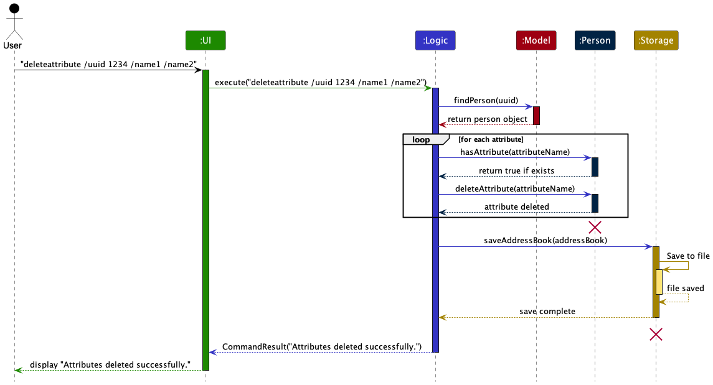

:information_source: **Note:** The lifeline for `Person` and `Storage` should end at the destroy marker (X) but due to a limitation of PlantUML, the lifeline reaches the end of diagram.

The following activity diagram provides a more detailed view of what happens when a user executes the `deleteattribute` command:

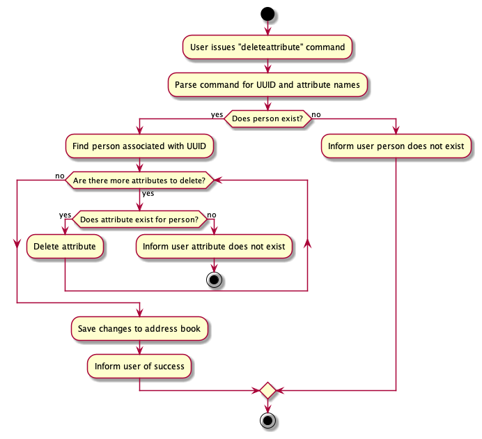

#### Design considerations

**Aspect: How the attribute names are stored before being deleted:**

* **Alternative 1 (current choice):** The `DeleteAttributeCommand` class stores the attribute names to be deleted in an array.
  * Pros: Simple and straightforward.
  * Cons: Leads to additional checks being required to ensure that there are not multiples of the same attributes to be deleted in one command.
* **Alternative 2:** The `DeleteAttributeCommand` class stores the attribute names to be deleted in an arraylist.
  * Pros: Ensures that only one instance of an attribute is allowed to be parsed for deletion.
  * Cons: Harder to implement and maintain.

**Aspect: Deleting a non-existent attribute of a person:**

* **Alternative 1 (current choice):** The `Model` component checks if the person already has the attribute before deleting it.
  * Pros: Ensures that the user can only delete existing attributes and prevents the deletion of non-existent attributes.
  * Cons: Might cause performance issues if the person has a large number of attributes.
* **Alternative 2:** The `Model` class does not check if the person already has the attribute before deleting it.
  * Pros: Straightforward implementation where the attribute is deleted without any checks.
  * Cons: Might cause confusion for the user when deleting an attribute that does not exist.

[Back to Table of Contents](#table-of-contents)

--------------------------------------------------------------------------------------------------------------------

### Find Attribute or UUID feature

The `FindCommand` provides the capability to search for persons within the address book whose names contain any of the specified keywords. The operation is case-insensitive and enhances the user experience by enabling efficient and flexible searches.

#### Implementation

The `FindCommand` is responsible for filtering the list of all persons in the address book to those whose names contain any of the specified keywords. The command updates the `model's filtered person list` to reflect only the search results.
The find operation is facilitated by the `NameContainsKeywordsPredicate` class, the `FindCommandParser` class and the `FindCommand` class.
The `FindCommand` class extends the `Command` class.

Here's a step-by-step description of the FindCommand execution process:

Step 1: The user issues the `find` command along with the key-phrases to search for.

Step 2: The `LogicManager` receives the string input and forwards it to the `AddressBookParser`.

Step 3: The `AddressBookParser` employs the `FindCommandParser` to extract the keywords from the input and instantiate a `FindCommand` with a `NameContainsKeywordsPredicate`.

Step 4: The `FindCommand` is executed, which involves the following steps:

* It calls `Model#updateFilteredPersonList(predicate)` to filter the list of persons using the `NameContainsKeywordsPredicate`.
* It updates the relationship list to show all relationships via `Model#updateFilteredRelationshipList(PREDICATE_SHOW_ALL_RELATIONSHIPS)`.

Step 5: The `FindCommand` concludes by returning a `CommandResult` that includes a message about the number of persons found and the `person` objects which are contain the keywords given.

The following sequence diagram illustrates how the `Find` command functions:

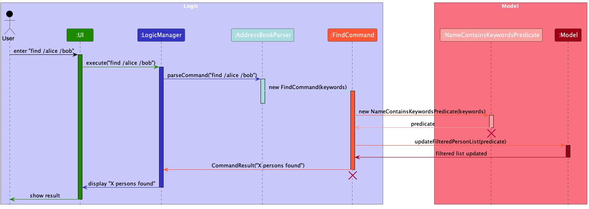

:information_source: **Note:** The lifeline for `FindCommand` and `NameContainsKeywordsPredicate` should end at the destroy marker (X) but due to a limitation of PlantUML, the lifeline reaches the end of diagram.

The following activity diagram provides a more detailed view of what happens when a user executes the `find` command:

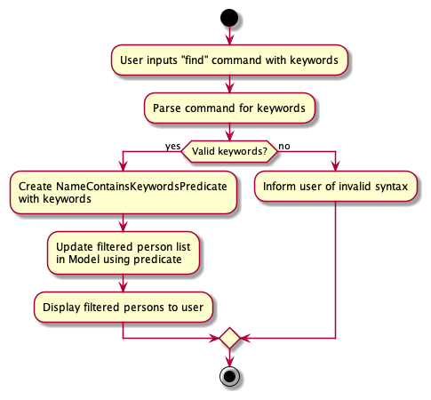

#### Design considerations

**Aspect: How the search is performed:**

* **Alternative 1 (current choice):** The `NameContainsKeywordsPredicate` class is responsible for filtering the list of persons based on the keywords.
  * Pros: Modular approach. Easy to extend and change the implementation of the search in the future.
  * Cons: Might be over engineering for a simple task.
* **Alternative 2:** The `FindCommand` class is responsible for filtering the list of persons based on the keywords.
  * Pros: Simple and straightforward.
  * Cons: Might lead to a bloated class.

**Aspect: Case sensitivity of the search:**

* **Alternative 1 (current choice):** The search is case-insensitive.
  * Pros: Enhances user experience by enabling efficient and flexible searches.
  * Cons: Might lead to unexpected search results if the user is not aware of the case-insensitivity.
* **Alternative 2:** The search is case-sensitive.
  * Pros: Ensures that the search results are accurate and precise.
  * Cons: Might limit the user's ability to search flexibly.

[Back to Table of Contents](#table-of-contents)

--------------------------------------------------------------------------------------------------------------------

### Add relationship feature

#### Implementation

The Add relationship mechanism is facilitated by the `AddRelationshipCommand` and `AddRelationshipCommandParser`.
The `AddRelationshipCommand` class extends the `Command` class and implements the following operation:
* `AddRelationshipCommand#execute()` — Adds a relationship between two persons.

#### Scenario 1 - Adding a roleless relationship

Given below is an example usage scenario and how adding a roleless relationship behaves at each step.

Step 1: The user executes `addRelation /1234 /5678 /friends` to add a roleless relationship.

Step 2: When `LogicManager` is called upon to execute this command, it will pass it to an `AddressBookParser` object.

Step 3: The `AddressBookParser` recognizes the `addRelation` keyword and creates a new `AddRelationshipCommandParser`. The `AddRelationshipCommandParser#parse` method is then called on the object to parse the rest of the command `/1234 /5678 /friends`.

Step 4: `ParserUtil#getRelationshipHashMapFromRelationshipStrings(details)`is then called to parse the relationship details. This method checks that the relationship details are provided in the correct format and that the UUIDs and relationship descriptors are valid. It then returns a `LinkedHashMap<String, String>` containing the relationship details.

Step 5: `ParserUtil#relationKeysAndValues(linkedHashmap, index, boolean)` is then called to extract the keys and values from the `LinkedHashMap<String, String>` at the specified index and boolean according to the provided relationship details. It then returns a `String` containing the key/value of the relationship details. This method is called multiple times to extract the `originUuid`, `targetUuid` and `relationshipDescriptor`.

Step 6: `AddRelationshipCommandParser#parse` then returns a new `AddRelationshipCommand` object with the parsed relationship details.

Step 7: `AddRelationshipCommand#execute` calls the following methods from `Model`:

* `Model#getFullUuid(String)` It retrieves the full UUID of the person passed into the `AddRelationship` command. This is called twice to get the full UUIDs of both persons in the relationship.
* `Model#isRelationRoleBased(relationshipDescriptor)` It checks whether the `relationshipDescriptor` is a existing role-based relationshipDescriptor. If it is, an exception is thrown stating that the `relationshipDescriptor` is already added as a role-based relationshipDescriptor, and can't be added as a roleless relationshipDescriptor.
* `Model#hasRelationshipWithDescriptor(toAdd)` It checks whether the relationship to be added between the two persons already exists. If it does, an exception is thrown stating that the relationship already exists.
* `Model#addRelationship(toAdd)` It communicates with the `Model` to add the relationship.
* `Model#addRolelessDescriptor(relationshipDescriptor)` It communicates with the `Model` to add the `relationshipDescriptor`.

Step 8: `AddRelationshipCommand#execute` returns the `CommandResult` object to the `LogicManager` component.

The following sequence diagram shows how adding a roleless relationship works:

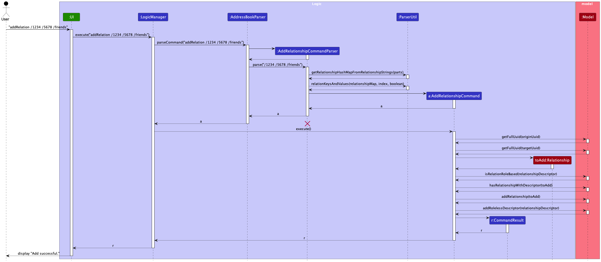

:information_source: **Note:**
* The lifeline for AddRelationshipCommandParser should end at the destroy marker (X) but due to a limitation of PlantUML, the lifeline reaches the end of diagram.

#### Scenario 2 - Adding a role-based relationship

Given below is an example usage scenario and how adding a role-based relationship behaves at each step.

Step 1: The user executes `addRelation /1234 husband /5678 wife /spouses` to add a relationship with roles.

Step 2: When `LogicManager` is called upon to execute this command, it will pass it to an `AddressBookParser` object.

Step 3: The `AddressBookParser` recognizes the `addRelation` keyword and creates a new `AddRelationshipCommandParser`. The `AddRelationshipCommandParser#parse` method is then called on the object to parse the rest of the command `/1234 husband /5678 wife /spouses`.

Step 4: `ParserUtil#getRelationshipHashMapFromRelationshipStrings(details)`is then called to parse the relationship details. This method checks that the relationship details are provided in the correct format and that the UUIDs and relationship descriptors are valid. It then returns a `LinkedHashMap<String, String>` containing the relationship details.

Step 5: `ParserUtil#relationKeysAndValues(linkedHashmap, index, boolean)` is then called to extract the keys and values from the `LinkedHashMap<String, String>` at the specified index and boolean according to the provided relationship details. It then returns a `String` containing the key/value of the relationship details. This method is called multiple times to extract the `originUuid`, `role1`, `targetUuid`, `role2` and `relationshipDescriptor`.

Step 6: `AddRelationshipCommandParser#parse` then returns a new `AddRelationshipCommand` object with the parsed relationship details.

Step 7: `AddRelationshipCommand#execute` calls the following methods from `Model`:

* `Model#getFullUuid(String)` It retrieves the full UUID of the person passed into the `AddRelationship` command. This is called twice to get the full UUIDs of both persons in the relationship.
* `Model#hasAttribute(Uuid)` It checks whether the attribute `Sex` exists for the person with the given Uuid.
* `Model#genderMatch(role, UuidString, Uuid)` It checks whether the role gender matches with the gender of the "Sex" attribute of the person with the given Uuid. This method is only called if the "Sex" attribute exists for the person.
* `Model#checkSiblingsSpousesGender(model, originUuid, targetUuid, role1, role2, isSiblings)` It checks whether the roles of the relationship for each person are valid according to the other existing relationships of the person.
* `Model#isRelationRoleless(relationshipDescriptor)` It checks whether the `relationshipDescriptor` is a existing roleless relationshipDescriptor. If it is, an exception is thrown stating that the `relationshipDescriptor` is already added as a roleless relationshipDescriptor, and can't be added as a role-based relationshipDescriptor.
* `Model#hasRelationshipWithDescriptor(toAdd)` It checks whether the relationship to be added between the two persons already exists. If it does, an exception is thrown stating that the relationship already exists.
* `Model#addRelationship(toAdd)` It communicates with the `Model` to add the relationship.
* `Model#addRoleBasedDescriptor(relationshipDescriptor, role1, role2)` It communicates with the `Model` to add the relationship descriptor with the provided roles.

Step 8: `AddRelationshipCommand#execute` returns the `CommandResult` object to the `LogicManager` component.

The following sequence diagram shows how adding a role-based relationship works:

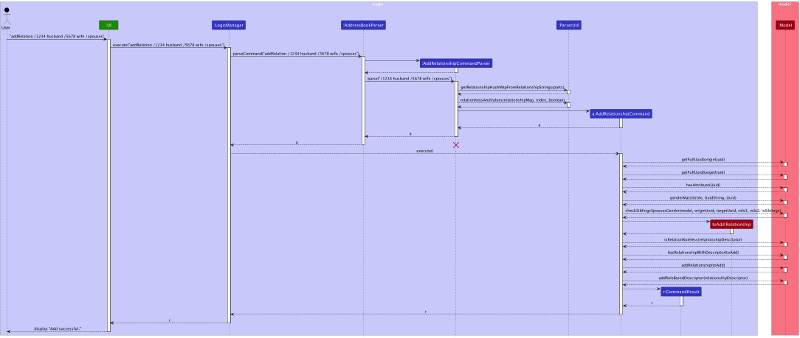

:information_source: **Note:**
* The lifeline for AddRelationshipCommandParser should end at the destroy marker (X) but due to a limitation of PlantUML, the lifeline reaches the end of diagram.

The following activity diagram sheds more light on exactly what happens a user executes the `addrelation` command:

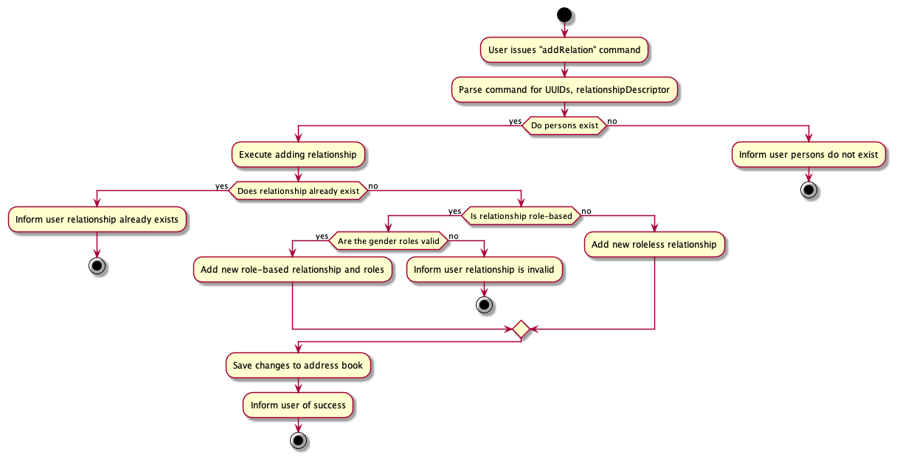

#### Design considerations

**Aspect: How different types of relationships are added:**

* **Alternative 1 (current choice):** The `AddRelationshipCommand` supports both adding a role-based and roleless relationship.
  * Pros: Simple and straightforward implementation.
  * Cons: May lead to a more complex implementation as more relationship types are added.
* **Alternative 2:** The `AddRelationshipCommand` is split into two separate commands, `AddRolelessRelationshipCommand` and `AddRoleBasedRelationshipCommand`.
  * Pros: More modular and easier to maintain.
  * Cons: More classes to manage.

[Back to Table of Contents](#table-of-contents)

--------------------------------------------------------------------------------------------------------------------

### Edit Relationship feature

#### Implementation

The Edit relationship mechanism is facilitated by the `EditRelationshipCommand` and `EditRelationshipCommandParser`.
The `EditRelationshipCommand` class extends the `Command` class and implements the following operation:
* `EditRelationshipCommand#execute()` — Edits a relationship between two persons.

#### Scenario 1 - Editing a roleless relationship

Given below is an example usage scenario and how editing a roleless relationship behaves at each step.

Step 1: The user executes `editRelation /1234 /5678 /friends /colleagues` to edit a roleless relationship.

Step 2: When `LogicManager` is called upon to execute this command, it will pass it to an `AddressBookParser` object.

Step 3: The `AddressBookParser` recognizes the `editRelation` keyword and creates a new `EditRelationshipCommandParser`. The `EditRelationshipCommandParser#parse` method is then called on the object to parse the rest of the command `/1234 /5678 /friends /colleagues`.

Step 4: `ParserUtil#getRelationshipHashMapEdit(details)`is then called to parse the relationship details into a hashmap. This method checks that the relationship details are provided in the correct format and that the UUIDs and relationship descriptors are valid. It then returns a `LinkedHashMap<String, String>` containing the relationship details.

Step 5: `ParserUtil#relationKeysAndValues(linkedHashmap, index, boolean)` is then called to extract the key/value according to the `boolean`(`true`: get value, `false`: get key) from the `LinkedHashMap<String, String>` at the specified index and boolean according to the provided relationship details. It then returns a `String` containing the result. This method will be called multiple times to extract the correct `originUuid`, `targetUuid`, `oldRelationshipDescriptor` and `newRelationshipDescriptor`.

Step 6: `EditRelationshipCommandParser#parse` then returns a new `EditRelationshipCommand` object with the parsed relationship details.

Step 7: `EditRelationshipCommand#execute` calls the following methods from `Model`:

* `Model#getFullUuid(String)` It retrieves the full UUID of the person passed into the `EditRelationship` command. This is called twice to get the full UUIDs of both persons in the relationship.
* `Model#hasRelationshipWithDescriptor(toEditOff)` It checks whether the relationship to be edited between the two persons exists.
* `Model#hasRelationshipWithDescriptor(toEditIn)` It checks whether the relationship to be edited to between the two persons already exists. If it does, an exception is thrown stating that the relationship already exists.
* `Model#isRelationRoleBased(newRelationshipDescriptor)` It checks whether the `newRelationshipDescriptor` is a existing role-based relationshipDescriptor. If it is, an exception is thrown stating that the `newRelationshipDescriptor` already exists, and can't be added as a roleless relationshipDescriptor.
* `Model#addRelationship(toEditIn)` It communicates with the `Model` to add the new relationship.
* `Model#addRolelessDescriptor(newRelationshipDescriptor)` It communicates with the `Model` to add the `newRelationshipDescriptor`.
* `Model#deleteRelationship(toEditOff)` It communicates with the `Model` to delete the old relationship .

Step 8: `EditRelationshipCommand#execute` returns the `CommandResult` object to the `LogicManager` component.

The following sequence diagram shows how editing a roleless relationship works:

:information_source: **Note:**
* The lifeline for EditRelationshipCommandParser should end at the destroy marker (X) but due to a limitation of PlantUML, the lifeline reaches the end of diagram.

#### Scenario 2 - Editing a relationship with roles

Given below is an example usage scenario and how editing a relationship with roles behaves at each step.

Step 1: The user executes `editRelation /1234 husband /5678 wife /partners /spouses` to edit a relationship with roles.

Step 2: When `LogicManager` is called upon to execute this command, it will pass it to an `AddressBookParser` object.

Step 3: The `AddressBookParser` recognizes the `editRelation` keyword and creates a new `EditRelationshipCommandParser`. The `EditRelationshipCommandParser#parse` method is then called on the object to parse the rest of the command `/1234 husband /5678 wife /partners /spouses`.

Step 4: `ParserUtil#getRelationshipHashMapEdit(details)`is then called to parse the relationship details. This method checks that the relationship details are provided in the correct format and that the UUIDs and relationship descriptors are valid. It then returns a `LinkedHashMap<String, String>` containing the relationship details.

Step 5: `ParserUtil#relationKeysAndValues(linkedHashmap, index, boolean)` is then called to extract the key/value according to the `boolean`(`true`: get value, `false`: get key) from the `LinkedHashMap<String, String>` at the specified index and boolean according to the provided relationship details. It then returns a `String` containing the result. This method will be called multiple times to extract the correct `originUuid`, `targetUuid`, `oldRelationshipDescriptor` and `newRelationshipDescriptor`.

Step 6: `EditRelationshipCommandParser#parse` then returns a new `EditRelationshipCommand` object with the parsed relationship details.

Step 7: `EditRelationshipCommand#execute` calls the following methods from `Model`:

* `Model#getFullUuid(String)` It retrieves the full UUID of the person passed into the `EditRelationship` command. This is called twice to get the full UUIDs of both persons in the relationship.
* `Model#hasRelationshipWithDescriptor(toEditOff)` It checks whether the relationship to be edited between the two persons exists.
* `Model#hasRelationshipWithDescriptor(toEditIn)` It checks whether the relationship to be edited to between the two persons already exists. If it does, an exception is thrown stating that the relationship already exists.
* `Model#hasAttribute(Uuid, "Sex")` It checks whether the attribute `Sex` exists for the person with the given Uuid.
* `Model#genderMatch(role, UuidString, Uuid)` It checks whether the role gender matches with the gender of the "Sex" attribute of the person with the given Uuid. This method is only called if the "Sex" attribute exists for the person.
* `Model#isRelationRoleBased(newRelationshipDescriptor)` It checks whether the `newRelationshipDescriptor` is a existing role-based relationshipDescriptor.
* `Model#getRoles(newRelationshipDescriptor)` It communicates with the `Model` to retrieve the roles of the relationship with the provided `newRelationshipDescriptor`.
* `Model#addRelationship(toEditIn)` It communicates with the `Model` to add the new relationship.
* `Model#addRoleBasedDescriptor(newRelationshipDescriptor, role1, role2)` It communicates with the `Model` to add the new relationship descriptor with the provided roles.
* `Model#deleteRelationship(toEditOff)` It communicates with the `Model` to delete the old relationship.

Step 8: `EditRelationshipCommand#execute` returns the `CommandResult` object to the `LogicManager` component.

The following sequence diagram shows how editing a relationship with roles works:

:information_source: **Note:**
* The lifeline for EditRelationshipCommandParser should end at the destroy marker (X) but due to a limitation of PlantUML, the lifeline reaches the end of diagram.

The following activity diagram sheds more light on exactly what happens a user executes the `editrelation` command:

#### Design considerations

**Aspect: How the relationship is edited:**

* **Alternative 1 (current choice):** The `EditRelationshipCommand` deletes the old relationship and adds the new relationship.
    * Pros: Straightforward implementation.
    * Cons: May cause performance issues if the person has a large number of relationships.
* **Alternative 2:** The `EditRelationshipCommand` updates the old relationship with the new relationship.
    * Pros: More efficient as it does not require deleting and adding relationships.
    * Cons: More complex implementation.

[Back to Table of Contents](#table-of-contents)

--------------------------------------------------------------------------------------------------------------------

### Delete Relationship feature

#### Implementation

The Delete relationship mechanism is facilitated by the `DeleteRelationshipCommand` and `DeleteRelationshipCommandParser`.
The `DeleteRelationshipCommand` class extends the `Command` class and implements the following operation:
* `DeleteRelationshipCommand#execute()` — Deletes a relationship between two persons.

#### Scenario 1 - Deleting a relationship

Given below is an example usage scenario and how deleting a relationship behaves at each step.

Step 1: The user executes `deleteRelation /1234 /5678 /friends` to delete a relationship.

Step 2: When `LogicManager` is called upon to execute this command, it will pass it to an `AddressBookParser` object.

Step 3: The `AddressBookParser` recognizes the `deleteRelation` keyword and creates a new `DeleteRelationshipCommandParser`. The `DeleteRelationshipCommandParser#parse` method is then called on the object to parse the rest of the command `/1234 /5678 /friends`.

Step 4: `ParserUtil#getRelationshipHashMapDelete(details, hasUuids)`is then called to parse the relationship details. This method checks that the relationship details are provided in the correct format and that the UUIDs and relationship descriptors are valid. It then returns a `LinkedHashMap<String, String>` containing the relationship details.

Step 5: `ParserUtil#relationKeysAndValues(linkedHashmap, index, boolean)` is then called to extract the keys and values from the `LinkedHashMap<String, String>` at the specified index and boolean according to the provided relationship details. It then returns a `String` containing the key or value of the relationship details. This method is called once to extract the `relationshipDescriptor`.

Step 6: `DeleteRelationshipCommandParser#parse` then returns a new `DeleteRelationshipCommand` object with the parsed relationship details.

Step 7: `DeleteRelationshipCommand#execute` calls the following methods from `Model`:

* `Model#getFullUuid(String)` It retrieves the full UUID of the person passed into the `DeleteRelationship` command. This is called twice to get the full UUIDs of both persons in the relationship.
* `Model#hasRelationshipWithDescriptor(toDelete)` It checks whether the relationship to be deleted between the two persons exists. If it does not, the method throws an exception stating that the relationship does not exist and cannot be deleted.
* `Model#deleteRelationship(toDelete)` It communicates with the `Model` to delete the relationship.

Step 8: `DeleteRelationshipCommand#execute` returns the `CommandResult` object to the `LogicManager` component.

The following sequence diagram shows how deleting a relationship works:

:information_source: **Note:**
* The lifeline for DeleteRelationshipCommandParser should end at the destroy marker (X) but due to a limitation of PlantUML, the lifeline reaches the end of diagram.

#### Scenario 2 - Deleting a relationType

Given below is an example usage scenario and how deleting a relationType behaves at each step.

Step 1: The user executes `deleteRelation /colleagues` to delete a relationType.

Step 2: When `LogicManager` is called upon to execute this command, it will pass it to an `AddressBookParser` object.

Step 3: The `AddressBookParser` recognizes the `deleteRelation` keyword and creates a new `DeleteRelationshipCommandParser`. The `DeleteRelationshipCommandParser#parse` method is then called on the object to parse the rest of the command `/friends`.

Step 4: `ParserUtil#getRelationshipHashMapDelete(details, hasUuids)`is then called to parse the relationship details. This method checks that the relationship details are provided in the correct format and that the relationship descriptor is valid. It then returns a `LinkedHashMap<String, String>` containing the relationship Descriptor.

Step 5: `ParserUtil#relationKeysAndValues(linkedHashmap, index, boolean)` is then called to extract the keys and values from the `LinkedHashMap<String, String>` at the specified index and boolean according to the provided relationship details. It then returns a `String` containing the key or value of the relationship details. This method is called once to extract the `relationshipDescriptor`.

Step 6: `DeleteRelationshipCommandParser#parse` then returns a new `DeleteRelationshipCommand` object with the parsed relationship details.

Step 7: `DeleteRelationshipCommand#execute` calls the following methods from `Model`:

* `Model#deleteRelationType(toDelete)` It communicates with the `Model` to delete the relationType. If the relationType does not exist, an exception is thrown stating that the relationType does not exist and cannot be deleted.

Step 8: `DeleteRelationshipCommand#execute` returns the `CommandResult` object to the `LogicManager` component.

The following sequence diagram shows how deleting a relationType works:

:information_source: **Note:**
* The lifeline for DeleteRelationshipCommandParser should end at the destroy marker (X) but due to a limitation of PlantUML, the lifeline reaches the end of diagram.

The following activity diagram sheds more light on exactly what happens a user executes the `deleterelation` command:

#### Design considerations

**Aspect: How the relationship vs relationType is deleted:**

* **Alternative 1 (current choice):** The `DeleteRelationshipCommand` deletes the relationship/relationType based on whether the user provides the UUIDs of the persons.
    * Pros: Straightforward implementation.
    * Cons: May cause confusion for the user whether the relationship or relationType is being deleted.
* **Alternative 2:** Have a separate command for deleting the relationType specifically.
    * Pros: More explicit for the user.
    * Cons: More commands to implement, resulting in a more complex overall system.

[Back to Table of Contents](#table-of-contents)

--------------------------------------------------------------------------------------------------------------------

### Clear terminal feature

The `ClearCommand` provides the capability to clear the terminal screen. The operation is designed to provide a clean and uncluttered interface for the user.

#### Implementation

The `ClearCommand` is straightforward in its execution: it clears the terminal screen by printing a series of newline characters. The command extends the `Command` class.
This feature is implemented within the `GUI controller` class, responsible for handling user input and updating the GUI components accordingly.

Process Overview
When the user inputs c or clear and presses the enter key, the following actions are performed:

Step 1: The `command text` input area is cleared.
Step 2: The `command dialog` container, which displays the command's output or feedback to the user, is also cleared.
Step 3: If an image or any additional GUI component is displayed as part of the command's output, it is hidden.
Step 4: The application checks the height of the command section `dialog scroll pane`. If it is less than or equal to 150 pixels, a short welcome dialog is added. Otherwise, a standard welcome dialog is displayed.
Step 5: The flag `isDisplayingCommand` is set to false, indicating that no command output is currently being displayed.

The following sequence diagram illustrates how the `Clear Terminal` command functions:

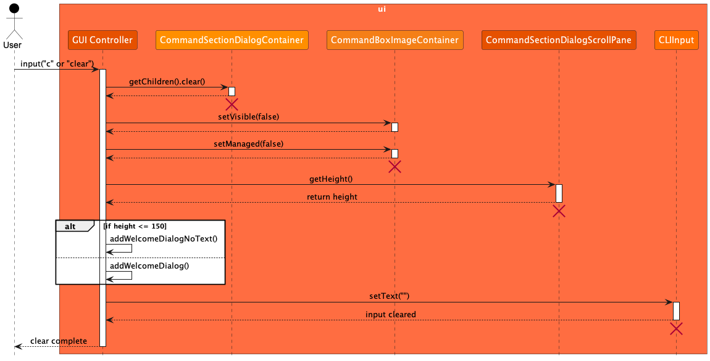

:information_source: **Note:** The lifeline for `GUIController` should end at the destroy marker (X) but due to a limitation of PlantUML, the lifeline reaches the end of diagram.

The following activity diagram provides a more detailed view of what happens when a user executes the `clear` command:

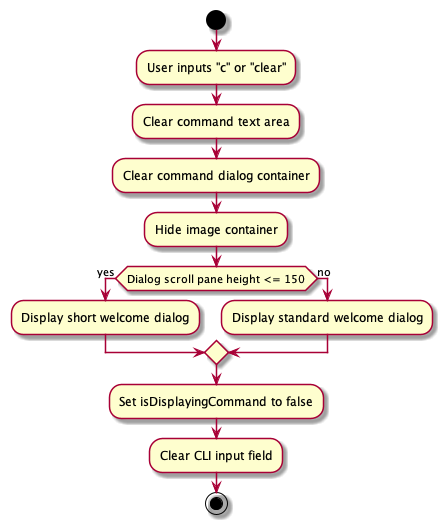

#### Design considerations

**Aspect: How the terminal is cleared:**

* **Alternative 1 (current choice):** The `GUIController` class is responsible for clearing the terminal screen.
  * Pros: Centralized logic for clearing the terminal screen.
  * Cons: Might lead to a bloated `GUIController` class if additional functionalities are added in the future.
* **Alternative 2:** Splitting of clearing the terminal screen into a separate class.
  * Pros: Simple and straightforward.
  * Cons: Might result in many overlapping classes and methods.

**Aspect: Display of welcome dialog after clearing the terminal:**

* **Alternative 1 (current choice):** The application displays a short welcome dialog if the height of the command section dialog scroll pane is less than or equal to 150 pixels.
  * Pros: Provides a clean and uncluttered interface for the user.
  * Cons: Might lead to a cluttered interface if the user has a large number of commands.
* **Alternative 2:** The application does not display a welcome dialog after clearing the terminal screen.
  * Pros: Provides a clean and uncluttered interface for the user.
  * Cons: Might lead to a lack of feedback for the user after clearing the terminal screen.

[Back to Table of Contents](#table-of-contents)

--------------------------------------------------------------------------------------------------------------------

### Delete All Persons feature

The `DeleteAllCommand` provides the capability to delete all persons from the address book. The operation is irreversible and is designed to provide a quick and efficient way to clear the address book.

#### Implementation

The `ClearCommand` is straightforward in its execution: it replaces the current address book model with a new, empty instance of `AddressBook`, and also resets any relationship descriptors that might be associated with the address book entries.
The `ClearCommand` class extends the `Command` class.

This is the command execution flow for the `ClearCommand`:

Step 1: The user inputs the command to clear the address book using the keyword `deleteallpersons` or the shorthand `dap`.

Step 2: The input is parsed by the `LogicManager`, which identifies the command as a `ClearCommand`.

Step 3: The `ClearCommand#execute(Model model)` method is called.

* Within the execute method, the `ClearCommand` calls `model.setAddressBook(new AddressBook())` to replace the current address book with a new, empty instance.
* It then calls `model.resetRelationshipDescriptors()` to clear any existing relationship descriptors.

Step 4: After clearing the address book and relationships, the command returns a new `CommandResult` with a success message indicating that the address book has been cleared.

The following sequence diagram illustrates how the `Clear` command functions:

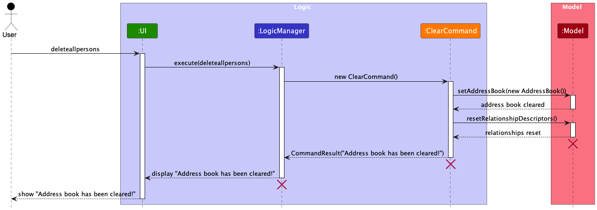

:information_source: **Note:** The lifeline for `Model`, `ClearCommand` and `LogicManager` should end at the destroy marker (X) but due to a limitation of PlantUML, the lifeline reaches the end of diagram.

The following activity diagram provides a more detailed view of what happens when a user executes the `deleteallpersons` command:

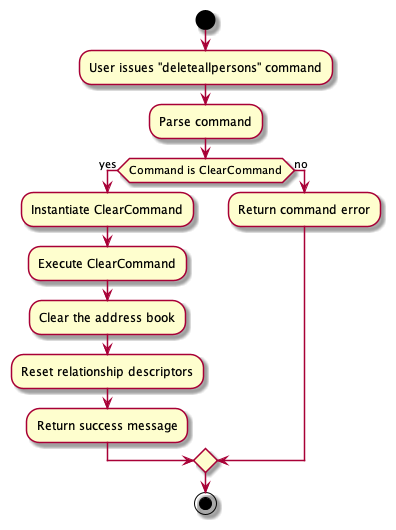

#### Design considerations

**Aspect: How the address book is cleared:**

* **Alternative 1 (current choice):** The `Model` component is responsible for clearing the address book, attributes and relationship descriptors.
  * Pros: Centralized logic for clearing the address book and relationships.
  * Cons: Might lead to a bloated `Model` class if additional functionalities are added in the future.
* **Alternative 2:** Splitting of clearing address book, attribute and relationship descriptors into separate classes.
  * Pros: Simple and straightforward.
  * Cons: Might result in many overlapping classes and methods.

**Aspect: Irreversibility of the clear operation:**

* **Alternative 1 (current choice):** The clear operation is irreversible.
  * Pros: Prevents accidental data loss by requiring user confirmation before clearing the address book.
  * Cons: Might lead to data loss if the user executes the command unintentionally.
* **Alternative 2:** The clear operation is reversible.
  * Pros: Provides a safety net for users who might accidentally clear the address book.
  * Cons: Might lead to data clutter if the user is unable to clear the address book.

[Back to Table of Contents](#table-of-contents)

--------------------------------------------------------------------------------------------------------------------

### AnySearch feature

#### Implementation

The AnySearch mechanism is facilitated by the `AnySearchCommand` and `AnySearchCommandParser`.
The `AnySearchCommand` class extends the `Command` class and implements the following operation:
* `AnySearchCommand#execute()` — Searches for the relationship pathway between two persons.

Given below is an example usage scenario and how the AnySearch feature behaves at each step.

Step 1: The user executes `anySearch /1234 /5678` to search for the relationship pathway between two persons.

Step 2: When `LogicManager` is called upon to execute this command, it will pass it to an `AddressBookParser` object.

Step 3: The `AddressBookParser` recognizes the `anySearch` keyword and creates a new `AnySearchCommandParser`. The `AnySearchCommandParser#parse` method is then called on the object to parse the rest of the command `/1234 /5678`.

Step 4: `AnySearchCommandParser#parse` then returns a new `AnySearchCommand` object with the parsed Uuid details.

Step 5: `AnySearchCommand#execute` calls the following methods from `Model`:

* `Model#getFullUuid(String)` It retrieves the full UUID of the person passed into the `AnySearch` command. This is called twice to get the full UUIDs of both persons in the relationship.
* `Model#anySearch(fullOriginUuid, fullTargetUuid)` It communicates with the `Model` to search for the relationship pathway between the two persons.
* `Model#updateFilteredPersonList(predicate)` It communicates with the `Model` to update the filtered person list with the results of the search.
* `Model#updateFilteredRelationshipList(predicate)` It communicates with the `Model` to update the filtered relationship list with the results of the search.

Step 6: `AnySearchCommand#execute` returns the `CommandResult` object to the `LogicManager` component.

The following sequence diagram shows how the AnySearch feature works:

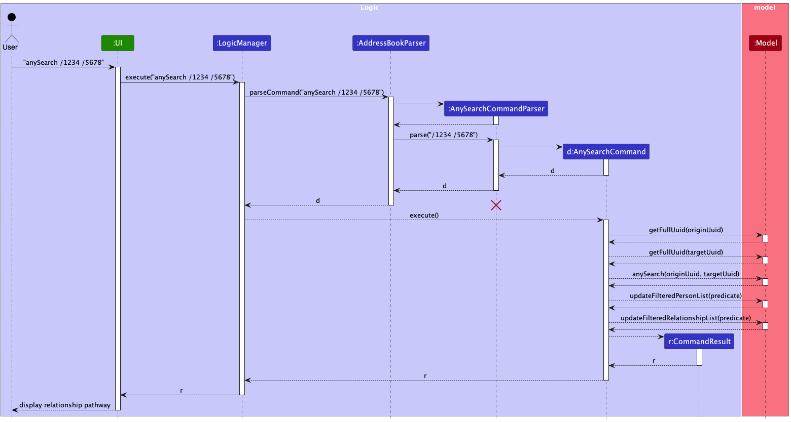

:information_source: **Note:**
* The lifeline for `AnySearchCommandParser` should end at the destroy marker (X) but due to a limitation of PlantUML, the lifeline reaches the end of diagram.

The following activity diagram sheds more light on exactly what happens a user executes the `anySearch` command:

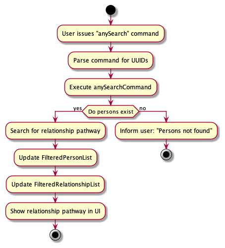

#### Design considerations

**Aspect: How the relationship pathway is searched:**

* **Alternative 1 (current choice):** The `AnySearchCommand` searches for the relationship pathway between two persons using Breadth-First-Search(BFS).
    * Pros: Efficient and scalable for large address books.
    * Cons: Might be overkill for small address books.
* **Alternative 2:** The `AnySearchCommand` searches for the relationship pathway between two persons using Depth-First-Search(DFS).
    * Pros: Simple and straightforward.
    * Cons: Might be less efficient for large address books.

**Aspect: Display of relationship pathway:**

* **Alternative 1 (current choice):** The `AnySearchCommand` displays the shortest relationship pathway between two persons.
    * Pros: Provides a clear and concise output for the user.
    * Cons: Might not display all possible relationship pathways.
* **Alternative 2:** The `AnySearchCommand` displays all possible relationship pathways between two persons.
    * Pros: Provides a comprehensive view of the relationship pathways.
    * Cons: Might lead to information overload for the user.

[Back to Table of Contents](#table-of-contents)

--------------------------------------------------------------------------------------------------------------------

## Documentation, logging, testing, configuration, dev-ops

* [Documentation guide](Documentation.md)
* [Testing guide](Testing.md)
* [Logging guide](Logging.md)
* [Configuration guide](Configuration.md)
* [DevOps guide](DevOps.md)

[Back to Table of Contents](#table-of-contents)

--------------------------------------------------------------------------------------------------------------------

## **Appendix: Requirements**

### Product scope

**Target user profile**:

* Has many family members to keep track off
* Wants to keep various information about these different family members
* Wants to visualize connections between family members
* Often only has provisional or partial information about their family members

**Value proposition**: Gene-nie puts connections between people at the forefront. It allows users to easily visualize and understand the relationships between people in their lives. It also allows users to store personal information about each individual, making it a one-stop solution for managing relationships.

### User stories

Priorities: High (must have) - `* * *`, Medium (nice to have) - `* *`, Low (unlikely to have) - `*`

| Priority | As a …​ | I want to …​                                                                         | So that I can…​                                        |
|----------|---------|--------------------------------------------------------------------------------------|--------------------------------------------------------|
| `* * *`  | user    | Create a new person with a Unique User ID                                            | Ensure every person in my address book is distinct     |
| `* * *`  | user    | Add custom attributes to each person                                                 | Store personal information relevant to each individual |
| `* * *`  | user    | Establish and record relationships between people                                    | Visualize connections between people                   |
| `* * *`  | user    | Find the relationship path between people                                            | Understand how everyone is connected                   |
| `* *`    | user    | Have clear success or failure messages after actions                                 | Ensure that the intended action has taken place        |
| `* *`    | user    | Sort and search a person by their attributes                                         | Find specific individuals more easily                  |
| `* * *`  | user    | Have my data automatically saved once i exit the app and loaded once i start the app | Seamless experience across different sessions          |

### Use cases

(For all use cases below, the **System** is the `Gene-nie` and the **Actor** is the `user`, unless specified otherwise)

**Use case: Assessing help page**

**MSS**

1. User requests to view the help page.
2. Gene-nie displays a message with a link to the help page.

    Use case ends.

**Use case: Listing all persons**

**MSS**

1. User requests to view the list of persons.
2. Gene-nie displays a list of all students along with their details.

    Use case ends.

**Use case: Add a new person**

**MSS**

1. User requests to add a new person with their attributes to Gene-nie.
2. Gene-nie adds the person with the provided attributes.
3. Gene-nie displays new person added and confirmation message.

    Use case ends.

**Extensions**

* 1a. User enters an invalid command format.
    * 1a1. Gene-nie shows an error message.

      Use case ends.
* 1b. User enters an invalid attribute.
    * 1b1. Gene-nie shows an error message.

      Use case ends.

**Use case: Delete a person**

**MSS**

1. User selects a specific person in the list to delete by providing the person’s UUID.
2. Gene-nie deletes the person.
3. Gene-nie displays confirmation message.

    Use case ends.

**Extensions**

* 1a. Given UUID is invalid or does not exist.
    * 1a1. Gene-nie shows an error message.

      Use case ends.

**Use case: Add an attribute to a person**

**MSS**

1. User requests to add an attribute to a person by providing the person's UUID and new attribute.
2. Gene-nie adds attribute details to specific person’s profile.
3. Gene-nie displays attribute in person’s profile and confirmation message.

    Use case ends.

**Extensions**

* 1a. Attribute details are invalid.
    * 1a1. Gene-nie shows an error message.

      Use case ends.

* 1b. Given UUID is invalid or does not exist.
    * 1b1. Gene-nie shows an error message.

      Use case ends.

**Use case: Edit an attribute of a person**

**MSS**

1. User requests to edit an attribute of a person by providing the person's UUID and the attribute they want to edit, along with the new attribute value.
2. Gene-nie updates attribute details to specific person’s profile.
3. Gene-nie updates the new attribute in person’s profile and confirmation message.

    Use case ends.

**Extensions**

* 1a. Attribute details are invalid.
    * 1a1. Gene-nie shows an error message.

      Use case ends.

* 1b. Given UUID is invalid or does not exist.
    * 1b1. Gene-nie shows an error message.

      Use case ends.

**Use case: Delete an attribute of a person**

**MSS**

1. User requests to delete an attribute of a person by providing the person's UUID and the attribute they want to delete.
2. Gene-nie deletes the attribute from the specified person's profile.

    Use case ends.

**Extensions**

* 1a. Attribute details are invalid.
    * 1a1. Gene-nie shows an error message.

      Use case ends.

* 1b. Given UUID is invalid or does not exist.
    * 1b1. Gene-nie shows an error message.

      Use case ends.

**Use case: Find persons by attribute**

**MSS**

1. User requests to find persons by attribute by entering the attribute name/value.
2. Gene-nie displays list of persons with each of the specified attribute name/value.

    Use case ends.

**Extensions**

* 1a. Attribute details are invalid or does not exist.
    * 1a1. Gene-nie shows an error message.

      Use case ends.

**Use case: List all valid relationTypes**

**MSS**

1. User requests to list all valid relationTypes.
2. Gene-nie displays list of all current relationTypes.

    Use case ends.

**Use case: Add a relationship between two persons**

**MSS**

1. User requests to add a relationship between two persons by providing both persons UUID and the relationship type.
2. Gene-nie creates a relationship with the provided details.
3. Gene-nie displays new relationship added under both persons’ profiles and confirmation message.

    Use case ends.

**Extensions**

* 1a. Relationship type is invalid.
    * 1a1. Gene-nie shows an error message.

      Use case ends.

* 1b. Given UUIDs are invalid or does not exist.
    * 1b1. Gene-nie shows an error message.

      Use case ends.

**Use case: Edit a relationship between two persons**

**MSS**

1. User requests to edit a specific relationship between two persons by providing both persons UUID, the existing and new relationship type.
2. Gene-nie edits the specified relationship with the provided details.
3. Gene-nie displays edited relationship under both persons’ profiles and confirmation message.

    Use case ends.

**Extensions**

* 1a. Relationship types are invalid.
    * 1a1. Gene-nie shows an error message.

      Use case ends.

* 1b. Given UUIDs are invalid or does not exist.
    * 1b1. Gene-nie shows an error message.

      Use case ends.

**Use case: Delete a relationship between two persons**

**MSS**

1. User requests to delete a specific relationship between two persons by providing both persons UUID and the relationship type.
2. Gene-nie deletes the specified relationship.
3. Gene-nie displays confirmation message.

    Use case ends.

**Extensions**

* 1a. Relationship type is invalid.
    * 1a1. Gene-nie shows an error message.

      Use case ends.

* 1b. Given UUIDs are invalid or does not exist.
    * 1a1. Gene-nie shows an error message.

      Use case ends.

**Use case: Search a relationship pathway between two persons**

**MSS**

1. User requests to search for a relationship pathway between two persons by providing both persons UUID and the relationship type.
2. Gene-nie displays the relationship pathway.

    Use case ends.

**Extensions**

* 1a. Given UUIDs are invalid or does not exist.
    * 1a1. Gene-nie shows an error message.

      Use case ends.

* 1b. No relationship pathway exists between the two persons.
    * 1a1. Gene-nie says that there is no relationship pathway found.

    Use case ends.

**Use case: Deleting all persons**

**MSS**

1. User requests to delete all persons from Gene-nie.
2. Gene-nie deletes all persons and displays the updated view.

    Use case ends.

**Use case: Clearing command history**

**MSS**

1. User requests to clear command history
2. Gene-nie clears the whole command history.

    Use case ends.

**Use case: Exit Gene-nie**

**MSS**

1. User requests to exit Gene-nie.
2. Gene-nie saves current data.
3. Gene-nie closes the application window.

    Use case ends.

*{More to be added}*

### Non-Functional Requirements

1.  Should work on any _mainstream OS_ as long as it has Java `11` or above installed.
2.  Should be able to hold up to 1000 persons and relationships without a noticeable sluggishness in performance for typical usage.
3.  A user with above average typing speed for regular English text (i.e. not code, not system admin commands) should be able to accomplish most of the tasks faster using commands than using the mouse.
4.  User actions should prompt responses within 5 seconds, maintaining acceptable performance standards.
5.  The user interface must be intuitive for users of varying technical proficiency levels, enhancing usability.
6.  The codebase should be well-documented and maintainable to facilitate future updates and enhancements.
7.  Comprehensive documentation should be provided for developers, administrators, and end-users, supporting ease of use.
8.  The system should be able to handle data corruption or loss gracefully, minimizing the impact on users.
9.  The system architecture should support future extensions or customizations, allowing for easy addition of new features.
10. Interoperability with other systems should be supported through standard protocols and formats, promoting seamless integration.
11. The system should be designed with testability in mind, allowing for comprehensive testing of all components, features, and scenarios.

### Glossary

* **Mainstream OS**: Windows, Linux, Unix, MacOS
* **Private contact detail**: A contact detail that is not meant to be shared with others
* **Command Line Interface (CLI)**: A text-driven user interface used for program execution, file management, and overall computer interaction.
* **Graphical User Interface (GUI)**: An operating system interface reliant on graphics, utilising icons, menus, and a mouse for user interaction.
* **Main Success Scenario (MSS)**: Describes the most direct interaction path for a given use case, assuming no errors or complications.
* **Actor**: Within use cases, an actor represents the role a person assumes while interacting with the system.
* **Application Programming Interface(API)**: Facilitates communication between distinct components of a program.
* **Architecture**: In the realm of software, architecture illustrates the systematic organization of the entire system.
* **Framework**: Comprises pre-written code with predefined classes and functions, aiding developers in constructing software.

[Back to Table of Contents](#table-of-contents)

--------------------------------------------------------------------------------------------------------------------

## **Appendix: Instructions for manual testing**

Given below are instructions to test the app manually.

:information_source: **Note:** These instructions only provide a starting point for testers to work on;
testers are expected to do more *exploratory* testing.

### Launch and shutdown

1. Initial launch

   1. Download the jar file and copy into an empty folder
   2. Double-click the jar file.   If nothing happens after double-clicking the jar file, run `java -jar Gene-nie.jar` in the folder containing the jar file.  
      **Expected Outcome**: Shows the GUI with a set of sample contacts. The window size may not be optimum.

2. Saving window preferences

    1. Resize the window to an optimum size. Move the window to a different location.
    2. Close the window.
    3. Re-launch the app by double-clicking the jar file. 
        **Expected Outcome**: The most recent window size and location is retained.

### Listing all persons
**Prerequisites**: There should be at least one person in Gene-nie.
1. Listing all persons:
    1. **Test case:** `list`  
       **Expected Outcome:** A list of all persons with their details is shown.

### Help
1. Seeking help:
    1. **Test case:** `help`  
       **Expected Outcome:** A new window is opened with a link to the help page.

### Adding a person
1. Adding a person with no attributes:
    1. **Test case:** `add`  
       **Expected Outcome:** A new person with a random UUID shown on the left panel of the PersonCard is added to Gene-nie. Attributes panel displays "No attributes found".

2. Adding a person with one attribute:
    1. **Test case:** `add /Name John`  
       **Expected Outcome:** A new person with a random UUID shown on the left panel of the PersonCard is added to Gene-nie. Attributes panel displays the attribute added.

3. Adding a person with multiple attributes:
    1. **Test case:** `add /Name John /Phone 98765432 /Email John@example.com`  
       **Expected Outcome:** A new person with a random UUID shown on the left panel of the PersonCard is added to Gene-nie. Attributes panel displays all the attributes added.

4. Adding a person with duplicate attributes:
    1. **Test case:** `add /Name John /Name Chad`  
       **Expected Outcome:** The last attribute value is taken. A new person with a random UUID shown on the left panel of the PersonCard is added to Gene-nie. Attributes panel displays "Name: Chad".

5. Adding a person with an invalid attribute:
    1. **Test case:** `add /Name`  
       **Expected Outcome:** Error message highlighted in red is shown. The command format and an example is also shown in the error message.
    2. **Test case:** `add /Sex dhdkag`  
       **Expected Outcome:** Error message highlighted in red is shown. It reads "Sex must only be male or female for Sex."

### Deleting a person
**Prerequisites**: There should be at least one person in Gene-nie.

1. Deleting a person with a valid uuid:
    1. **Additional Prerequisites**: Replace the UUID in the test case with a valid UUID (e.g. 0001) from your list of persons.  
       **Test case:** `delete /UUID`  
       **Expected Outcome:** The person with the given UUID is removed from Gene-nie. Details of the deleted person is shown in the status message.

2. Deleting a person with an invalid uuid:
    1. **Test case:** `delete /!!!!`  
       **Expected Outcome:** No person is deleted. An error message is shown, indicating that the UUID provided is invalid.

3. Deleting a person with no uuid provided:
    1. **Test case:** `delete`  
       **Expected Outcome:** No person is deleted. An error message is shown, indicating that the command format is invalid.

### Adding attributes to existing persons
**Prerequisites**: There should be at least one person in Gene-nie.

1. Adding an attribute to a person with a valid uuid:
    1. **Additional Prerequisites**: Replace the UUID in the test case with a valid UUID (e.g. 0001) from your list of persons.  
       **Test case:** `addattribute /UUID /Phone 12345678`  
       **Expected Outcome:** The attribute is added to the person with the given UUID. The new attribute is shown in the attributes panel of the person.

2. Adding multiple attributes to a person with a valid uuid:\
    1. **Additional Prerequisites**: Replace the UUID in the test case with a valid UUID (e.g. 0001) from your list of persons.  
       **Test case:** `addattribute /UUID /Phone 12345678 /Email john@example.com`  
       **Expected Outcome:** The attributes are added to the person with the given UUID. The new attributes are shown in the attributes panel of the person.

3. Adding an attribute to a person with an invalid uuid:
    1. **Test case:** `addattribute /!!!! /Phone 12345678`  
       **Expected Outcome:** No attribute is added. An error message is shown, saying "Person not found."

4. Adding an attribute with no uuid provided:
    1. **Test case:** `addattribute /Phone 12345678`  
       **Expected Outcome:** No attribute is added. An error message is shown, indicating that the command format is invalid.

5. Adding a duplicate attribute to a person:
    1. **Additional Prerequisites**: Replace the UUID in the test case with a valid UUID (e.g. 0001) from your list of persons.  
       **Test case:** `addattribute /UUID /Phone 12345678 /Phone 87654321`  
       **Expected Outcome:** No attribute is added. An error message is shown, indicating that the attribute is a duplicate.

### Editing attributes of existing persons
**Prerequisites**: There should be at least one person in Gene-nie, and that person should have at least one attribute.

1. Editing an attribute of a person with a valid uuid and valid attribute:
    1. **Additional Prerequisites**: Replace the UUID in the test case with a valid UUID (e.g. 0001) from your list of persons. Person must also have the attribute `Phone`.  
       **Test case:** `editattribute /UUID /Phone 12345678`  
       **Expected Outcome:** The attribute is edited for the person with the given UUID. The new attribute is shown in the attributes panel of the person.

2. Editing an attribute of a person with an invalid uuid:
    1. **Test case:** `editattribute /!!!! /Phone 12345678`  
       **Expected Outcome:** No attribute is edited. An error message is shown, saying "Person not found."

3. Editing an attribute of a person without the attribute provided:
    1. **Additional Prerequisites**: Replace the UUID in the test case with a valid UUID (e.g. 0001) from your list of persons. The person must NOT have the attribute `Email`.  
       **Test case:** `editattribute /UUID /Email john@example.com`  
       **Expected Outcome:** No attribute is edited. An error message is shown, indicating that the attribute does not exist and cannot be edited.

4. Editing an attribute of a person with no uuid provided:
    1. **Test case:** `editattribute /Phone 12345678`  
       **Expected Outcome:** No attribute is edited. An error message is shown, indicating that the command format is invalid.

### Deleting attributes of existing persons
**Prerequisites**: There should be at least one person in Gene-nie, and that person should have at least one attribute.

1. Deleting an attribute of a person with a valid uuid and valid attribute:
    1. **Additional Prerequisites**: Replace the UUID in the test case with a valid UUID (e.g. 0001) from your list of persons. Person must also have the attribute `Phone`.  
       **Test case:** `deleteattribute /UUID /Phone`  
       **Expected Outcome:** The attribute is deleted for the person with the given UUID. The attribute is removed from the attributes panel of the person.

2. Deleting multiple attributes of a person with a valid uuid and valid attributes:
    1. **Additional Prerequisites**: Replace the UUID in the test case with a valid UUID (e.g. 0001) from your list of persons. Person must also have the attributes `Phone` and `Email`.  
       **Test case:** `deleteattribute /UUID /Phone /Email`  
       **Expected Outcome:** The attributes are deleted for the person with the given UUID. The attributes are removed from the attributes panel of the person.

3. Deleting an attribute of a person with an invalid uuid:
    1. **Test case:** `deleteattribute /!!!! /Phone`  
       **Expected Outcome:** No attribute is deleted. An error message is shown, saying that the UUID provided is invalid.

4. Deleting an attribute of a person without the attribute provided:
    1. **Additional Prerequisites**: Replace the UUID in the test case with a valid UUID (e.g. 0001) from your list of persons. The person must NOT have the attribute `Email`.  
       **Test case:** `deleteattribute /UUID /Email`  
       **Expected Outcome:** No attribute is deleted. An error message is shown, indicating that the attribute is not found.

### Finding persons
**Prerequisites**: There should be at least one person in Gene-nie.

1. Finding persons by attribute name:
    1. **Additional Prerequisites**: The persons should have the attribute `Name`.  
       **Test case:** `find /Name`  
       **Expected Outcome:** A list of persons with the specified attribute name `Name` is shown.

2. Finding persons by attribute value:
    1. **Additional Prerequisites**: The persons should have an attribute with the value `John`.  
       **Test case:** `find /John`  
       **Expected Outcome:** A list of persons with the specified attribute containing the value `John` is shown.

3. Finding persons by uuid:
    1. **Additional Prerequisites**: Replace the UUID in the test case with a valid UUID (e.g. 0001) from your list of persons.  
       **Test case:** `find /UUID`  
       **Expected Outcome:** The person with the specified UUID is shown.

4. Finding persons using an attribute name/value that does not exist:
    1. **Additional Prerequisites**: All persons do not have the attribute `Country` and do not have any attribute with the value `Singapore`.  
       **Test case:** `find /Country`  
       **Expected Outcome:** The left panel is empty, with no person found.
    2. **Test case:** `find /Singapore`  
       **Expected Outcome:** The left panel is empty, with no person found.

5. Finding persons using an invalid uuid:
    1. **Test case:** `find /!!!!`  
       **Expected Outcome:** The left panel is empty, with no person found.

### Listing all valid relationship types

1. Listing all valid relationship types:
    1. **Test case:** `listrelations`  
       **Expected Outcome:** A list of all valid relationship types is shown.

### Adding relationships between persons
**Prerequisites**: There should be at least two persons in Gene-nie.

1. Adding a roleless relationship between two persons with valid uuids:
    1. **Additional Prerequisites**: Replace the UUIDs in the test case with valid UUIDs (e.g. 0001 and 0002) from your list of persons.  
       **Test case:** `addrelation /UUID1 /UUID2 /friends`  
       **Expected Outcome:** A relationship of type `friends` is added between the two persons with the given UUIDs. The relationship is shown in the relationships panel of both persons.

2. Adding a role-based relationship between two persons with valid uuids:
    1. **Additional Prerequisites**: Replace the UUIDs in the test case with valid UUIDs (e.g. 0001 and 0002) from your list of persons.  
       **Test case:** `addrelation /UUID1 husband /UUID2 wife /spouses`  
       **Expected Outcome:** A relationship of type `spouses` is added between the two persons with the given UUIDs. The relationship is shown in the relationships panel of both persons, each with their respective role.

3. Adding a relationship between two persons with an invalid uuid:
    1. **Test case:** `addrelation /!!!! /UUID2 /friends`  
       **Expected Outcome:** No relationship is added. An error message is shown, indicating that the UUID provided is invalid.

4. Adding a relationship between two persons with no relationship type provided:
    1. **Additional Prerequisites**: Replace the UUIDs in the test case with valid UUIDs (e.g. 0001 and 0002) from your list of persons.  
       **Test case:** `addrelation /UUID1 /UUID2`  
       **Expected Outcome:** No relationship is added. An error message is shown, indicating that the command format is invalid.

5. Adding a relationship between two persons with an invalid relationship type:
    1. **Additional Prerequisites**: Replace the UUIDs in the test case with valid UUIDs (e.g. 0001 and 0002) from your list of persons.  
       **Test case:** `addrelation /UUID1 /UUID2 /!!!!`  
       **Expected Outcome:** No relationship is added. An error message is shown, indicating that the relationship type provided is invalid.

### Editing relationships between persons
**Prerequisites**: There should be at least two persons in Gene-nie, and they should have at least one relationship between them.

1. Editing a relationship between two persons with valid uuids and valid relationship type from a roleless relationship to a roleless relationship:
    1. **Additional Prerequisites**: Replace the UUIDs in the test case with valid UUIDs (e.g. 0001 and 0002) from your list of persons. The persons must have a relationship of type `friends`.  
       **Test case:** `editrelation /UUID1 /UUID2 /friends /colleagues`  
       **Expected Outcome:** The relationship type is edited for the two persons with the given UUIDs. The relationship is shown in the relationships panel of both persons with the new relationship type.

2. Editing a relationship between two persons with valid uuids and valid relationship type from a role-based relationship to a role-based relationship:
    1. **Additional Prerequisites**: Replace the UUIDs in the test case with valid UUIDs (e.g. 0001 and 0002) from your list of persons. The persons must have a relationship of type `siblings` with roles `brother` and `sister` respectively.  
       **Test case:** `editrelation /UUID1 husband /UUID2 wife /siblings /spouses`  
       **Expected Outcome:** The relationship type is edited for the two persons with the given UUIDs. The relationship is shown in the relationships panel of both persons with the new relationship type and roles.

3. Editing a relationship between two persons with an invalid uuid:
    1. **Test case:** `editrelation /!!!! /UUID2 /friends /colleagues`  
       **Expected Outcome:** No relationship is edited. An error message is shown, indicating that the UUID provided is invalid.

4. Editing a relationship between two persons with an invalid relationship type:
    1. **Additional Prerequisites**: Replace the UUIDs in the test case with valid UUIDs (e.g. 0001 and 0002) from your list of persons.  
       **Test case:** `editrelation /UUID1 /UUID2 /friends /!!!!`  
       **Expected Outcome:** No relationship is edited. An error message is shown, indicating that the relationship type provided is invalid.

5. Editing a relationship between two persons with the old relationship type not present:
    1. **Additional Prerequisites**: Replace the UUIDs in the test case with valid UUIDs (e.g. 0001 and 0002) from your list of persons. The persons must NOT have a relationship of type `colleagues`.  
       **Test case:** `editrelation /UUID1 /UUID2 /colleagues /friends`  
       **Expected Outcome:** No relationship is edited. An error message is shown, indicating that the relationship `colleagues` does not exist.

### Deleting relationships between persons
**Prerequisites**: There should be at least two persons in Gene-nie, and they should have at least one relationship between them.

1. Deleting a relationship between two persons with valid uuids and valid relationship type:
    1. **Additional Prerequisites**: Replace the UUIDs in the test case with valid UUIDs (e.g. 0001 and 0002) from your list of persons. The persons must have a relationship of type `friends`.  
       **Test case:** `deleterelation /UUID1 /UUID2 /friends`  
       **Expected Outcome:** The relationship is deleted for the two persons with the given UUIDs. The relationship is removed from the relationships panel of both persons.

2. Deleting a relationship between two persons with an invalid uuid:
    1. **Test case:** `deleterelation /!!!! /UUID2 /friends`  
       **Expected Outcome:** No relationship is deleted. An error message is shown, indicating that the UUID provided is invalid.

3. Deleting a relationship between two persons without the relationship present:
    1. **Additional Prerequisites**: Replace the UUIDs in the test case with valid UUIDs (e.g. 0001 and 0002) from your list of persons. The persons must NOT have a relationship of type `colleagues`.  
       **Test case:** `deleterelation /UUID1 /UUID2 /colleagues`  
       **Expected Outcome:** No relationship is deleted. An error message is shown, indicating that the relationship `colleagues` does not exist.

4. Deleting a relationship between two persons with no relationship type provided:
    1. **Additional Prerequisites**: Replace the UUIDs in the test case with valid UUIDs (e.g. 0001 and 0002) from your list of persons.  
       **Test case:** `deleterelation /UUID1 /UUID2`  
       **Expected Outcome:** No relationship is deleted. An error message is shown, indicating that the command format is invalid.

### Finding the relationship path between two persons
**Prerequisites**: There should be at least two persons in Gene-nie, and they should have at least one relationship between them.

1. Finding the general relationship path between two persons with valid uuids:
    1. **Additional Prerequisites**: Replace the UUIDs in the test case with valid UUIDs (e.g. 0001 and 0002) from your list of persons. The persons must have at least one relationship between them, or be indirectly related through multiple relationships.  
       **Test case:** `anySearch /UUID1 /UUID2`  
       **Expected Outcome:** The relationship path between the two persons with the given UUIDs is shown.

2. Finding the family relationship path between two persons with valid uuids:
    1. **Additional Prerequisites**: Replace the UUIDs in the test case with valid UUIDs (e.g. 0001 and 0002) from your list of persons. The persons must have at least one family relationship between them, or be indirectly related through multiple family relationships. These family relationships types include "bioparents", "spouses" and "siblings".  
       **Test case:** `familySearch /UUID1 /UUID2`  
       **Expected Outcome:** The family relationship path between the two persons with the given UUIDs is shown.

3. Finding the family relationship path between two persons with no valid path between them:
    1. **Additional Prerequisites**: Replace the UUIDs in the test case with valid UUIDs (e.g. 0001 and 0002) from your list of persons. The persons must NOT have a valid relationship path between them.  
       **Test case:** `anySearch /UUID1 /UUID2`  
       **Expected Outcome:** The left panel is empty, with no relationship path found.

4. Finding the relationship path between two persons with a uuid that does not exist in Gene-nie:
    1. **Test case:** `anySearch /!!!! /UUID2`  
       **Expected Outcome:** An error message is shown, saying "You have not added the contacts of the people you are looking for!"

### Deleting all persons
**Prerequisites**: There should be at least one person in Gene-nie.

1. Deleting all persons:
    1. **Test case:** `deleteallpersons`  
       **Expected Outcome:** All persons are deleted. The left panel is empty, with no persons found.

### Clearing command responses

1. Clearing the command responses:
    1. **Test case:** `clear`  
       **Expected Outcome:** All command responses are cleared from the command box.

### Issues with saving data

1. Dealing with missing data file:  

   **Test case:** Remove the data file to simulate a missing file
    1. Go to the location of the data file indicated in the bottom left corner of the application.
    2. Delete the file named `addressbook.json`.
    3. Relaunch Gene-nie.  
       **Expected Outcome:** A new file with sample person data is created. Sample person data is shown in the application.

2. Dealing with corrupted file:  
   **Test case:** Modify the data file to simulate a corrupted data file
    1. Go to the location of the data file indicated in the bottom left corner of the application.
    2. Open the file named `addressbook.json`.
    3. Modify the file. For example, you could remove the first few lines of the file.
    4. Relaunch Gene-nie.  
       **Expected Outcome:** The left panel is now empty. No person records are shown in the application.

[Back to Table of Contents](#table-of-contents)

--------------------------------------------------------------------------------------------------------------------

## **Appendix: Planned Enhancements**

### C.1 - Display results of find command in Search Results tab

Currently, the results of the `find` command are displayed in the left panel of the application. This enhancement aims to display the results in the separate already implemented tab called "Search Results" to improve the user experience. This will allow users to view the search results without losing sight of the main list of persons.

* Proposed Enhancement:
  * Display the results of the `find` command in the "Search Results" tab. This tab will be updated with the search results each time the `find` command is executed. The results will be displayed in a similar format to the current display in the left panel. The "Search Results" tab will be cleared when the user executes a new `find` command or closes the application.

* Implementation Details:
  * Update the `find` command to use the alternate `CommandResult` constructor.
  * Return the appropriate `CommandResult(findSucessMessage, false, false, true)` to indicate that the search results should be displayed in the "Search Results" tab.
  * Update the `MainWindow` to display the search results in the "Search Results" tab.

### C.2 - Improve error handling for invalid commands

Currently, the application displays a generic error message when an invalid command such as `add attribute` is entered. The current implementation returns the wrong error message and does not provide the user with enough information to correct the error. This enhancement aims to improve the error handling for invalid commands to provide more specific and helpful error messages to the user.

* Proposed Enhancement:
  * Improve error handling for invalid commands by ensuring the correct error message is returned.

* Implementation Details:
  * Change the command words for all commands to be more than one word. For example, `add` will become `addperson`.
  * Update the error handling logic to check for the specific command entered by the user.
  * Return a specific error message based on the invalid command entered by the user.

### C.3 - Improve saving of valid relationship descriptors

Currently, the application saves the relationship descriptors to the list of valid descriptors everytime the user enters a new relationship with that specific descriptor. As there are no checks performed to ensure that the descriptor is unique, the relationship descriptor can be saved multiple times in the list. This enhancement aims to improve the saving of valid relationship descriptors by checking if the descriptor already exists in the list before saving it.

* Proposed Enhancement:
  * Improve the saving of valid relationship descriptors by checking if the descriptor already exists in the list before saving it.

* Implementation Details:
  * Update the `addrelation` and `editrelation` command to check if the relationship descriptor already exists in the list of valid descriptors.
  * If the descriptor already exists, do not save it again. If the descriptor does not exist, save it to the list of valid descriptors.
  * Display an appropriate message to the user indicating whether the descriptor was saved or not.

### C.4 - Improve error handling for duplicate relationship types

Currently, the application allows for users to add any relationTypes with no limitations unless the exact relationType already exists. Thus, the current implementation does not take into account for varied spellings of the same word even if they already exist (e.g., "friend" and "friends"), resulting in potential confusion for users. This enhancement aims to improve the error handling for duplicate relation types to provide clearer guidance to users encountering duplicate relation types.

* Proposed Enhancement:
  * Improve error handling for duplicate relation types by checking for similar relation types before adding a new relation type.

* Implementation Details:
    * Update the `addrelation` and `editrelation` command to check for similar relation types before adding a new relation type.
    * If a similar relation type already exists, display an error message to the user indicating that the relation type already exists.
    * Provide suggestions for similar relation types to help the user choose the correct relation type.

### C.5 - Improve display result for UUIDs in certain error messages

Currently, when displaying errors for duplicate relationships, the application shows the full UUIDs of the Persons involved in the relationship in the error message. This can be confusing for users as the UUIDs are long and not easily readable. This enhancement aims to improve the display of UUIDs in error messages to make them more user-friendly.

* Proposed Enhancement:
  * Improve the display of UUIDs in error messages by showing only the first few characters of the UUID.

* Implementation Details:
    * Update the error messages for duplicate UUIDs to show only the first few characters of the UUID.
    * Provide a tooltip or additional information for users to view the full UUID if needed.

### C.6 - Add support for extendable roles for relationships

Currently, the application allows for users to add any relationTypes with little limitation in regard to spelling. Thus, users are able to add any roles and relation types that they want to for custom relationships, including roles and relation types that are not valid words (e.g. aaa). This enhancement aims to improve the checking of roles for custom relationships.

* Proposed Enhancement:
    * Improve the checking of roles for custom relationships by checking for similar roles before adding a new role.

* Implementation Details:
    * Update the `addrelation` and `editrelation` command to check for valid roles before adding the relationship.
    * Use an external library or dictionary to check if the roles are valid words.
    * Display an error message to the user if the role is not a valid word.

### C.7 - Improve changing of roles for a specific relationship type

Currently, when the user wants to change the roles for a specific relationship type, they would first need to delete all the relationships with that relation type, then delete the relation type from the database, and then redefine it by adding a new relationship with the new roles. This process is cumbersome and time-consuming. This enhancement aims to improve the changing of roles for a specific relationship type by allowing users to directly edit the roles for a specific relationship type.

* Proposed Enhancement:
  * Improve the changing of roles for a specific relationship type by allowing users to directly edit the roles for that relationship type.

* Implementation Details:
    * Update the `editrelation` command to allow users to change the roles for a specific relationship type.
    * Provide a command format that allows users to specify the relationship type and the new roles for that relationship type.
    * Display a confirmation message to the user indicating that the roles for the relationship type have been successfully changed.

### C.8 - Improve the checking of valid roles with respect to the relationType

Currently, the application only supports a few pre-defined relationships with fixed roles (e.g., "spouses" with roles "husband" and "wife"). Users are able to add any roles that they want to for custom role-based relationships. Thus, they are able to add roles unrelated to the relation type (e.g. roles of brother and sister in cousins relationship). This enhancement aims to improve the checking of valid roles with respect to the relationType.

* Proposed Enhancement:
    * Improve the checking of valid roles with respect to the relationType by ensuring that the roles are appropriate for the relationType.

* Implementation Details:
    * Update the `addrelation` and `editrelation` command to check for valid roles with respect to the relationType.
    * Use an external library or dictionary to define a set of valid roles for each relationType.
    * Ensure that the roles provided by the user match the valid roles for that relationType.
    * Display an error message to the user if the roles are not appropriate for the relationType.

### C.9 - Improve UI handling of filtering commands

Currently, when the user uses a filtering command e.g. `find`, `anysearch` and `familysearch` the subsequent results will remain filtered and other commands will not act as expected.

* Proposed Enhancement:
    * Improve the backend handling of filtering commands by automatically clearing the filter after each successful call of the filtering functions.

* Implementation Details:
    * Update the list component after every successful `find`, `anysearch` and `familysearch` commands to automatically clear the filter after displaying the results.
    * Ensure that the filter is cleared when the user executes a new command or closes the application.
    * Display a confirmation message to the user indicating that the filter has been cleared.
