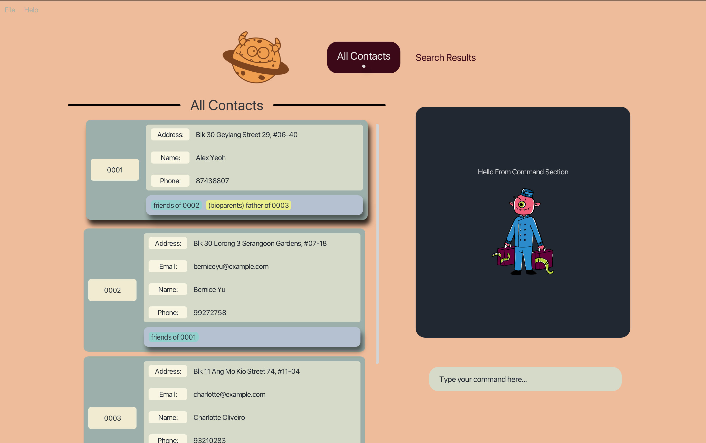
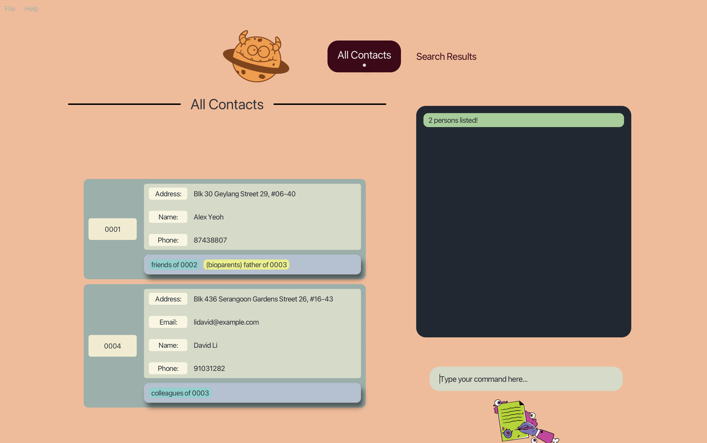

<h1 align="center"><i>GENE-NIE USER GUIDE</i></h1>

Gene-nie is our address book reimagined. It is a desktop app able to not only manage your contacts, but also to help you 
keep track of the relationships between them. Gene-nie acts as your personal autobiographer, helping you manage your
the relationship tree and history of friends and family.

## Table of Contents

- [Quick Start](#quick-start)
- [Managing Person Profiles](#features---managing-person-profiles)
    - [Listing all persons](#listing-all-persons--list)
    - [Adding a person](#adding-a-person--add)
    - [Locating persons by name](#locating-persons-by-name--find)
    - [Adding an Attribute](#adding-an-attribute--addattribute)
    - [Editing an Attribute](#editing-an-attribute--editattribute)
    - [Deleting an Attribute](#deleting-an-attribute--deleteattribute)
    - [Deleting a Person](#deleting-a-person--delete)
- [Managing Person Relationships](#features---managing-person-relationships)
    - [Listing all relationship types](#listing-all-relationship-types--listrelations)
    - [Adding a Relationship](#adding-a-relationship--addrelation)
    - [Editing a Relationship](#editing-a-relationship--editrelation)
    - [Deleting a Relationship](#deleting-a-relationship--deleterelation)
    - [Finding Relationship between Entities](#finding-relationship-between-entities--anysearch)
- [Clearing All Persons](#features---clearing-all-persons)
    - [Clearing all entries](#clearing-all-entries--clear)
- [General Features](#features---general-features)
    - [Viewing Help](#viewing-help--help)
    - [Clearing all Entries](#clearing-all-entries--clear)
    - [Exiting the Program](#exiting-the-program--exit)
- [FAQ](#faq)
- [Known Issues](#known-issues)
- [Command Summary](#command-summary)

## Quick start

1. Ensure you have Java `11` or above installed in your Computer.

1. Download the latest `Gene-nie.jar` from [here](https://github.com/AY2324S2-CS2103T-T11-1/tp/releases).

1. Copy `Gene-nie.jar` to a convenient folder on your computer, using your file explorer. This will be referred to as Gene-nie's _home folder_.

:bulb: **Tip:**
To ensure a smooth experience, it is recommended to keep the `gene-nie.jar` file in a dedicated folder, with no other files in it.

4. Open a command terminal in the _home folder_ (see OS-specific instructions below), and type `java -jar Gene-nie.jar` to run Gene-nie. 

:question: **for Linux users:**
In your terminal, type `cd (path)`, replacing `(path)` with the _home folder_ path.

:question: **for Windows users:**
Navigate to the _home folder_ in File Explorer, then type `cmd` in the address bar and press Enter.

:question: **for MacOS users:**
Navigate to the _home folder_ in Finder, then right-click and select "New Terminal at Folder".

   A window similar to the below should appear in a few seconds. Note how the app contains some sample data. 
   

5. Type the command in the command box and press Enter to execute it. e.g. typing **`help`** and pressing Enter will open the help window. 
   Some example commands you can try:

   * `list` : Lists all contacts.

   * `add /Name John Doe /Phone 98765432 /Email johnd@example.com /Address John street, block 123, #01-01` : Adds a contact with the specified attributes to the Address Book.

   * `delete /0001` : Deletes the contact with the `UUID` "0001".
   
   * `addAttribute /12db /Pet Dog` : Adds the attribute Pet with the value Dog to the person with the `UUID` "12db".
   
   * `deleteAttribute /12db /Pet` : Deletes the attribute Pet from the person with the `UUID` "12db".

   * `addRelation /12db parent /34ab child /bioparents` : Adds the relation bioparents between the person with the `UUID` "12db" and the person with the `UUID` "34ab" with the roles parent and child respectively.

   * `editRelation /12db /34ab /friends /colleagues` : Edits the relation between the person with the `UUID` "12db" and the person with the `UUID` "34ab" from friends to colleagues.

   * `deleteRelation /12db /34ab /friend` : Deletes the relation friend between the person with the `UUID` "12db" and the person with the `UUID` "34ab".

   * `clear` : Removes all of Gene-nie's previous responses from the command section, so that you dont have to see them anymore!

   * `deleteAllPersons` : When you are done with experimenting with the sample data, you can delete all the persons in Gene-nie to begin building your own contacts list!

:warning::warning::warning: **Warning:**
Be careful when using this command with your own data as it will delete all your contacts!

   * `exit` : Exits the app. All your contacts will be saved for when you next return.

6. Refer to the [Features](#features---managing-person-profiles) below for details of each command.

[Back to Table of Contents](#table-of-contents)

--------------------------------------------------------------------------------------------------------------------

## Command Format

**:information_source: Notes about the command format:** 

* Words in `UPPER_CASE` are the parameters to be supplied by the user. 
  e.g. in `add /Name NAME`, `NAME` is a parameter which can be used as `add /Name John Doe`.

* Items in square brackets are optional. 
  e.g. `/NAME name [/Phone PHONE]` can be used as `/NAME John Doe /Phone 98765432` or as `/NAME name`.

* Items with `…`​ after them can be used multiple times including zero times. 
  e.g. `[/ATTRIBUTENAME ATTRIBUTEVALUE]…​` can be used as ` ` (i.e. 0 times), `/Name John Doe`, `/Name John Doe /Phone 98765432` etc.

* Extraneous parameters for commands that do not take in parameters (such as `help`, `list`, `exit` and `clear`) will be ignored. 
  e.g. if the command specifies `help 123`, it will be interpreted as `help`.

* The add attribute command is case-insensitive. The attribute name is case-insensitive for defined attributes like Name or Address, but the attribute name for user defined attributes is case-sensitive.

* The delete attribute command is case-sensitive. It must match the attribute name exactly.

* All relationship commands are case-sensitive (must be in lower-case). It must match the relationship type name exactly.

* If you are using a PDF version of this document, be careful when copying and pasting commands that span multiple lines as space characters surrounding line-breaks may be omitted when copied over to the application.

[Back to Table of Contents](#table-of-contents)

--------------------------------------------------------------------------------------------------------------------

## Features - Managing Person Profiles

### Listing all persons : `list`

Shows a list of all persons in the address book.

Format: `list`

### Adding a person: `add`

Adds a person to the address book.

Format: `add [/ATTRIBUTENAME ATTRIBUTEVALUE]…​`

:bulb: **Tip:**
A person can have any number of attributes (including 0)

Examples:
* `add /Name John Doe /Phone 98765432 /Email johnd@example.com /Address John street, block 123, #01-01`
* `add /Name Betsy Crowe /Email betsycrowe@example.com /Address Newgate Prison /Phone 1234567 /Occupation criminal`

### Locating persons by name: `find`

Finds persons whose names contain any of the given keywords.

Format: `find /KEYWORD [MORE_KEYWORDS]`

* The search is case-insensitive. e.g. `hans` will match `Hans`
* The order of the keywords does not matter. e.g. `Hans Bo` will match `Bo Hans`
* Only the name is searched.
* Only full words will be matched e.g. `Han` will not match `Hans`
* Persons matching at least one keyword will be returned (i.e. `OR` search).
  e.g. `/Hans /Bo` will return `Hans Gruber`, `Bo Yang`
* Persons matching both keywords can also be returned (i.e. 'AND' search).
  e.g. `/Hans Gruber` will return `Hans Gruber`

Examples:
* `find /John` returns `john` and `John Doe`
* `find /alex david` returns only `Alex David` 
* `find /alex /david` returns `Alex Yeoh`, `David Li` 
  

### Adding an attribute : `addAttribute`

Adds an attribute to a person in the address book.

Format: `addAttribute /UUID /ATTRIBUTE_NAME ATTRIBUTE_VALUE`

* Adds the attribute with the specified `ATTRIBUTE_NAME` and `ATTRIBUTE_VALUE` to the person with the specified `UUID`.
* The `UUID` refers to the unique identifier of the person shown in the displayed person list.
* The `UUID` **must be a valid UUID**.
* The `ATTRIBUTE_NAME` is case-insensitive. The attribute name will automatically be converted to the correct case. The attribute name will be converted to having all lowercase after the first letter being capitalized. e.g. `/pEt` will be converted to `Pet`.
* The `ATTRIBUTE_VALUE` is case-sensitive.

Examples:
* `addAttribute /12db /Pet Dog` adds the attribute Pet with the value Dog to the person with the UUID 12db.
* `addAttribute /12db /Pet Cat` adds the attribute Pet with the value Cat to the person with the UUID 12db.
* `addAttribute /12db /pet Dog` adds the attribute pet with the value Dog to the person with the UUID 12db.
* `addAttribute /12db /Pet dog` adds the attribute Pet with the value dog to the person with the UUID 12db.

### Deleting an attribute : `deleteAttribute`

Deletes an attribute from a person in the address book.

Format: `deleteAttribute /UUID /ATTRIBUTE_NAME`

* Deletes the attribute with the specified `ATTRIBUTE_NAME` from the person with the specified `UUID`.
* The `UUID` refers to the unique identifier of the person shown in the displayed person list.
* The `UUID` **must be a valid UUID**.
* The `ATTRIBUTE_NAME` is case-sensitive.
* If the person does not have the specified attribute, the command will not have any effect.
* If the person does not exist, the command will not have any effect.
* If the attribute does not exist, the command will not have any effect.

Examples:
* `deleteAttribute /12db /Pet` deletes the attribute Pet from the person with the UUID 12db.
* `deleteAttribute /12db /pet` does not delete the attribute Pet from the person with the UUID 12db but will delete the attribute pet.

### Editing an attribute : `editAttribute`

Edit attributes of a person in the address book.

Format: `editAttribute /UUID /ATTRIBUTE_NAME NEW_ATTRIBUTE_VALUE [/ATTRIBUTENAME ATTRIBUTEVALUE]…​`

* Edits the attribute with the specified `ATTRIBUTE_NAME` to have the `NEW_ATTRIBUTE_VALUE` for the person with the specified `UUID`.
* The `UUID` refers to the unique identifier of the person shown in the displayed person list.
* The `UUID` **must be a valid UUID**.
* The `ATTRIBUTE_NAME` is case-sensitive.
* The `NEW_ATTRIBUTE_VALUE` is case-sensitive.
* If the person does not have the specified attribute, the command will not have any effect.
* If the person does not exist, the command will not have any effect.
* If the attribute is of a different type, the command will fail and throw an error. E.g. if the attribute is of type Integer, and the new value is a String, the command will fail.

Examples:
* `editAttribute /12db /Pet Cat` edits the attribute Pet to have the value Cat for the person with the UUID 12db.

### Deleting a person : `delete`

Deletes the specified person from the address book.

Format: `delete /UUID`

* Deletes the person with the specified `UUID`.
* The `UUID` refers to the unique identifier of the person shown in the displayed person list.
* The `UUID` **must be a valid UUID**.
* If the `UUID` does not exist, the command will not have any effect.

Examples:
* `delete /12db` deletes the person with the `UUID` "12db".
* `delete /1` does not delete the person with the `UUID` "5964" as the `UUID` is not valid.

[Back to Table of Contents](#table-of-contents)

--------------------------------------------------------------------------------------------------------------------

## Features - Managing Person Relationships

### Listing all relationship types : `listRelations` or `lr`

Shows a list of all current relationshipTypes in the address book.

Format: `listRelations` or `lr`

* The command word is not case-sensitive.

### Adding a relationship : `addRelation` or `ar`

Adds a roleless relationship between two people in the address book.

Format: `addRelation /UUID1 /UUID2 /RELATIONSHIP_TYPE`

* The command word and `RELATIONSHIP_TYPE` are not case-sensitive.
* Adds the roleless relationship between the person with the specified `UUID1` and the person with the specified `UUID2`.
* The `UUID1` and `UUID2` refer to the unique identifiers of the persons shown in the displayed person list.
* The `UUID1` and `UUID2` **must be valid UUIDs**.
* The `RELATIONSHIP_TYPE` **must be a String** but can be more than one word.
* If the relationship already exists, the command will not have any effect.
* If either persons do not exist, the command will not have any effect.
* If the `RELATIONSHIP_TYPE` does not exist and is valid, it will be added to the existing list of relationTypes.

Examples:
* `addRelation /12db /34ab /friend` adds the relation friend between the person with the `UUID` "12db" and the person with the `UUID` "34ab".

Adds a role-based relationship between two people in the address book.

Format: `addRelation /UUID1 ROLE1 /UUID2 ROLE2 /RELATIONSHIP_TYPE`

* The command word, `RELATIONSHIP_TYPE`, `ROLE1` and `ROLE2` are not case-sensitive.
* Adds the role-based relationship between the person with the specified `UUID1` and the person with the specified `UUID2` with roles `ROLE1` and `ROLE2` respectively.
* The `UUID1` and `UUID2` refer to the unique identifiers of the persons shown in the displayed person list.
* The `UUID1` and `UUID2` **must be valid UUIDs**.
* The `RELATIONSHIP_TYPE`, `ROLE1` and `ROLE2` **must be Strings**.
* The `RELATIONSHIP_TYPE` can be more than one word.
* The `ROLE1` and `ROLE2` can only be one word.
* If the relationship already exists, the command will not have any effect.
* If either persons do not exist, the command will not have any effect.
* If the `ROLE1` or `ROLE2` does not exist for the `RELATIONSHIP_TYPE`, the command will not have any effect.
* If the `RELATIONSHIP_TYPE` does not exist, it will be added to the existing list of relationTypes.

Examples:
* `addRelation /12db father /34ab child /bioparents` adds the relation bioparents between the person with the UUID 12db and the person with the UUID 34ab with the roles parent and child respectively.

**:exclamation: Caution:**  
* The `RELATIONSHIP_TYPE` "family" is not allowed. The address book will throw an error asking the user to be more specific about the family relation. 
* The correct way to do this is to enter the exact family relation (bioparents, siblings or spouses) as the `RELATIONSHIP_TYPE`.

### Editing a relationship : `editRelation` or `er`

Edits the relationship between two people in the address book to a roleless relationship.

Format: `editRelation /UUID1 /UUID2 /OLD_RELATIONSHIP_TYPE /NEW_RELATIONSHIP_TYPE`

* The command word, `OLD_RELATIONSHIP_TYPE` and `NEW_RELATIONSHIP_TYPE` are not case-sensitive.
* Edits the relationship between the person with the specified `UUID1` and the person with the specified `UUID2` to the new relationship type.
* The `UUID1` and `UUID2` refer to the unique identifiers of the persons shown in the displayed person list.
* The `UUID1` and `UUID2` **must be valid UUIDs**.
* The `OLD_RELATIONSHIP_TYPE` and `NEW_RELATIONSHIP_TYPE` **must be Strings**, but can be more than one word.
* If the relationship to be edited from does not exist, the command will not have any effect.
* If the relationship to be edited to already exists, the command will not have any effect.
* If either persons do not exist, the command will not have any effect.
* If either relationship types do not exist, the command will not have any effect.
* If the `NEW_RELATIONSHIP_TYPE` does not exist, it will be added to the existing list of relationTypes.

Examples:
* `editRelation /12db /34ab /friends /colleagues` edits the relation between the person with the `UUID` "12db" and the person with the `UUID` "34ab" from friends to colleagues.

Edits the relationship between two people in the address book to a role-based relationship.

Format: `editRelation /UUID1 ROLE1 /UUID2 ROLE2 /OLD_RELATIONSHIP_TYPE /NEW_RELATIONSHIP_TYPE`

* The command word, `OLD_RELATIONSHIP_TYPE`, `NEW_RELATIONSHIP_TYPE`, `ROLE1` and `ROLE2` are not case-sensitive.
* Edits the relationship between the person with the specified `UUID1` and the person with the specified `UUID2`.
* The `UUID1` and `UUID2` refer to the unique identifiers of the persons shown in the displayed person list.
* The `UUID1` and `UUID2` **must be valid UUIDs**.
* The `OLD_RELATIONSHIP_TYPE`,`NEW_RELATIONSHIP_TYPE`, `ROLE1` and `ROLE2` **must be Strings**.
* The `OLD_RELATIONSHIP_TYPE` and `NEW_RELATIONSHIP_TYPE` can be more than one word.
* The `ROLE1` and `ROLE2` can only be one word.
* If the relationship to be edited from does not exist, the command will not have any effect.
* If the relationship to be edited to already exists, the command will not have any effect.
* If either persons do not exist, the command will not have any effect.
* If either relationship types do not exist, the command will not have any effect.
* If the `NEW_RELATIONSHIP_TYPE` does not exist, it will be added to the existing list of relationTypes.

Examples:
* `editRelation /12db parent /34ab child /friends /bioparents` edits the relation between the person with the UUID 12db and the person with the UUID 34ab from friends to bioparents with the roles parent and child respectively.

### Deleting a relationship : `deleteRelation` or `dr`

Deletes the relationship between two people in the address book.

Format: `deleteRelation /UUID1 /UUID2 /RELATIONSHIP_TYPE`

* The command word and `RELATIONSHIP_TYPE` are not case-sensitive.
* Deletes the relationship between the person with the specified `UUID1` and the person with the specified `UUID2`.
* The `UUID1` and `UUID2` refer to the unique identifiers of the persons shown in the displayed person list.
* The `UUID1` and `UUID2` **must be valid UUIDs**.
* The `RELATIONSHIP_TYPE` **must be a String**, but can be more than one word.
* If the specified relationship to be deleted does not exist, the command will not have any effect.
* If either persons do not exist, the command will not have any effect.

Examples:
* `deleteRelation /12db /34ab friend` deletes the relation friend between the person with the UUID 12db and the person with the UUID 34ab.

Deletes the relationType from the list of existing relationTypes.

Format: `deleteRelation /RELATIONSHIP_TYPE`

* Deletes the specific `RELATIONSHIP_TYPE` from the list of existing relationTypes.
* The `RELATIONSHIP_TYPE` **must be a String**, but can be more than one word.
* If the specified `RELATIONSHIP_TYPE` does not exist, the command will not have any effect.
* If an existing relationship uses the specified `RELATIONSHIP_TYPE`, the command will not have any effect.

Examples:
* `deleteRelation /workmates` deletes the relationType workmates from the list of existing relationTypes.

### Finding All Relationships between Entities: `anySearch`

Finds the relationship pathway between 2 input entities.

Format: `anySearch /ORIGINUUID /TARGETUUID`

> [!IMPORTANT]
> Valid Input UUIDs only include the last 4 digits of a UUID containing only alphanumeric characters

* The search is case-sensitive, '10cb' and '10CB' are considered different UUID
* If there exists at least one relationship between `ORIGINUUID` and `TARGETUUID` the relationship pathway will be returned, 
else `No Relationship Pathway Found` will be returned
    - Example: `anySearch /10cb /980c` suppose 980c is the friend of 10cb mother, `anySearch` will then return the descriptor
`10cb -> (bioParents) child of --> 5964 --> friends of --> 980c`
    - Example: `anySearch /10cb /867d` suppose 867d is not related to 10cb at all, then `anySearch` returns `No Relationship Pathway Found`
* The command is order-sensitive `anySearch /10cb /987d` can potentially return a different result from `anySearch /987d /10cb`
  * Example: `anySearch 10cb 980c` suppose the search above returns `10cb -> (bioParents) child of --> 5964 --> friends of --> 980c` then `anySearch /867d /10cb`
    returns `980c -> friends of --> 5964 --> (bioParents) mother of --> 10cb` since relationships are bidirectional

### Finding Family Relationships between Entities: `familySearch`

Finds the family relationship pathway between 2 input entities.

Format: `familySearch /ORIGINUUID /TARGETUUID`

> [!IMPORTANT]
> Valid Input UUIDs only include the last 4 digits of a UUID containing only alphanumeric characters

* The search is case-sensitive, '10cb' and '10CB' are considered different UUID
* If there exists a family relationship between `ORIGINUUID` and `TARGETUUID` the relationship descriptor will be returned, 
else `No Relationship Pathway Found` will be returned
    - Example: `familySearch /10cb /980c` suppose 980c is the grandfather of 10cb, `familySearch` will then return the descriptor
`10cb -> (bioParents) child of --> 5964 --> (bioParents) child of --> 980c`
    - Example: `familySearch /10cb /867d` suppose 867d has no family relation to 10cb, then `familySearch` returns `No Relationship Pathway Found`
* The command is order-sensitive `familySearch 10cb 987d` can potentially return a different result from `familySearch 987d 10cb`
  * Example: `familySearch 10cb 980c` suppose the search above returns `10cb -> (bioParents) child of --> 5964 --> (bioParents) child of --> 980c` then `familySearch 867d 10cb`
      returns `980c -> (bioParents) father of --> 5964 --> (bioParents) father of --> 10cb` since relationships are bidirectional

[Back to Table of Contents](#table-of-contents)

--------------------------------------------------------------------------------------------------------------------

## Features - General Features

### Viewing help : `help`

Shows a message explaning how to access the help page.

Format: `help`

### Clearing all entries : `clear`

Clears all entries from the address book.

Format: `clear`

### Exiting the program : `exit`

Exits the program.

Format: `exit`

### Saving the data

Gene-nie data is saved in the hard disk automatically after any command that changes the data. There is no need to save manually.

### Editing the data file

Gene-nie data is saved automatically as a JSON file `[JAR file location]/data/addressbook.json`. Advanced users are welcome to update data directly by editing that data file.

:exclamation: **Caution:**
If your changes to the data file makes its format invalid, Gene-nie will discard all data and start with an empty data file at the next run. Hence, it is recommended to take a backup of the file before editing it. 
Furthermore, certain edits can cause Gene-nie to behave in unexpected ways (e.g., if a value entered is outside of the acceptable range). Therefore, edit the data file only if you are confident that you can update it correctly.

[Back to Table of Contents](#table-of-contents)

--------------------------------------------------------------------------------------------------------------------

## FAQ

**Q**: How do I install Java 11, the Java version required by Gene-nie? 
**A**: You can download Java 11 from [here](https://www.oracle.com/java/technologies/javase-jdk11-downloads.html).

**Q**: How do I transfer my data to another Computer? 
**A**: Install the app in the other computer and overwrite the empty data file it creates with the file that contains the data of your previous AddressBook home folder.

**Q**: Do I need an active internet connection to use Gene-nie? 
**A**: You can use Gene-nie offline, but you'll need an internet connection to download it to your device.

[Back to Table of Contents](#table-of-contents)

--------------------------------------------------------------------------------------------------------------------

## Known issues

1. **When using multiple screens**, if you move the application to a secondary screen, and later switch to using only the primary screen, the GUI will open off-screen. The remedy is to delete the `preferences.json` file created by the application before running the application again.

[Back to Table of Contents](#table-of-contents)

--------------------------------------------------------------------------------------------------------------------

## Glossary

| Term      | Description                                                                                                                                                                                                                                                                                            |
|-----------|--------------------------------------------------------------------------------------------------------------------------------------------------------------------------------------------------------------------------------------------------------------------------------------------------------|
| UUID      | **Universally Unique Identifier:** A code used to represent a person. Every person in your contacts list has a unique UUID.                                                                                                                                                                            |
| CLI       | **Command Line Interface (CLI):** A text-based interface that allows users to interact with a computer or software by entering text commands. It's often preferred by power users and developers for its efficiency and scriptability.                                                                 |
| Field     | **Field:** In the context of data, a field refers to a specific piece of information within a record or data structure. Fields are used to organise and store data in a structured manner, and they are often associated with a particular type or attribute.                                          |
| GUI       | **Graphical User Interface (GUI):** A user interface that utilises graphical elements such as icons, buttons, windows, and menus to allow users to interact with software or applications. GUIs are known for their visual appeal and user-friendliness.                                               |
| Integer   | **Integer:** In computer programming, an integer is a whole number without a fractional or decimal component. Integers are used to represent whole quantities in mathematics and computer science. They can be positive, negative, or zero.                                                            |
| JAR       | **JAR (Java ARchive):** A file format used for aggregating multiple files (typically Java class files, metadata, and resources) into a single compressed archive. JAR files are commonly used to package and distribute Java applications or libraries.                                                |
| JSON      | **JSON (JavaScript Object Notation):** A lightweight data interchange format that is easy for humans to read and write, and easy for machines to parse and generate. JSON is commonly used for data storage and exchange in web applications. It consists of key-value pairs enclosed in curly braces. |
| Parameter | **Parameter:** In the context of software, a parameter is a variable or value that is passed into a function, method, or command. Parameters are used to customise the behavior of the function or command.                                                                                            |

[Back to Table of Contents](#table-of-contents)

--------------------------------------------------------------------------------------------------------------------

## Command summary

| Action                      | Shorthand | Format, Examples                                                                                                                                    |
|-----------------------------|-----------|-----------------------------------------------------------------------------------------------------------------------------------------------------|
| **Add Person**              | a         | `add /ATTRIBUTE_NAME ATTRIBUTE_VALUE [/ATTRIBUTE_NAME ATTRIBUTE_VALUE] ...`   e.g., `add /Name Bob /Phone 01010101 /Address 123 Computing Drive` |
| **Delete Person**           | d         | `delete /UUID`  e.g., `delete /3k83`                                                                                                             |
| **Add Person Attribute**    | aa        | `addAttribute /UUID /ATTRIBUTE_NAME ATTRIBUTE_VALUE [/ATTRIBUTE_NAME ATTRIBUTE_VALUE] ...`  e.g., `addAttribute /12db /Pet Dog`                  |
| **Delete Person Attribute** | da        | `deleteAttribute /UUID /ATTRIBUTE_NAME  [/ATTRIBUTE_NAME] ...`  e.g., `deleteAttribute /12db /Pet /Address`                                      |
| **Edit Person Attribute**   | ea        | `editAttribute /UUID /ATTRIBUTE_NAME NEW_ATTRIBUTE_VALUE [/ATTRIBUTE_NAME NEW_ATTRIBUTE_VALUE] ...`  e.g., `editAttribute /12db /Pet Cat`        |
| **Add Relation**            | ar        | `addRelation /UUID1 /UUID2 /RELATION_TYPE`  e.g., `addRelation /12db /3dab /friends`                                                             |
| **Edit Relation**           | er        | `editRelation /UUID1 /UUID2 /OLD_RELATION_TYPE /NEW_RELATION_TYPE`  e.g., `editRelation /12db /3dab friends colleagues`                          |
| **Delete Relation**         | dr        | `deleteRelation /UUID1 /UUID2 /RELATION_TYPE`  e.g., `deleteRelation /12db /3dab friends`                                                        |
| **Find**                    | f         | `find /PHRASE [/MORE_PHRASES] ...`  e.g., `find James Jake`                                                                                      |
| **List All Persons**        | l         | `list`                                                                                                                                              |
| **anySearch**               | as        | `anySearch /originUUID /targetUUID`  e.g., `anySearch /10cb /987d`                                                                               |
| **familySearch**            | fs        | `familySearch /originUUID /targetUUID`  e.g., `familySearch /10cb /987d`                                                                         |
| **Help**                    | h         | `help`                                                                                                                                              |
| **Exit App**                | e         | `exit`                                                                                                                                              |
| **Clear Command Responses** | c         | `clear`                                                                                                                                             |
| **Delete all Persons**      | dap       | `deleteAllPersons`                                                                                                                                  |

[Back to Table of Contents](#table-of-contents)
