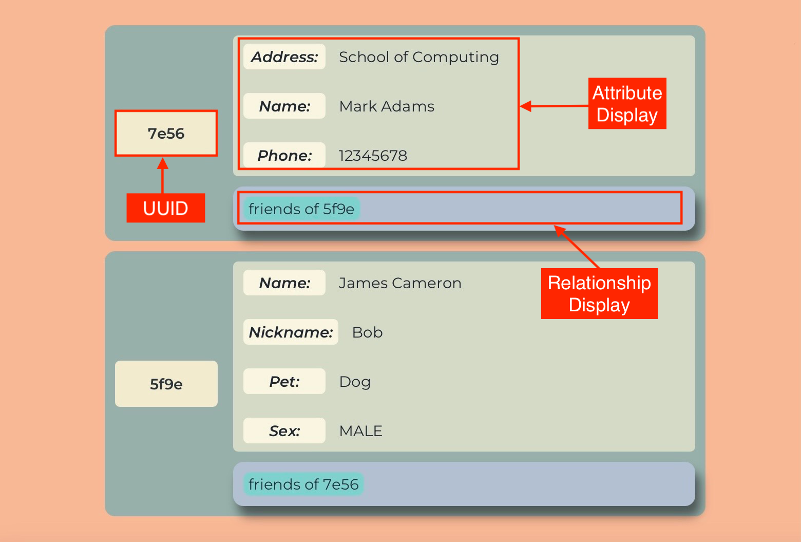

Hello There my fellow budding genealogists!! It looks like you have found me, The  Gene-nie. 
I bet you are eager to command me around, after all, I work magic. Who am I, you may ask?

Well, I am your personal genealogy assistant! Are you curious about me and how I work?

Well then, we welcome you to this user guide, where we demystify the magic of Gene-nie and help you start your genealogy journey!

    <h2><a href="#table-of-contents" id="table-of-contents">Table of Contents</a></h2>
<ul>
  <li><a href="#introduction">Introduction</a></li>
  <li><a href="#using-this-guide">Using this guide</a></li>
  <li><a href="#quick-start">Quick Start</a></li>
  <li><a href="#user-interface">User Interface</a></li>
  <li><a href="#using-the-command-line-interface--cli-">Using the Command Line Interface (CLI)</a></li>
  <li><a href="#command-format">Command Format</a></li>
  <li><a href="#tutorial">Tutorial</a></li>
  <li>
<a href="#features">Features</a>
    <ul>
      <li><a href="#persons">Persons</a></li>
      <li><a href="#attributes">Attributes</a></li>
      <li><a href="#relationships">Relationships</a></li>
    </ul>
  </li>
  <li>
<a href="#features---managing-persons">Features - Managing Person Profiles</a>
    <ul>
      <li><a href="#listing-all-persons--list-or-l">Listing all Persons: <code class="language-plaintext highlighter-rouge">list</code>/<code class="language-plaintext highlighter-rouge">l</code></a></li>
      <li><a href="#adding-a-person--add-or-a">Adding a person: <code class="language-plaintext highlighter-rouge">add</code>/<code class="language-plaintext highlighter-rouge">a</code></a></li>
      <li><a href="#locating-persons-by-details--find-or-f">Locating persons by details: <code class="language-plaintext highlighter-rouge">find</code>/<code class="language-plaintext highlighter-rouge">f</code></a></li>
      <li><a href="#deleting-a-person--delete-or-d">Deleting a Person: <code class="language-plaintext highlighter-rouge">delete</code>/<code class="language-plaintext highlighter-rouge">d</code></a></li>
    </ul>
  </li>
  <li>
<a href="#features---managing-attributes-of-persons">Features - Managing Attributes of Persons</a>
    <ul>
      <li><a href="#adding-attributes-to-a-person--addattribute-or-aa">Adding an Attribute: <code class="language-plaintext highlighter-rouge">addAttribute</code>/<code class="language-plaintext highlighter-rouge">aa</code></a></li>
      <li><a href="#deleting-an-attribute-from-a-person--deleteattribute-or-da">Deleting an Attribute: <code class="language-plaintext highlighter-rouge">deleteAttribute</code>/<code class="language-plaintext highlighter-rouge">da</code></a></li>
      <li><a href="#editing-an-attribute-of-a-person--editattribute-or-ea">Editing an Attribute: <code class="language-plaintext highlighter-rouge">editAttribute</code>/<code class="language-plaintext highlighter-rouge">ea</code></a></li>
    </ul>
  </li>
  <li>
<a href="#features---managing-person-relationships">Managing Person Relationships</a>
    <ul>
      <li><a href="#listing-all-relationship-types--listrelations-or-lr">Listing all relationship types: <code class="language-plaintext highlighter-rouge">listRelations</code>/<code class="language-plaintext highlighter-rouge">lr</code></a></li>
      <li><a href="#adding-a-relationship--addrelation-or-ar">Adding a Relationship: <code class="language-plaintext highlighter-rouge">addRelation</code>/<code class="language-plaintext highlighter-rouge">ar</code></a></li>
      <li><a href="#editing-a-relationship--editrelation-or-er">Editing a Relationship: <code class="language-plaintext highlighter-rouge">editRelation</code>/<code class="language-plaintext highlighter-rouge">er</code></a></li>
      <li><a href="#deleting-a-relationship--deleterelation-or-dr">Deleting a Relationship: <code class="language-plaintext highlighter-rouge">deleteRelation</code>/<code class="language-plaintext highlighter-rouge">dr</code></a></li>
      <li><a href="#finding-all-relationships-between-entities--anysearch-or-as">Finding All Relationship between Entities: <code class="language-plaintext highlighter-rouge">anySearch</code>/<code class="language-plaintext highlighter-rouge">as</code></a></li>
      <li><a href="#finding-family-relationships-between-entities--familysearch-or-fs">Finding Family Relationships between Entities: <code class="language-plaintext highlighter-rouge">familySearch</code>/<code class="language-plaintext highlighter-rouge">fs</code></a></li>
    </ul>
  </li>
  <li>
<a href="#features---general-features">General Features</a>
    <ul>
      <li><a href="#viewing-help--help-or-h">Viewing Help: <code class="language-plaintext highlighter-rouge">help</code>/<code class="language-plaintext highlighter-rouge">h</code></a></li>
      <li><a href="#clearing-all-entries--deleteallpersons-or-dap">Clearing all Entries: <code class="language-plaintext highlighter-rouge">deleteAllPersons</code>/<code class="language-plaintext highlighter-rouge">dap</code></a></li>
      <li><a href="#clearing-command-section-of-past-responses--clear-or-c">Clearing Command Responses: <code class="language-plaintext highlighter-rouge">clear</code>/<code class="language-plaintext highlighter-rouge">c</code></a></li>
      <li><a href="#exiting-the-program--exit-or-e">Exiting the Program: <code class="language-plaintext highlighter-rouge">exit</code>/<code class="language-plaintext highlighter-rouge">e</code></a></li>
      <li><a href="#saving_the_data">Saving the Data</a></li>
      <li><a href="#editing_the_data">Editing the Data file</a></li>
    </ul>
  </li>
  <li><a href="#faq">FAQ</a></li>
  <li><a href="#known-issues">Known Issues</a></li>
  <li><a href="#coming-soon">Coming Soon</a></li>
  <li><a href="#glossary">Glossary</a></li>
  <li><a href="#command-summary">Command Summary</a></li>
</ul>

    <h2><a href="#introduction" id="introduction">Introduction</a></h2>

Do you face issues trying to keep track of all your friends and family? Do you find it hard to remember who is related to who? Do you face issues trying to add people into your family tree with missing information? Fret not! 
Gene-nie here will magic away your issues!

Through the magic of Gene-nie you are able to
* manage all your contacts through Gene-nie 
* keep track of the relationships between not only you but your also your contacts 
* input and remember small details of each contact
* manage your relationship tree and history of friends and family
* and much more!
You absolutely won't regret choosing me. I am here to help you with all your genealogy needs!

Gene-nie is a desktop app for managing your contacts, built for use via a Command Line Interface ([CLI](#glossary)). 

[Back to Table of Contents](#table-of-contents)

--------------------------------------------------------------------------------------------------------------------

    <h2><a href="#using-this-guide" id="using-this-guide">Using This Guide</a></h2>

Whether you are an expert genealogist or a budding enthusiast, this guide will help you get started with Gene-nie.

We will walk you through every step, from the basics of adding a person and their relationships to advanced features that will enchant you in your journey of genealogy.

Novice Users:
* If you are new to genealogy, we recommend you start with the [Quick Start](#quick-start) section.
* This section will guide you through the installation process and provide you with a quick overview of the app's features.

Amateur Users:
* If you are familiar with genealogy, you can skip the [Quick Start](#quick-start) section and proceed to the [Features](#features) section.
* This section will provide you with a detailed explanation of the app's features and how to use them.

Advanced Users:
* If you are an expert genealogist, you can skip the [Features](#features) section and proceed to the [Command Summary](#command-summary) section.
* This section will provide you with a quick summary of all the commands available in Gene-nie.

If you encounter any issues or have any questions, please refer to the [FAQ](#faq) section. You may also refer to the [Known Issues](#known-issues) section for any known bugs or limitations of the app. You are also welcome to contact us at Gene-nie@gmail.com for any further assistance.

Additionally, there will be symbols to help you navigate through this guide:

:bulb: **Tip:** This symbol will provide you with tips and tricks to help you use Gene-nie more effectively. 

:exclamation: **Caution:** This symbol will provide you with warnings and cautionary notes to help you avoid common pitfalls. 

:information_source: **Information:** This symbol will provide you with additional information to help you understand the app better. 

|             Text Formatting              | Meaning                                                       |
|:----------------------------------------:|---------------------------------------------------------------|
| [Hyperlink to Header](#using-this-guide) | Clickable hyperlink to navigate to another section            |
|              `command text`              | Text relevant to Gene-nie's user commands and executable file |

[Back to Table of Contents](#table-of-contents)

--------------------------------------------------------------------------------------------------------------------

    <h2><a href="#quick-start" id="quick-start">Quick Start</a></h2>

Ah, I see that you are excited to command me... Let me show you how to make me work my magic quickly!!

1. Ensure you have Java `11` or above installed in your Computer. If not, see [FAQ](#faq) for instructions on how to install Java.

2. Download the latest [JAR](#glossary) file `Gene-nie.jar` from [here](https://github.com/AY2324S2-CS2103T-T11-1/tp/releases). The file can be found under the “Assets” section of the page as seen in the image below.

    

        <figure>
            
            <figcaption class="img_container_figCaption">Figure 1: Download Location</figcaption>
        </figure>
    

3. Copy `Gene-nie.jar` to a convenient folder on your computer, using your file explorer. This will be referred to as Gene-nie's _home folder_.

4. Open a command terminal in the _home folder_ (see OS-specific instructions below), and type `java -jar Gene-nie.jar` to run Gene-nie. An example is shown below.

    <figure>
        
        <figcaption class="img_container_figCaption">Figure 2: Terminal Window Running Command</figcaption>
    </figure>

:bulb:
To ensure a smooth experience, it is recommended to keep the `Gene-nie.jar` file in a dedicated folder, with no other files in it.

:information_source: **for Linux users:**
In your terminal, type `cd (path)`, replacing `(path)` with the _home folder_ path.

:information_source: **for Windows users:**
Navigate to the _home folder_ in File Explorer, then type `cmd` in the address bar and press Enter.

:information_source: **for MacOS users:**
Navigate to the _home folder_ in Finder, then right-click and select "New Terminal at Folder".

A window similar to the below should appear in a few seconds. Note how the app contains some sample data. 

    <figure>
        
        <figcaption class="img_container_figCaption">Figure 3: Gene-nie User Interface Containing Sample Data</figcaption>
    </figure>

1. Type the command in the command box and press Enter to execute it. e.g. typing **`help`** and pressing Enter will open the help window.

2. Refer to the [Features](#features) below for details of each command.

3. Refer to the [Command Summary](#command-summary) for a quick summary of all commands.

:bulb: **Tip:**
The app will resize and expand initially to fit the size of your screen. You can resize the app window to your liking. However, we recommend the app to be fullscreen for the best experience!

*Congratulations! You have successfully set up Gene-nie and are ready to start managing your contacts! But before we leave you, let us quickly run through the Command Line Interface (CLI).*

[Back to Table of Contents](#table-of-contents)

--------------------------------------------------------------------------------------------------------------------

    <h2><a href="#user-interface" id="user-interface">User Interface</a></h2>

You look lost, let my friends show you the way that I work!

Gene-nie has a simple and intuitive user interface that is designed to help you manage your contacts with ease. Let's first take a closer look into at the main screen of Gene-nie.

    <figure>
        
        <figcaption class="img_container_figCaption">Figure 4: Gene-nie Main Figure</figcaption>
    </figure>

1. Command Box:

   * The command box is where you can enter your commands to interact with Gene-nie.
   * Type your command and press enter to execute it.
   * You can locate the list of commands to use in the [Command Summary](#command-summary) section.
2. Command Result:

   * The command result panel displays the result of your command.
   * If your command is successful, the result will be displayed in a green card.
   * If your command fails, the result will be displayed in a red card.
3. Person List Panel:

   * The person list panel displays all the contacts you have added to Gene-nie.
   * Each contact is displayed as a card with their details.
   * You can scroll through the contacts using the scroll bar on the right.
4. Menu Bar:

   * The menu bar contains the main menu options for Gene-nie.
   * You can access the help menu and exit the app from the menu bar.
5. Panel Switcher:

   * The panel switcher allows you to switch between different panels in Gene-nie.
   * You can switch between the "All Contacts", "Search Results".

:bulb: **Tip:** You can resize the app window to your liking. We recommend the app to be fullscreen for the best experience!

Now that you are familiar with the main screen of Gene-nie, let us introduce to you the _Search Result Panel_ of Gene-nie!

The Search Result Panel is where you can view the results of your `anySearch` and `familySearch` queries. It displays the contacts that match your search criteria including their relationship pathway. You can view the details of each contact and perform actions on them. Let's take a closer look at the Search Result Panel!

    <figure>
        
        <figcaption class="img_container_figCaption">Figure 5: Gene-nie Search Result</figcaption>
    </figure>

1. Person List Panel:

   * The person list panel displays all the contacts that match your search criteria.
   * Each contact is displayed as a card with their details.
   * You can scroll through the contacts using the scroll bar on the right.
2. Relationship Pathway Display:

   * The relationship pathway displays the relationship between the contacts in the search result.
   * You can view the relationship pathway between the contacts to understand how they are related.
3. CLI Output:

   * The CLI output displays the results of your search query in the CLI.
   * You can view the details of the contacts that match your search criteria.

:bulb: **Tip:** You can switch between the "All Contacts" and "Search Results" panels using the panel switcher.

Having a mastery of the panels in Gene-nie, now we will introduce to you the individual components of the _person card_ in Gene-nie!

The person card is where you can view the details of each contact you have added to Gene-nie. It displays the unique identifier, attributes, and relationships of the contact. Let's take a closer look at the person card!

    <figure>
        
        <figcaption class="img_container_figCaption">Figure 6: Gene-nie Person Card</figcaption>
    </figure>

1. Unique Identifier ([UUID](#glossary)):

   * The unique identifier (UUID) is a 4-character code that is used to identify the contact (case-sensitive).
   * You can view the UUID of the contact on the left of the person card.
2. Attribute Display:

   * The attributes are the details of the contact that you have added to Gene-nie.
   * You can view the attributes of the contact in the right of the person card.
3. Relationship Display:

   * The relationships are the connections between the contact and other contacts in Gene-nie.
   * You can view the relationships of the contact on the bottom of the person card.

Now that you are familiar with the user interface of Gene-nie, let us quickly start you on the magical world of Gene-nie!

[Back to Table of Contents](#table-of-contents)

--------------------------------------------------------------------------------------------------------------------

    <h2>
        <a href="#using-the-command-line-interface--cli-" id="using-the-command-line-interface--cli-">
            Using the Command Line Interface (CLI)
        </a>
    </h2>

I see that you are nervous... Don't be! It is as easy as ABC! 

Gene-nie is a desktop app that uses a Command Line Interface (CLI) for users to interact with the app. CLI is a text-based interface that allows users to input commands and receive responses via typing into our command box!

If you are still worried about using the CLI, let us demystify it for you! In fact, this is all there is to it:

    <figure>
        
        <figcaption class="img_container_figCaption">Figure 7: Using Gene-nie Command Line Interface</figcaption>
    </figure>

Recall that the image above shows you the CLI interface of Gene-nie. 
It is akin to the magic words Aladdin uses to command the Genie! 

You can key in your commands and Gene-nie will respond to your commands *if correct*!

Using CLI offers many advantages, such as:
* If you can _type as fast you can think_, Gene-nie can help you work magic faster!
* It takes up _lesser memory and resources_ compared to a Graphical User Interface ([GUI](#glossary)) app.
* It is _cool_! You can impress your friends with your command-line skills!

However, to make full use of our CLI interface, you need to: 
* Familiarise yourself with the commands available in Gene-nie.
* Ensure you key in the correct commands _accurately_ to get the desired results.

Nevertheless, if you are still unsure about using the CLI, do not worry! Ensure that you follow the [Command Formats](#command-format) below and you will be able to use Gene-nie with ease!

[Back to Table of Contents](#table-of-contents)

--------------------------------------------------------------------------------------------------------------------

    <h2><a href="#command-format" id="command-format">Command Format</a></h2>

Ah, you wish to command me to do your bidding! Fret not! I will show you the way... But make sure to REMEMBER THESE FORMATS OR ELSE!!!!

Notes about the command format:

* Command keywords are case-insensitive.
  e.g. `addAttribute` can be `addattribute`, `ADDATTRIBUTE`, etc.

* Command keywords are have shortcuts that are case-insensitive. Shortcuts can be found in the description of each specific feature below.
  e.g. `addAttribute` can be `aa`, `aA`, etc.

* Words in `UPPER_CASE` are the [parameters](#glossary) to be supplied by the user.
  e.g. in `add /Name NAME`, `NAME` is a parameter which can be used as `add /Name John Doe`.

* Items in square brackets are optional.
  e.g. `/NAME name [/Phone PHONE]` can be used as `/NAME John Doe /Phone 98765432` or as `/NAME name`.

* Items with `…`​ after them can be used multiple times including zero times.
  e.g. `[/ATTRIBUTENAME ATTRIBUTEVALUE]…​` can be used as ` ` (i.e. 0 times), `/Name John Doe`, `/Name John Doe /Phone 98765432` etc.

* Extraneous parameters for commands that do not take in parameters (such as `help`, `list`, `exit` and `clear`) will be ignored.
  e.g. if the command specifies `help 123`, it will be interpreted as `help`.

* Extraneous characters before the specificed paramters for commands that take in parameters will be ignored.
  e.g. if the command specifies `addAttribute aaa /1234 /Name John`, it will be interpreted as `addAttribute /1234 /Name John`.

* UUID are 4 characters long and is case-sensitive.

* Attribute names are not case-sensitive.

* If you are using a PDF version of this document, be careful when copying and pasting commands that span multiple lines as space characters surrounding line-breaks may be omitted when copied over to the application.

:exclamation: **Caution:**
Be careful when inputting commands into the CLI interface. Especially when accidentally inputting a space in the command name, the command may result in the wrong execution or error message being thrown!

Now that you are familiar with the command format, let us bring you through a short tutorial of how to use our magical app Gene-nie! Happy learning!

[Back to Table of Contents](#table-of-contents)

--------------------------------------------------------------------------------------------------------------------

    <h2><a href="#tutorial" id="tutorial">Tutorial</a></h2>

 I can show you the world! Shining, shimmering, splendid! You better pay attention to my friends...

To properly make use of Gene-nie, let us take you through a tutorial of how to utilise Gene-nie!
Regardless of your skill level, we will guide you through the basics of using Gene-nie!

Firstly, let us open the app! If you have forgotten how to you can refer to the [Quick Start](#quick-start) section above!

You will be greeted with our interface below populated with some sample data ready for you to work your magic!

    <figure>
        
        <figcaption class="img_container_figCaption">Figure 8: Gene-nie Starting Page</figcaption>
    </figure>

Before we continue, make sure that you understand:
* The [Command Format](#command-format) of Gene-nie
* The [User Interface](#user-interface) of Gene-nie
* The [Command Line Interface (CLI)](#using-the-command-line-interface--cli-) of Gene-nie

Now, let us start with the basics of Gene-nie!

Clearing the Sample Data!

Before we start if you aren't a fan of the imaginary friends we gave you, let us clear the sample data in Gene-nie! We will use the `deleteAllPersons` command to clear all the sample data! This leaves you with a clean slate to start your genealogy journey!

    <figure>
        
        <figcaption class="img_container_figCaption">Figure 9: Cleared Gene-nie</figcaption>
    </figure>

Adding Yourself!

Now that we have a clean slate, let us add you into Gene-nie! We will use the `add` command to add yourself into Gene-nie! You can add your name, phone number, email, address, or any other details you wish to add! If you want to you are even able to add a person without any attributes!
Type this command `add /name Your Name /phone Your Number /email youremail@email.com` to add yourself into Gene-nie!

    <figure>
        
        <figcaption class="img_container_figCaption">Figure 10: Gene-nie After Adding Yourself</figcaption>
    </figure>

Adding Your Friend!

Now that you have added yourself, let us add your friend into Gene-nie! We will use the `add` command to add your friend into Gene-nie!

    <figure>
        
        <figcaption class="img_container_figCaption">Figure 11: Gene-nie After Adding Your Friend</figcaption>
    </figure>

Editing you/your friend's details!

Now that you have added yourself and your friend into Gene-nie, you can edit your details or your friend's details using the `editAttribute` command! You can edit any attribute you have added to yourself or your friend! Make sure that you follow the [Attribute format](#attributes) when editing the details!
Type this command `editAttribute /UUID /AttributeName New Value` to edit the attribute of yourself or your friend!

    <figure>
        
        <figcaption class="img_container_figCaption">Figure 12: Gene-nie After Editing Contact Details</figcaption>
    </figure>

Well done! You have successfully edited the address of your friend! You can also edit any other details you wish to change as long as they exist!

Adding the Relationship!

Since you have settled the details for you and your friend's profiles Gene-nie, let us add the relationship between the two of you! We will use the `addRelation` command to add this relationship! You can add any relationship you wish to add! Make sure that you follow the [Relationship format](#relationships) when adding the relationship!
Type this command `addRelation /UUID1 /UUID2 RelationshipType` to add the relationship between you and your friend!

    <figure>
        
        <figcaption class="img_container_figCaption">Figure 13: Gene-nie After Adding Relationship</figcaption>
    </figure>

Wow! Wasn't that easy? You have successfully added the relationship between you and your friend! You can also add any other relationships you wish to add as long as they are valid!

HA HA HA...Congratulations! I never doubted you. You have successfully mastered how to use me! You are now ready to start your magical genealogy journey with me! That wasn't so hard, was it?

:bulb: **Tip:** If you are unsure of the commands to use, you can always refer to the [Command Summary](#command-summary) section for a quick summary of all commands available in Gene-nie!

Now that you are a master of Gene-nie, let us bring you through the [features](#features) of Gene-nie!

[Back to Table of Contents](#table-of-contents)

--------------------------------------------------------------------------------------------------------------------

    <h2><a href="#features" id="features">Features</a></h2>

Ah, you wish to know more about me! Let me show you the magical features I use to help you manage your contacts and relationships!

Gene-nie has 3 main features:
1. Managing Persons
2. Managing Attributes of Persons
3. Managing Person Relationships

Let us dive into the magical world of Gene-nie!

    <h2><a href="#persons" id="persons">Persons</a></h2>

It seems like you are trying to remember specific details of your friends and family... Let me magic away this issue for you!

In the world of Gene-nie, we believe that every contact is unique and special! Every friend or family you store in Gene-nie is considered a _Person_.

A person's profile in Gene-nie is made up of three pieces of information:
1. A unique identifier (UUID)
   1. Each person has a unique UUID that is used to identify them
   2. You may view the UUID of a person on the left of their details on each person card, shown in the "All Contacts" and "Search Results" panels
   3. UUID are 4-characters long
   4. UUID are case-sensitive
2. A set of attributes
3. A set of relationships
   To learn more about attributes and relationships, find their descriptions in [Relationships](#relationships).

In Gene-nie, a person's profile is defined as a person card. Have a look at this sample person card. Can you spot where each detail is located?

    <figure>
        
        <figcaption class="img_container_figCaption">Figure 14: Gene-nie Sample Person Card</figcaption>
    </figure>

:bulb: **Tip:** You are able to have add a person with no attributes or relationships! This allows you to add a person into your family tree without any details and fill them in later! 

[Back to Table of Contents](#table-of-contents)

    <h2><a href="#attributes" id="attributes">Attributes</a></h2>

Ah... It seems you're trying to remember specific details of your friends and family... Let me help!

Gene-nie believes that every person is unique and special! To help you remember the details of each person, Gene-nie remembers stored information about each person in the form of **Attributes**.

Attributes are what you use to store any information about a particular person!
It is one of three types of information in a person's profile, with the other 2 being the UUID and relationships.

Each attribute possesses a name and a value. They can be added, edited or deleted.
You have the power to craft any attribute with your own name and value, limited only by the constraints of the specified attributes and your imagination.
Generally, the value of attributes are not policed, as we open our arms to welcome people who have family members with exotic details, like symbols in names (subject to limitations due to command format, see below)!
However, tread carefully, for duplicate attribute values are checked and will not be added to the same person.

1. Attribute names are case-insensitive and will be converted to a consistent case. However, we do not restrict the length of your names. So with great power comes great responsibility! Having too long a name will cause the UI to be ugly so do choose wisely! We recommend keeping it short and sweet!
2. Attribute Values are case-sensitive and will be stored as is.
3. You will be able to define your own Attribute Names! and the value for it. But be warned, other than the predefined attributes listed below, attribute values must be a string!

For your convenience, Gene-nie has some predefined attributes that you can use, with stricter checks when creating or editing them. These are:

1. `Name` attribute with String value, and can be any string supported by the command format (see [attribute commands below](#features---managing-attributes-of-persons))
    1. It is a predefined attribute for the purposes of future features.
2. `Phone` attribute with [Integer](#glossary) value, limited to 9 numeric digits (no spaces or symbols), for we keep our magic pure and precise.
3. `Birthday` attribute with Date value, with the format `yyyy-mm-dd`, for example `2024-01-01`
    1. Our application supports a wide range of date inputs to accommodate various historical and genealogical data. You can enter dates using the following format: YYYY-MM-DD.
    2. Year (YYYY): The year can range from -9999 to today's date! This lets you represent of historical dates and more easily track your family history! This range is dictated by the limits of the DateTime object used in our application. Negative years are used to denote years BCE (Before the Common Era).
    3. While our application supports a wide range of years, the input still requires valid months and days corresponding to the Gregorian calendar. For example, `2023-02-29` is invalid because `2023` is not a leap year.
4. `Sex` attribute with String value, limited to `Male` or `Female` (not case-sensitive)
    1. This attribute is used to check whether the relationship is valid or not. For example, a person cannot be a `bioparents` of a person with the same `Sex` attribute.
    2. The valid inputs for `Male` attributes are `male` and `m`. The inputs are not case-sensitive.
    3. The valid inputs for `Female` attributes are `female` and `f`. The inputs are not case-sensitive.

:bulb: **Tip:**
Gene-nie is our comprehensive family storage device. We acknowledge historical and genealogical uses where ancient dates (e.g., BCE dates) may be necessary. Therefore, negative years (denoting BCE) are considered valid when entered in accordance with the above guidelines.

:exclamation: **Caution:**
Be careful with custom attribute names and values! We are unable to handle any unexpected bugs that might occur due to the user's defined relations other than the constraints we have [defined below](#features---managing-attributes-of-persons).

:exclamation: **Caution:**

Attribute names:
* are case-insensitive
* will automatically be converted to a consistent case
  * This case is first letter capitalised, lowercase thereafter. e.g. `/pEt` will be stored as `Pet`
* cannot be empty
* cannot contain `/` or ` ` (space)
  * if the attribute name contains a space, the portion after the space will erroneously be treated as part of the attribute value and throw the relevant error
  * if you forget to add the space to the attribute name, the attribute name will be stored as the whole string without spaces

Attribute values:
* are case-sensitive
* cannot be empty
* cannot contain `/`
* will be of type String, other than the predefined attributes listed above
* cannot be converted to another type. e.g. if the attribute is of type Integer, the edit command must be used with an integer value

[Back to Table of Contents](#table-of-contents)

    <h2><a href="#relationships" id="relationships">Relationships</a></h2>

You wish to know more about the relationships between your friends and family... Let me show you the way!

In this magical world of Gene-nie, we cherish each and every connection that exist between individuals! To help you remember the relationships between each person, Gene-nie remembers stored information about each person in the form of **Relationships**.

Relationships are what you use to store information about the relationship between 2 persons. It is one of three types of information in a person's profile, with the other 2 being the UUID and attributes.

Each relationship possesses a relationship type. They can be added, edited or deleted. Relationships come in two delightful varieties: roleless or role-based. Oh, but fear not about duplicates! Our magical system checks for existing relationships and any duplicate relationships will not be added to the same two people.

1. **Relation types** and **Roles** will be accepted heedless of case-sensitivity, but will be transformed into lower case strings! 
2. Embrace your creativity! Define any roles (for role-based relationships) and any relation types (with some limitations of course - details [at the bottom]!(#features---managing-person-relationships)). Do be warned, this only applies to roles and relation types other than the predefined relation types listed below!
3. **Relation types** and **Roles** must take the form of strings, and no special characters or numbers are allowed. While roles must be a single word, relationship types have the freedom to as many words as you'd like! Although we grant you freedom in the length per word, remember to wield this power wisely! Having too long a relation type will look ugly, so do choose wisely! We recommend keeping it short and sweet!

For your convenience, Gene-nie has some predefined attributes that you can use, with stricter checks when creating or editing them. These are:

1. `bioparents` role-based relationship type 
    1. This relationship type is used to denote a biological parent-child relationship.
    2. The roles for this relationship type are `parent` and `child`.
2. `siblings` role-based relationship type
    1. This relationship type is used to denote a sibling relationship.
    2. The roles for this relationship type are `brother` and `sister`.
3. `spouses` roleless relationship type
    1. This relationship type is used to denote a marital relationship.
    2. The roles for this relationship type are `husband` and `wife`.
4. `friends` roleless relationship type
    1. This relationship type is used to denote a friendship relationship.

Custom relations:
* There is a possibility that similar family relation types can be added as custom relation types, even though they are part of the pre-defined relation types. For example, you can add `parent` as a custom relation type even though a pre-defined relation type `bioparents` exists.
* This may cause unexpected bugs when adding these custom relation types as roleless relations. Hence, we have included checks to ensure that certain custom relation types cannot be added as roleless relations.
* Please refer to the table below for the complete list of banned roleless relation types.

    <h2><a href="#banned-roleless-relation-types" id="banned-roleless-relation-types">Banned Roleless relation types</a></h2>

| No  | Relation type |
|-----|---------------|
| 1   | parent        |
| 2   | father        |
| 3   | mother        |
| 4   | dad           |            
| 5   | mom           |
| 6   | mum           |
| 7   | son           |
| 8   | daughter      |     
| 9   | child         |         
| 10  | offspring     |     
| 11  | kin           |
| 12  | kid           |
| 13  | bro           |
| 14  | sis           |
| 15  | husband       |
| 16  | wife          |

:exclamation: **Caution:**
**Be careful with custom relation types and roles!** We are unable to handle any unexpected bugs that might occur due to the user's defined relations other than the constraints we have [defined below](#features---managing-person-relationships). Alas, we cannot wave our wands to fix these just yet. Remember:

*  Adding predefined relation types without an 's' still counts as a custom relation type (eg. sibling instead of the predefined relation type siblings)! 
*  Any relation types that do not match the banned relation types mentioned above **exactly** are also considered custom relation types (eg. sis instead of the banned relatino type 'sister')!

To harness the power of our predefined relation types mentioned above, be sure to match the characters exactly.

:exclamation: **Caution:**

Relation types:

* are case-insensitive
* will automatically be converted to lower case
    * e.g. `/HouSemAtes` will be stored as `/housemates`
* cannot be empty
* cannot contain any special characters or numbers
* can be more than one word
* cannot be converted to a role-based relationship type if it has been defined as a roleless, and vice-versa (see more details [below](#features---managing-person-relationships))

Roles:

* are case-insensitive
* will automatically be converted to lower case
    * e.g. `SISter` will be stored as `sister`
* can be empty for roleless relationships, must not be empty for role-based relationships
* cannot contain any special characters or numbers
* cannot be more than one word

[Back to Table of Contents](#table-of-contents)

--------------------------------------------------------------------------------------------------------------------

    <h2><a href="#features---managing-persons" id="features---managing-persons">Features - Managing Person's Profiles</a></h2>

Listing all Persons : `list` or `l`

    HO HO HO... it seems that you are trying to manage your contacts! Let me guide you through the magical world of managing person profiles in Gene-nie!

Format: `list` or `l`

    <figure>
        
        <figcaption class="img_container_figCaption">Figure 15: Gene-nie listing all persons</figcaption>
    </figure>

[Back to Table of Contents](#table-of-contents)

--------------------------------------------------------------------------------------------------------------------

Adding a Person : `add` or `a`

Adds a person to the address book.

Format: `add [/ATTRIBUTENAME ATTRIBUTEVALUE]…​` or `a [/ATTRIBUTENAME ATTRIBUTEVALUE]…​`

* Adds a person to the address book with the specified attributes or none at all!
* You can add multiple attributes in one command, how enchanting!
* The order of the attributes does not matter.

:bulb: **Tip:**
**A person can have any number of attributes (yes, even zero)!** 
Sometimes, you may stumble upon a person in your family tree, but their details are shrouded in mystery.
Gene-nie comes to the rescue by allowing you to create empty persons with no attributes!
This way, you can still add them to relationships, and fill in their details later.

Examples:
* `add /Name John Doe /Phone 98765432 /Email johnd@example.com /Address John street, block 123, #01-01`
* `add /Name Betsy Crowe /Email betsycrowe@example.com /Address Newgate Prison /Phone 1234567 /Occupation criminal`

    <figure>
        
        <figcaption class="img_container_figCaption">Figure 16: Gene-nie adding a person</figcaption>
    </figure>

[Back to Table of Contents](#table-of-contents)

--------------------------------------------------------------------------------------------------------------------

Finding persons by details : `find` or `f`

    Find persons whose details contain any of the given phrases.

Format: `find /PHRASE [/MORE_PHRASES] ...` or `f /PHRASE [/MORE_PHRASES] ...`

* Between phrases,
  * Persons with details matching at least one phrase will be returned (i.e. `OR` search)
  * The search will also work if user wants to find a person using a specified UUID
  * Furthermore, the search will return all persons whose "details" "contain" the phrase and does not need to be exclusively only phrases or UUID
    * e.g. `/Hans /Bo` will return `Hans Gruber`, `Bo Yang`
    * e.g. `/0001` will return the person with UUID `0001`
    * e.g. `/0001 /Hans` will return the person with UUID `0001` and `Hans Gruber`
  * The order of the phrases do not matter — Gene-nie's magic works its wonders regardless.
    * e.g. `find /Hans /Bo` will return the same results as `find /Bo /Hans`
* Within a phrase,
  * Gene-nie's search spans far and wide, returning all persons whose "details" "contains" the phrase.
  * "Details" means UUID or any attribute values
  * "Contains" means that the entire phrase is a substring of a detail of a person
    * e.g. `/ans Grub` will return any person with `Hans Gruber` in their details
  * The search is case-insensitive. e.g. `hans` will match `Hans`

Examples:
* `find /John` returns anyone with `john` and `John Doe` in their details
* `find /alex david` returns only someone with `Alex David` as a substring of their details 
* `find /alex /david` returns `Alex Yeoh`, `David Li` (see image below) 

    <figure>
        
        <figcaption class="img_container_figCaption">Figure 17: Result For <code class="language-plaintext highlighter-rouge">find /alex /david</code></figcaption>
    </figure>

[Back to Table of Contents](#table-of-contents)

---

Deleting a Person : `delete` or `d`

 
    Delete the specified person from the address book.

Format: `delete /UUID`

* Deletes the person with the specified `UUID`
* The `UUID` refers to the unique identifier of the person shown in the displayed person list
* The `UUID` **must be a valid UUID**, or the magic won't work
* If the `UUID` does not exist, fear not, the command will not have any effect

Examples:
* `delete /0001` deletes the person with the `UUID` "0001"
* `delete /1` does not delete the person with the `UUID` "5964" as the `UUID` is not valid

    <figure>
        
        <figcaption class="img_container_figCaption">Figure 18: Before Delete Person Command</figcaption>
    </figure>
    <figure>
        
        <figcaption class="img_container_figCaption">Figure 19: After Delete Person Command</figcaption>
    </figure>

[Back to Table of Contents](#table-of-contents)

--------------------------------------------------------------------------------------------------------------------

    <h2><a href="#features---managing-attributes-of-persons" id="features---managing-attributes-of-persons">Features - Managing Attributes of Persons</a></h2>

AHHHHH... It seems that you are now trying to manage the attributes of your contacts! Let me guide you through the magical world of managing attributes of persons in Gene-nie!

Adding Attributes to a Person: `addAttribute` or `aa`

    Adds an attribute to a person in the address book.

Format: `addAttribute /UUID /ATTRIBUTE_NAME ATTRIBUTE_VALUE [/ATTRIBUTENAME ATTRIBUTEVALUE]…​` or `aa /UUID /ATTRIBUTE_NAME ATTRIBUTE_VALUE [/ATTRIBUTENAME ATTRIBUTEVALUE]…​`
* Adds the attribute with the specified `ATTRIBUTE_NAME` and `ATTRIBUTE_VALUE` to the person with the specified `UUID`
* Prepared to be dazzled as you can add multiple attributes in one command!
* Duplicate attribute names are checked and will not be allowed for the command to be parsed
* The `UUID` refers to the unique identifier of the person shown in the displayed person list
* The `UUID` **must be a valid UUID (case-sensitive)**
* The first space after the attribute name is marks the start of the attribute value
* See the [Attributes](#attributes) section for more information on what are valid attribute names and values, and how they are processed

Examples:
* `addAttribute /0001 /Pet Dog /Nickname Klien` adds the attribute Pet with the value Dog and the attribute Nickname with the value Klien to the person with the UUID 0001
* `addAttribute /0001 /Pet Cat /Pet Dog` does not add the attribute to the person with UUID 0001 as the attribute name is duplicated and instead throws an error
* `addAttribute /0001 /pet Dog` adds the attribute pet with the value Dog to the person with the UUID 0001
* `addAttribute /0001 /Pet dog` adds the attribute Pet with the value dog to the person with the UUID 0001

    <figure>
        
        <figcaption class="img_container_figCaption">Figure 20: Before Add Attribute Command</figcaption>
    </figure>

    <figure>
        
        <figcaption class="img_container_figCaption">Figure 21: After Add Attribute Command</figcaption>
    </figure>

:exclamation: **Caution:**
If the person you are adding the sex attribute to already has a siblings' or a spouses' relationship, the gender of the sex attribute must match the gender of the specified person's role in the relationship. It's all about keeping the mystical balance in our enchanted world of GENE-NIE!

[Back to Table of Contents](#table-of-contents)

----

Deleting an attribute from a Person: `deleteAttribute` or `da`

    Delete an attribute from a person in the address book.

Format: `deleteAttribute /UUID /ATTRIBUTE_NAME [/ATTRIBUTENAME]…​` or `da /UUID /ATTRIBUTE_NAME [/ATTRIBUTENAME]…​`

* Deletes the attribute with the specified `ATTRIBUTE_NAME` from the person with the specified `UUID`
* You have the delightful privilege of deleting multiple attributes in one command
* However, duplicate attribute names are checked and will not be allowed for the command to be parsed
* The `UUID` refers to the unique identifier of the person shown in the displayed person list
* The `UUID` **must be a valid UUID (case-sensitive)**
* If the person does not have the specified attribute, the command will not have any effect
* If the person does not exist, the command will not have any effect
* If the attribute does not exist, the command will not have any effect
* See the [Attributes](#attributes) section for more information on what are valid attribute names and values, and how they are processed

Examples:
* `deleteAttribute /0001 /Pet /Nickname` deletes the attribute Pet and Nickname from the person with the UUID 0001
* `deleteAttribute /0001 /pet` does not delete the attribute Pet from the person with the UUID 0001 but will delete the attribute pet
* `deleteAttribute /0001 /Pet /Pet` does not delete the attribute Pet from the person with the UUID 0001 as the attribute name is duplicated and instead throws an error

    <figure>
        
        <figcaption class="img_container_figCaption">Figure 22: Before Delete Attribute Command</figcaption>
    </figure>
    <figure>
        
        <figcaption class="img_container_figCaption">Figure 23: After Delete Attribute Command</figcaption>
    </figure>

[Back to Table of Contents](#table-of-contents)

----

Editing an Attribute of a Person: `editAttribute` or `ea`

    Edit attributes of a person in the address book.

Format: `editAttribute /UUID /ATTRIBUTE_NAME NEW_ATTRIBUTE_VALUE [/ATTRIBUTENAME ATTRIBUTEVALUE]…​` or `ea /UUID /ATTRIBUTE_NAME NEW_ATTRIBUTE_VALUE [/ATTRIBUTENAME ATTRIBUTEVALUE]…​`

* Edits the attribute with the specified `ATTRIBUTE_NAME` to have the `NEW_ATTRIBUTE_VALUE` for the person with the specified `UUID`
* Multiple attributes are allowed to be edited simultaneously in one command
* Duplicate attribute names are checked and will not be allowed for the command to be parsed
* The `UUID` refers to the unique identifier of the person shown in the displayed person list
* The `UUID` **must be a valid UUID (case-sensitive)**
* If the person does not have the specified attribute, the command will not have any effect and will throw an error
  * If you have used an incorrect attribute name, and wish to edit the attribute name, you must delete the attribute (using the 'incorrect' name) and add a new one instead
* If the person does not exist, the command will not have any effect and will throw an error
* If the attribute is of a different type, the command will fail and throw an error. E.g. if the attribute is of type Date, and the new value is a String, the command will fail
  * However, if the attribute is of type String, and the new value is intended to be another type, the command will succeed and the attribute value will be converted to a String
* The first space after the attribute name is marks the start of the attribute value
* See the [Attributes](#attributes) section for more information on what are valid attribute names and values, and how they are processed

Examples:
* `editAttribute /0001 /Pet Cat` edits the attribute Pet to have the value Cat for the person with the UUID 0001
* `editAttribute /0001 /Pet Cat /Nickname Elvis` edits the attribute Pet to have the value Cat and the attribute Nickname to have the value Elvis for the person with the UUID 0001

    <figure>
        
        <figcaption class="img_container_figCaption">Figure 24: Before Edit Attribute Command</figcaption>
    </figure>
    <figure>
        
        <figcaption class="img_container_figCaption">Figure 25: After Edit Attribute Command</figcaption>
    </figure>

[Back to Table of Contents](#table-of-contents)

--------------------------------------------------------------------------------------------------------------------

    <h2><a href="#features---managing-person-relationships" id="features---managing-person-relationships">Features - Managing Person Relationships</a></h2>

    WOW!!!! It seems that you are now trying to manage the relationships of your contacts! Let me guide you through the magical world of managing person relationships in Gene-nie!

Listing all relationship types : `listRelations` or `lr`

    Shows a list of all current valid relationshipTypes in the address book. This includes:
    <ul>
        <li>Pre-defined relationships (bioparents, spouses, siblings)</li>
        <li>User-defined relationships</li>
    </ul>

Format: `listRelations` or `lr`

    <figure>
        
        <figcaption class="img_container_figCaption">Figure 26: Gene-nie lists all relationTypes</figcaption>
    </figure>

Adding a relationship : `addRelation` or `ar`

Adds a roleless relationship between two people in the address book.

Format: `addRelation /UUID1 /UUID2 /RELATIONSHIP_TYPE` or `ar /UUID1 /UUID2 /RELATIONSHIP_TYPE`

* The command word and `RELATIONSHIP_TYPE` are not case-sensitive.
* Adds the roleless relationship between the person with the specified `UUID1` and the person with the specified `UUID2`.
* The `UUID1` and `UUID2` refer to the unique identifiers of the persons shown in the displayed person list.
* The `UUID1` and `UUID2` **must be valid UUIDs (case-sensitive)**.
* The `RELATIONSHIP_TYPE` **must be a String** but can be more than one word.
* If the relationship already exists, the command will not have any effect.
* If either persons do not exist, the command will not have any effect.
* If the `RELATIONSHIP_TYPE` does not exist and is valid, it will be added to the existing list of relationTypes.

Examples:
* `addRelation /0001 /0002 /colleagues` adds the relation colleagues between the person with the `UUID` "0001" and the person with the `UUID` "0002".

    <figure>
        
        <figcaption class="img_container_figCaption">Figure 27: Before Add Roleless Relation Command</figcaption>
    </figure>
    <figure>
        
        <figcaption class="img_container_figCaption">Figure 28: After Add Roleless Relation Command</figcaption>
    </figure>

**:exclamation: Caution:**  
* Once you add a roleless relationship, you are then unable to add a role-based relationship with the same `RELATIONSHIP_TYPE`. you must first delete all relationships with the `RELATIONSHIP_TYPE`.  
* Next, even if no relationships are using the `RELATIONSHIP_TYPE`, it will still be stored in the database. Hence, you will have to delete it from the database using `deleteRelation /RELATIONSHIP_TYPE` before you can add a new relationship for it with roles.  
* Note that some [relation types](#banned-roleless-relation-types) are banned from being used as roleless relationships. To use these relation types, you must add them as role-based relationships.  

Adds a role-based relationship between two people in the address book.

Format: `addRelation /UUID1 ROLE1 /UUID2 ROLE2 /RELATIONSHIP_TYPE` or `ar /UUID1 ROLE1 /UUID2 ROLE2 /RELATIONSHIP_TYPE`

* The command word, `RELATIONSHIP_TYPE`, `ROLE1` and `ROLE2` are not case-sensitive.
* Adds the role-based relationship between the person with the specified `UUID1` and the person with the specified `UUID2` with roles `ROLE1` and `ROLE2` respectively.
* The `UUID1` and `UUID2` refer to the unique identifiers of the persons shown in the displayed person list.
* The `UUID1` and `UUID2` **must be valid UUIDs (case-sensitive)**.
* The `RELATIONSHIP_TYPE`, `ROLE1` and `ROLE2` **must be Strings**.
* The `RELATIONSHIP_TYPE` can be more than one word.
* The `ROLE1` and `ROLE2` can only be one word.
* The `ROLE1` and `ROLE2` must be different. (except for the predefined relationTypes `siblings`(where both roles can be `brother`/`sister`) and `spouses`(where both roles can be `husband`/`wife`))
* If the relationship already exists, the command will not have any effect.
* If either persons do not exist, the command will not have any effect.
* If the `ROLE1` or `ROLE2` does not exist for the `RELATIONSHIP_TYPE`, the command will not have any effect.
* If the `RELATIONSHIP_TYPE` does not exist, it will be added to the existing list of relationTypes.

Examples:
* `addRelation /0001 parent /0002 child /bioparents` adds the relation bioparents between the person with the `UUID` "0001" and the person with the `UUID` "0002" with the roles parent and child respectively.

    <figure>
        
        <figcaption class="img_container_figCaption">Figure 29: Before Add RoleBased Relation Command</figcaption>
    </figure>
    <figure>
        
        <figcaption class="img_container_figCaption">Figure 30: After Add RoleBased Relation Command</figcaption>
    </figure>

**:exclamation: Caution:**  
* The `RELATIONSHIP_TYPE` "family" is not allowed. The address book will throw an error asking the user to be more specific about the family relation.  
* The correct way to do this is to enter the exact family relation (bioparents, siblings or spouses) as the `RELATIONSHIP_TYPE`.  
* When adding a pre-defined familial relation (bioparents, siblings or spouses), the roles entered must be the ones predefined for them (e.g. adding a bioParents relationship with `father` as one of the roles will result in an error as the predefined roles are `parent` and `child`).  
* If you are adding a `siblings` or a `spouses` relationship, the gender of the specified person's role in the relationship must match the gender of the person's `Sex` attribute. It's all about keeping the mystical balance in our enchanted world of GENE-NIE! 
* Adding more than 2 bioParents relationships with the role `child` to a Person is not allowed. One person can only have a maximum of 2 bioParents relationships with the role `child`.  
* Once you add a custom role-based `RELATIONSHIP_TYPE` with the defined roles, you cannot add another relationship with the same `RELATIONSHIP_TYPE` but different roles. To do this, you must first delete all relationships with the `RELATIONSHIP_TYPE`.  
* Next, even if no relationships are using the `RELATIONSHIP_TYPE`, it will still be stored in the database with the defined roles. Hence, you will have to delete it from the database using `deleteRelation /RELATIONSHIP_TYPE` before you can add a new relationship for it with new roles.  
* Once you add a role-based relationship, you are then unable to add a roleless relationship with the same `RELATIONSHIP_TYPE`. To do this, you must follow the same steps above to remove the `RELATIONSHIP_TYPE` and all relationships associated with it from the database.

:information_source: **Tip:**

* The error message displayed when adding a relationship that already exists will show the full UUID of the persons in the existing relationship. This might confuse you as it can be hard to read, but fret not! This is something that we are actively working to fix in the future of this magical system.

[Back to Table of Contents](#table-of-contents)

---

Editing a relationship : `editRelation` or `er`

Edits the relationship between two people in the address book to a roleless relationship.

Format: `editRelation /UUID1 /UUID2 /OLD_RELATIONSHIP_TYPE /NEW_RELATIONSHIP_TYPE` or `er /UUID1 /UUID2 /OLD_RELATIONSHIP_TYPE /NEW_RELATIONSHIP_TYPE`

* The command word, `OLD_RELATIONSHIP_TYPE` and `NEW_RELATIONSHIP_TYPE` are not case-sensitive.
* Edits the relationship between the person with the specified `UUID1` and the person with the specified `UUID2` to the new relationship type.
* The `UUID1` and `UUID2` refer to the unique identifiers of the persons shown in the displayed person list.
* The `UUID1` and `UUID2` **must be valid UUIDs (case-sensitive)**.
* The `OLD_RELATIONSHIP_TYPE` and `NEW_RELATIONSHIP_TYPE` **must be Strings**, but can be more than one word.
* If the relationship to be edited from does not exist, the command will not have any effect.
* If the relationship to be edited to already exists, the command will not have any effect.
* If either persons do not exist, the command will not have any effect.
* If either relationship types do not exist, the command will not have any effect.
* If the `NEW_RELATIONSHIP_TYPE` does not exist, it will be added to the existing list of relationTypes.

Examples:
* `editRelation /0001 /0002 /friends /colleagues` edits the relation between the person with the `UUID` "0001" and the person with the `UUID` "0002" from friends to colleagues.

    <figure>
        
        <figcaption class="img_container_figCaption">Figure 31: Before Edit Roleless Relation Command</figcaption>
    </figure>
    <figure>
        
        <figcaption class="img_container_figCaption">Figure 32: After Edit Roleless Relation Command</figcaption>
    </figure>

**:exclamation: Caution:**  
* Editing a roleless relationship to a different one works like deleting the old relationship and adding a new one. Hence, the same constraints apply for adding a new roleless relationship will apply here. For your convenience, the constraints will be emphasized again below.  
* Once you add a roleless relationship, you are then unable to add a role-based relationship with the same `RELATIONSHIP_TYPE`. you must first delete all relationships with the `RELATIONSHIP_TYPE`.  
* Next, even if no relationships are using the `RELATIONSHIP_TYPE`, it will still be stored in the database. Hence, you will have to delete it from the database using `deleteRelation /RELATIONSHIP_TYPE` before you can add a new relationship for it without roles.  
* Note that some [relation types](#banned-roleless-relation-types) are banned from being used as roleless relationships. To use these relation types, you must add them as role-based relationships.  

Edits the relationship between two people in the address book to a role-based relationship.

Format: `editRelation /UUID1 ROLE1 /UUID2 ROLE2 /OLD_RELATIONSHIP_TYPE /NEW_RELATIONSHIP_TYPE` or `er /UUID1 ROLE1 /UUID2 ROLE2 /OLD_RELATIONSHIP_TYPE /NEW_RELATIONSHIP_TYPE`

* The command word, `OLD_RELATIONSHIP_TYPE`, `NEW_RELATIONSHIP_TYPE`, `ROLE1` and `ROLE2` are not case-sensitive.
* Edits the relationship between the person with the specified `UUID1` and the person with the specified `UUID2`.
* The `UUID1` and `UUID2` refer to the unique identifiers of the persons shown in the displayed person list.
* The `UUID1` and `UUID2` **must be valid UUIDs (case-sensitive)**.
* The `OLD_RELATIONSHIP_TYPE`,`NEW_RELATIONSHIP_TYPE`, `ROLE1` and `ROLE2` **must be Strings**.
* The `OLD_RELATIONSHIP_TYPE` and `NEW_RELATIONSHIP_TYPE` can be more than one word.
* The `ROLE1` and `ROLE2` can only be one word.
* The `ROLE1` and `ROLE2` must be different. (except for the predefined relationTypes `siblings`(where both roles can be `brother`/`sister`) and `spouses`(where both roles can be `husband`/`wife`))
* If the relationship to be edited from does not exist, the command will not have any effect.
* If the relationship to be edited to already exists, the command will not have any effect.
* If either persons do not exist, the command will not have any effect.
* If either relationship types do not exist, the command will not have any effect.
* If the `NEW_RELATIONSHIP_TYPE` does not exist, it will be added to the existing list of relationTypes.

Examples:
* `editRelation /0001 parent /0002 child /friends /bioparents` edits the relation between the person with the `UUID` "0001" and the person with the `UUID` "0002" from friends to bioparents with the roles parent and child respectively.

    <figure>
        
        <figcaption class="img_container_figCaption">Figure 33: Before Edit RoleBased Relation Command</figcaption>
    </figure>
    <figure>
        
        <figcaption class="img_container_figCaption">Figure 34: After Edit RoleBased Relation Command</figcaption>
    </figure>

**:exclamation: Caution:**  
* Editing a role-based relationship to a different one works like deleting the old relationship and adding a new one. Hence, the same constraints apply for adding a new role-based relationship will apply here. For your convenience, the constraints will be emphasized again below.  
* The `RELATIONSHIP_TYPE` "family" is not allowed. The address book will throw an error asking the user to be more specific about the family relation.  
* The correct way to do this is to enter the exact family relation (bioparents, siblings or spouses) as the `RELATIONSHIP_TYPE`.  
* When adding a pre-defined familial relation (bioparents, siblings or spouses), the roles entered must be the ones predefined for them (e.g. adding a bioParents relationship with `father` as one of the roles will result in an error as the predefined roles are `parent` and `child`).  
* If you are adding a `siblings` or a `spouses` relationship, the gender of the specified person's role in the relationship must match the gender of the person's `Sex` attribute. It's all about keeping the mystical balance in our enchanted world of GENE-NIE!   
* Adding more than 2 bioParents relationships with the role `child` to a Person is not allowed. One person can only have a maximum of 2 bioParents relationships with the role `child`.  
* Once you add a custom role-based `RELATIONSHIP_TYPE` with the defined roles, you cannot add another relationship with the same `RELATIONSHIP_TYPE` but different roles. To do this, you must first delete all relationships with the `RELATIONSHIP_TYPE`.  
* Next, even if no relationships are using the `RELATIONSHIP_TYPE`, it will still be stored in the database with the defined roles. Hence, you will have to delete it from the database using `deleteRelation /RELATIONSHIP_TYPE` before you can add a new relationship for it with new roles.  
* Once you add a role-based relationship, you are then unable to add a roleless relationship with the same `RELATIONSHIP_TYPE`. To do this, you must follow the same steps above to remove the `RELATIONSHIP_TYPE` and all relationships associated with it from the database.

:bulb: **Tip:**

* With a wave of Gene-nie's magical wand, you can perform any kind of enchanting edits to your relationships! Here are the amazing possibilities:  
  * Edit a roleless relationship to another roleless relationship  
  * Edit a roleless relationship to a role-based relationship  
  * Edit a role-based relationship to another role-based relationship  
  * Edit a role-based relationship to a roleless relationship  

:information_source: **Tip:**

* The error message displayed when editing to a relationship that already exists will show the full UUID of the persons in the existing relationship. This might confuse you as it can be hard to read, but fret not! This is something that we are actively working to fix in the future of this magical system.

[Back to Table of Contents](#table-of-contents)

---

Deleting a relationship : `deleteRelation` or `dr`

Deletes the relationship between two people in the address book.

Format: `deleteRelation /UUID1 /UUID2 /RELATIONSHIP_TYPE` or `dr /UUID1 /UUID2 /RELATIONSHIP_TYPE`

* The command word and `RELATIONSHIP_TYPE` are not case-sensitive.
* Deletes the relationship between the person with the specified `UUID1` and the person with the specified `UUID2`.
* The `UUID1` and `UUID2` refer to the unique identifiers of the persons shown in the displayed person list.
* The `UUID1` and `UUID2` **must be valid UUIDs (case-sensitive)**.
* The `RELATIONSHIP_TYPE` **must be a String**, but can be more than one word.
* If the specified relationship to be deleted does not exist, the command will not have any effect.
* If either persons do not exist, the command will not have any effect.

Examples:
* `deleteRelation /0001 /0002 friends` deletes the relation friends between the person with the `UUID` "0001" and the person with the `UUID` "0002".

    <figure>
        
        <figcaption class="img_container_figCaption">Figure 35: Before Delete Relation Command</figcaption>
    </figure>
    <figure>
        
        <figcaption class="img_container_figCaption">Figure 36: After Delete Relation Command</figcaption>
    </figure>

Deletes the relationType from the list of existing relationTypes.

Format: `deleteRelation /RELATIONSHIP_TYPE` or `dr /RELATIONSHIP_TYPE`

* Deletes the specific `RELATIONSHIP_TYPE` from the list of existing relationTypes.
* The `RELATIONSHIP_TYPE` **must be a String**, but can be more than one word.
* If the specified `RELATIONSHIP_TYPE` does not exist, the command will not have any effect.
* If an existing relationship uses the specified `RELATIONSHIP_TYPE`, the command will not have any effect.

Examples:
* `deleteRelation /workmates` deletes the relationType workmates from the list of existing relationTypes.

    <figure>
        
        <figcaption class="img_container_figCaption">Figure 37: Before Delete Relation Type Command</figcaption>
    </figure>
    <figure>
        
        <figcaption class="img_container_figCaption">Figure 38: After Delete Relation Type Command</figcaption>
    </figure>

:exclamation: **Caution:**
Before you delete a `RELATIONSHIP_TYPE` from the database, you need to make sure that there are no relationships using the `RELATIONSHIP_TYPE`. If there are, you must first delete all of these relationships before you can successfully delete the `RELATIONSHIP_TYPE`.  

[Back to Table of Contents](#table-of-contents)

---

Finding All Relationships between Entities: `anySearch` or `as`

Finds the relationship pathway between 2 input entities.

Format: `anySearch /ORIGINUUID /TARGETUUID` or `as /ORIGINUUID /TARGETUUID`

:exclamation: **Important:**
UUIDs are 4 characters long, containing only alphanumeric characters

* The search is case-sensitive, '10cb' and '10CB' are considered different UUID.
* If there exists at least one relationship between `ORIGINUUID` and `TARGETUUID` the relationship pathway will be returned,
else `No Relationship Pathway Found` will be returned.

Examples:
* Example: `anySearch /0001 /0003` suppose 0003 is the friend of 0001 parent, `anySearch` will then return the descriptor `0001 -> (bioParents) child of --> 0002 --> friends of --> 0003`.

    <figure>
        
        <figcaption class="img_container_figCaption">Figure 39: Before Any Search Command</figcaption>
    </figure>
    <figure>
        
        <figcaption class="img_container_figCaption">Figure 40: After Any Search Command</figcaption>
    </figure>

Examples:
* `anySearch /0001 /0004` suppose 0004 is not related to 0001 at all, then `anySearch` returns `No Relationship Pathway Found`
* The command is order-sensitive: `anySearch /0001 /0003` can potentially return a different result from `anySearch /0003 /0001`
* `anySearch /0001 /0003` suppose the search above returns `0001 -> (bioParents) child of --> 0002 --> friends of --> 0003` then `anySearch /0003 /0001`
   returns `0003 -> friends of --> 0002 --> (bioParents) parent of --> 0001` since relationships are bidirectional

:bulb: **Tip:**
Note that anySearch will prioritize the shortest relationship path between the two Persons. If there are multiple paths between the two entities, anySearch will return the shortest possible path.

[Back to Table of Contents](#table-of-contents)

---

Finding Family Relationships between Entities: `familySearch` or `fs`

Finds the family relationship pathway between 2 input entities.

Format: `familySearch /ORIGINUUID /TARGETUUID` or `fs /ORIGINUUID /TARGETUUID`

:exclamation: **Important:**
UUIDs are 4 characters long, containing only alphanumeric characters (case-sensitive)

* Unlike `anySearch`, `familySearch` only recognises family relationships, which are `bioparents`, `siblings` and `spouses`
* The search is case-sensitive, '10cb' and '10CB' are considered different UUID
* If there exists a family relationship between `ORIGINUUID` and `TARGETUUID` the relationship descriptor will be returned,
else `No Relationship Pathway Found` will be returned.

Examples:
* `familySearch /0001 /0003` suppose 0003 is the grandparent of 0001, `familySearch` will then return the descriptor `0001 -> (bioParents) child of --> 0002 --> (bioParents) child of --> 0003`.

    <figure>
        
        <figcaption class="img_container_figCaption">Figure 41: Before Family Search Command</figcaption>
    </figure>
    <figure>
        
        <figcaption class="img_container_figCaption">Figure 42: After Family Search Command</figcaption>
    </figure>

* `familySearch /0001 /0004` suppose 0004 has no family relation to 0001, then `familySearch` returns `No Relationship Pathway Found`
* The command is order-sensitive `familySearch /0001 /0003` can potentially return a different result from `familySearch /0003 /0001`

Examples:
* `familySearch /0001 /0003` suppose the search above returns `0001 -> (bioParents) child of --> 0002 --> (bioParents) child of --> 0003` then `familySearch /0003 /0001` returns `0003 -> (bioParents) parent of --> 0002 --> (bioParents) parent of --> 0001` since relationships are bidirectional.

:exclamation: **Caution:**
familySearch will only work for the pre-defined familial relations (`bioparents`, `siblings` and `spouses`). If you have added a custom familial relation(e.g. `cousins`), familySearch will not be able to take that into account when finding the family relationship path.

:bulb: **Tip:**
Note that familySearch will prioritize the shortest relationship path between the two Persons. If there are multiple paths between the two entities, familySearch will return the shortest possible path.

[Back to Table of Contents](#table-of-contents)

--------------------------------------------------------------------------------------------------------------------

    <h2><a href="#features---general-features" id="features---general-features">Features - General Features</a></h2>

    INTERESTING!!! It seems that you are now trying to explore the general features of Gene-nie! Let me guide you through the magical world of Gene-nie!

Viewing help : `help` or `h`

Shows a message explaning how to access the help page.

Format: `help`

    <figure>
        
        <figcaption class="img_container_figCaption">Figure 43: Gene-nie Help Message</figcaption>
    </figure>

[Back to Table of Contents](#table-of-contents)

---

Clearing all entries : `deleteAllPersons` or `dap`

Clears all entries from the address book. This includes all Persons along with their Attributes, Relationships and created RelationTypes.

Format: `deleteAllPersons`

[Back to Table of Contents](#table-of-contents)

---

Clearing command section of past responses : `clear` or `c`

    Clears all of Gene-nie's previous responses from the command section. Gene-nie keeps track of your previous commands and Gene-nie's own responses to them, since the last time you launched Gene-nie.This way, you can easily refer to what changes you have made! However, if you want to clear all previous responses, simply use this command!

Format: `clear`

    <figure>
        
        <figcaption class="img_container_figCaption">Figure 44: Before VS After Gene-nie Clear Command</figcaption>
    </figure>

[Back to Table of Contents](#table-of-contents)

---

Exiting the program : `exit` or `e`

Exits the program.

Format: `exit`

[Back to Table of Contents](#table-of-contents)

---

Saving the data

Gene-nie data is saved in the hard disk automatically after any command that changes the data. There is no need to save manually.

[Back to Table of Contents](#table-of-contents)

---

Editing the Data File

   Gene-nie data is saved automatically as a <a href="#glossary">JSON</a> file at filepath 
   <code class="language-plaintext highlighter-rouge">[JAR file location]/data/addressbook.json</code> 
   Advanced users are welcome to update data directly by editing that data file.

:exclamation: **Caution:**

If your changes to the data file makes its format invalid, Gene-nie will discard all data and start with an empty data file at the next successful command except for the clear command. Hence, it is recommended to take a backup of the file before editing it. 
Furthermore, certain edits can cause Gene-nie to behave in unexpected ways (e.g., if a value entered is outside the acceptable range). Therefore, edit the data file only if you are confident that you can update it correctly.

[Back to Table of Contents](#table-of-contents)

--------------------------------------------------------------------------------------------------------------------

    <h2><a href="#faq" id="faq">FAQ</a></h2>

**Q**: How do I install Java 11, the Java version required by Gene-nie? 
**A**: Download Java 11 JRE from [here](https://adoptium.net/temurin/releases/?package=jre&version=11).
Then, use the "Installers" section of the [installation guide](https://adoptium.net/installation/) to install it.

**Q**: How do I transfer my data to another Computer? 
**A**: Install the app in the other computer and overwrite the empty data file it creates with the file that contains the data of your previous AddressBook home folder.

**Q**: Do I need an active internet connection to use Gene-nie? 
**A**: You can use Gene-nie offline, but you'll need an internet connection to download it to your device.

[Back to Table of Contents](#table-of-contents)

--------------------------------------------------------------------------------------------------------------------

    <h2><a href="#known-issues" id="known-issues">Known Issues</a></h2>

1. **When using multiple screens**, if you move the application to a secondary screen, and later switch to using only the primary screen, the GUI will open off-screen. The remedy is to delete the `preferences.json` file created by the application before running the application again.

[Back to Table of Contents](#table-of-contents)

--------------------------------------------------------------------------------------------------------------------

    <h2><a href="#coming-soon" id="coming-soon">Coming Soon</a></h2>

1. **Display results of find command in "Search Results" panel.**
Currently, the results of the find command are displayed in the "All Contacts" panel.
This may not be intuitive due to the existence of the "Search Results" panel.

2. **Extend UUID to have more characters.** Currently, the user-facing UUID system is limited to 4 characters.
This is expected to be sufficient for most use cases.
However, in the future, the UUID system may be extended to have more characters.

3. **Utilise the predefined Name attribute.** Currently, the Name attribute behaves like any other user-defined attribute.
In the future, the Name attribute may be used to provide additional functionality, such as displaying the name of the person in the GUI.

4. **Maximise UI elements automatically.** Currently, UI elements resize when the user types in the command box. This may distract some users.

5. **Improve saving of duplicate relationshipDescriptors.** Currently, relationshipDescriptors can be saved multiple times in the same data file. This may lead to inconsistencies in the data.
In the future, the application may be updated to prevent the saving of duplicate relationshipDescriptors.

6. **Improve error handling of duplicate relationship types.** Currently, the application allows for users to add any relationTypes with no limitations unless the exact relationType already exists. This may result in confusion for users.
In the future, the application may be updated to improve the checking for similar relationTypes.

7. **Improve display results for UUIDs in certain error messages.** Currently, when displaying errors for duplicate relationships, the application shows the full UUIDs of the Persons involved in the relationship in the error message. This can be confusing for users as the UUIDs are long and not easily readable.
In the future, the application may be updated to display only the first few characters of the UUIDs in such error messages.

8. **Add support for extendable roles in relationships.** Currently, the application allows for users to add any relationTypes with little limitation in regard to spelling. Thus, users are able to add any roles and relation types that they want to for custom relationships, including roles and relation types that are not valid words (e.g. aaa).
In the future, the application may be updated to restrict the roles and relation types that can be added to only valid words.

[Back to Table of Contents](#table-of-contents)

--------------------------------------------------------------------------------------------------------------------

    <h2><a href="#glossary" id="glossary">Glossary</a></h2>

| Term       | Description                                                                                                                                                                                                                                                                                            |
|------------|--------------------------------------------------------------------------------------------------------------------------------------------------------------------------------------------------------------------------------------------------------------------------------------------------------|
| UUID       | **Universally Unique Identifier:** A four-digit code used to represent a person. Every person in your contacts list has a unique UUID (case-sensitive).                                                                                                                                                |
| CLI        | **Command Line Interface (CLI):** A text-based interface that allows users to interact with a computer or software by entering text commands. It's often preferred by power users and developers for its efficiency and scriptability.                                                                 |
| GUI        | **Graphical User Interface (GUI):** A user interface that utilises graphical elements such as icons, buttons, windows, and menus to allow users to interact with software or applications. GUIs are known for their visual appeal and user-friendliness.                                               |
| Integer    | **Integer:** In computer programming, an integer is a whole number without a fractional or decimal component. Integers are used to represent whole quantities in mathematics and computer science. They can be positive, negative, or zero.                                                            |
| JAR        | **JAR (Java Archive):** A file format used for aggregating multiple files (typically Java class files, metadata, and resources) into a single compressed archive. JAR files are commonly used to package and distribute Java applications or libraries.                                                |
| JSON       | **JSON (JavaScript Object Notation):** A lightweight data interchange format that is easy for humans to read and write, and easy for machines to parse and generate. JSON is commonly used for data storage and exchange in web applications. It consists of key-value pairs enclosed in curly braces. |
| Parameters | **Parameters:** In the context of software, parameters are variables or values that are passed into a function, method, or command. Parameters are used to customise the behavior of the function or command.                                                                                          |

[Back to Table of Contents](#table-of-contents)

--------------------------------------------------------------------------------------------------------------------

    <h2><a href="#command-summary" id="command-summary">Command Summary</a></h2>

| Action                          | Shorthand | Format, Examples                                                                                                                                    |
|---------------------------------|-----------|-----------------------------------------------------------------------------------------------------------------------------------------------------|
| **Add Person**                  | a         | `add /ATTRIBUTE_NAME ATTRIBUTE_VALUE [/ATTRIBUTE_NAME ATTRIBUTE_VALUE] ...`   e.g., `add /Name Bob /Phone 01010101 /Address 123 Computing Drive` |
| **Delete Person**               | d         | `delete /UUID`  e.g., `delete /3k83`                                                                                                             |
| **Add Person Attribute**        | aa        | `addAttribute /UUID /ATTRIBUTE_NAME ATTRIBUTE_VALUE [/ATTRIBUTE_NAME ATTRIBUTE_VALUE] ...`  e.g., `addAttribute /0001 /Pet Dog`                  |
| **Delete Person Attribute**     | da        | `deleteAttribute /UUID /ATTRIBUTE_NAME  [/ATTRIBUTE_NAME] ...`  e.g., `deleteAttribute /0001 /Pet /Address`                                      |
| **Edit Person Attribute**       | ea        | `editAttribute /UUID /ATTRIBUTE_NAME NEW_ATTRIBUTE_VALUE [/ATTRIBUTE_NAME NEW_ATTRIBUTE_VALUE] ...`  e.g., `editAttribute /0001 /Pet Cat`        |
| **Add Relation**                | ar        | `addRelation /UUID1 /UUID2 /RELATION_TYPE`  e.g., `addRelation /0001 /3dab /friends`                                                             |
| **Edit Relation**               | er        | `editRelation /UUID1 /UUID2 /OLD_RELATION_TYPE /NEW_RELATION_TYPE`  e.g., `editRelation /0001 /3dab /friends /colleagues`                        |
| **Delete Relation**             | dr        | `deleteRelation /UUID1 /UUID2 /RELATION_TYPE`  e.g., `deleteRelation /0001 /3dab /friends`                                                       |
| **List current Relation types** | lr        | `listRelations`                                                                                                                                     |
| **Find Person**                 | f         | `find /PHRASE [/MORE_PHRASES] ...`  e.g., `find /James /Jake`                                                                                    |
| **List all Persons**            | l         | `list`                                                                                                                                              |
| **anySearch**                   | as        | `anySearch /originUUID /targetUUID`  e.g., `anySearch /10cb /987d`                                                                               |
| **familySearch**                | fs        | `familySearch /originUUID /targetUUID`  e.g., `familySearch /10cb /987d`                                                                         |
| **Help**                        | h         | `help`                                                                                                                                              |
| **Exit App**                    | e         | `exit`                                                                                                                                              |
| **Clear Command Responses**     | c         | `clear`                                                                                                                                             |
| **Delete all Persons**          | dap       | `deleteAllPersons`                                                                                                                                  |

[Back to Table of Contents](#table-of-contents)
