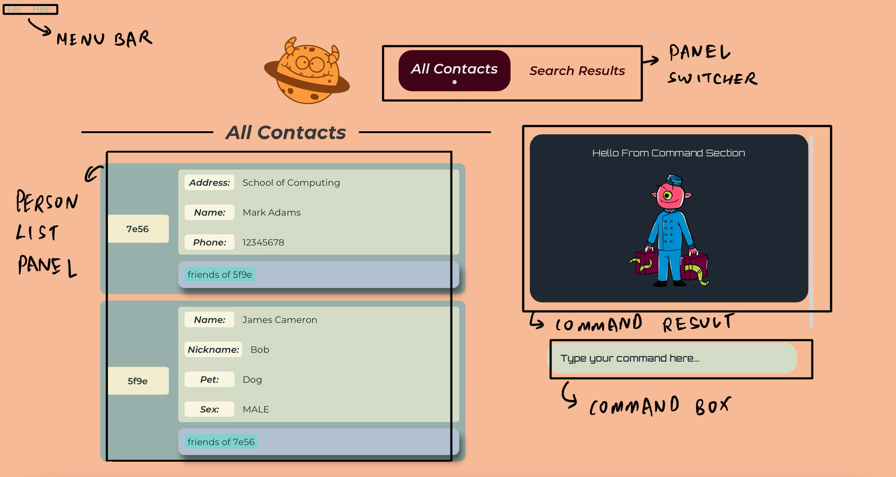
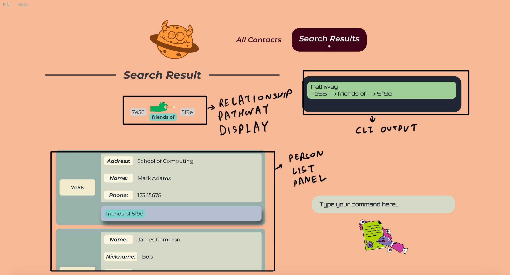

<h1 align="center"><i>GENE-NIE USER GUIDE</i></h1>

Hello my fellow budding genealogists! Welcome to Gene-nie, your personal genealogy assistant!
We welcome you to this user guide, where we demystify the magic of Gene-nie and help you get started on your genealogy journey!

## Table of Contents

- [Quick Start](#quick-start)
- [Command Format](#command-format)
- [Persons](#persons)
- [Features](#features)
  - [Attributes](#attributes)
  - [Relationships](#relationships)
- [Features - Managing Person Profiles](#features---managing-persons)
    - [Listing all Persons](#listing-all-persons--list-or-l)
    - [Adding a person](#adding-a-person--add-or-a)
    - [Locating persons by details](#locating-persons-by-details--find-or-f)
    - [Deleting a Person](#deleting-a-person--delete-or-d)
- [Features - Managing Attributes of Persons](#features---managing-attributes-of-persons)
    - [Adding an Attribute](#adding-attributes-to-a-person--addattribute-or-aa)
    - [Deleting an Attribute](#deleting-an-attribute-from-a-person--deleteattribute-or-da)
    - [Editing an Attribute](#editing-an-attribute-of-a-person--editattribute-or-ea)
- [Managing Person Relationships](#features---managing-person-relationships)
    - [Listing all relationship types](#listing-all-relationship-types--listrelations-or-lr)
    - [Adding a Relationship](#adding-a-relationship--addrelation-or-ar)
    - [Editing a Relationship](#editing-a-relationship--editrelation-or-er)
    - [Deleting a Relationship](#deleting-a-relationship--deleterelation-or-dr)
    - [Finding All Relationship between Entities](#finding-all-relationships-between-entities--anysearch-or-as)
- [General Features](#features---general-features)
    - [Viewing Help](#viewing-help--help-or-h)
    - [Clearing all Entries](#clearing-all-entries--deleteallpersons-or-dap)
    - [Clearing Command Responses](#clearing-command-section-of-past-responses--clear-or-c)
    - [Exiting the Program](#exiting-the-program--exit-or-e)
- [FAQ](#faq)
- [Known Issues](#known-issues)
- [Coming Soon](#coming-soon)
- [Command Summary](#command-summary)

--------------------------------------------------------------------------------------------------------------------

## Introduction

Do you face issues trying to keep track of all your friends and family? Do you find it hard to remember who is related to who? Do you face issues trying to add people into your family tree with missing information? Fret not! **Gene-nie** is here to magic away your issues!

Through the magic of **Gene-nie** you are able to
* manage all your contacts through Gene-nie 
* keep track of the relationships between not only you but your also your contacts 
* input and remember small details of each contact
* manage your relationship tree and history of friends and family
* and much more!

**Gene-nie** is a desktop app for managing your contacts, built for use via a Command Line Interface (CLI). If you can type fast as fast you can think, **Gene-nie** can help you manage your contacts faster than traditional Graphical User Interface (GUI) apps can!

--------------------------------------------------------------------------------------------------------------------

## Using this guide

Whether you are an expert genealogist or a budding enthusiast, this guide will help you get started with **Gene-nie**.

We will walk you through every step, from the basics of adding a person and their relationships to advanced features that will empower you in your journey of genealogy.

Novice Users:
* If you are new to genealogy, we recommend you start with the [Quick Start](#quick-start) section.
* This section will guide you through the installation process and provide you with a quick overview of the app's features.

Amateur Users:
* If you are familiar with genealogy, you can skip the [Quick Start](#quick-start) section and proceed to the [Features](#features) section.
* This section will provide you with a detailed explanation of the app's features and how to use them.

Advanced Users:
* If you are an expert genealogist, you can skip the [Features](#features) section and proceed to the [Command Summary](#command-summary) section.
* This section will provide you with a quick summary of all the commands available in **Gene-nie**.

If you encounter any issues or have any questions, please refer to the [FAQ](#faq) section. You may also refer to the [Known Issues](#known-issues) section for any known bugs or limitations of the app. You are also welcome to contact us at Gene-nie@gmail.com for any further assistance.

Additionally, there will be symbols to help you navigate through this guide:

:bulb: **Tip:** This symbol will provide you with tips and tricks to help you use **Gene-nie** more effectively.

:exclamation: **Caution:** This symbol will provide you with warnings and cautionary notes to help you avoid common pitfalls.

:information_source: **Information:** This symbol will provide you with additional information to help you understand the app better.

[Back to Table of Contents](#table-of-contents)

--------------------------------------------------------------------------------------------------------------------

## User Interface

**Gene-nie** has a simple and intuitive user interface that is designed to help you manage your contacts with ease. Let's first take a closer look into at the main screen of **Gene-nie**.

1. **Command Box**:
   * The command box is where you can enter your commands to interact with **Gene-nie**.
   * Type your command and press Enter to execute it.
   * You can locate the list of commands to use in the [Command Summary](#command-summary) section.
2. **Command Result**:
   * The command result panel displays the result of your command.
   * If your command is successful, the result will be displayed in a green card.
   * If your command fails, the result will be displayed in a red card.
3. **Person List Panel**:
   * The person list panel displays all the contacts you have added to **Gene-nie**.
   * Each contact is displayed as a card with their details.
   * You can scroll through the contacts using the scroll bar on the right.
4. **Menu Bar**:
   * The menu bar contains the main menu options for **Gene-nie**.
   * You can access the help menu and exit the app from the menu bar.
5. **Panel Switcher**:
   * The panel switcher allows you to switch between different panels in **Gene-nie**.
   * You can switch between the "All Contacts", "Search Results".

:bulb: **Tip:** You can resize the app window to your liking. We recommend the app to be fullscreen for the best experience!

Now that you are familiar with the main screen of **Gene-nie**, let us introduce to you the Search Result Panel of **Gene-nie**!

The Search Result Panel is where you can view the results of your `anySearch` and `familySearch` queries. It displays the contacts that match your search criteria including their relationship pathway. You can view the details of each contact and perform actions on them. Let's take a closer look at the Search Result Panel.

1. **Person List Panel**:
   * The person list panel displays all the contacts that match your search criteria.
   * Each contact is displayed as a card with their details.
   * You can scroll through the contacts using the scroll bar on the right.
2. **Relationship Pathway Display**:
   * The relationship pathway displays the relationship between the contacts in the search result.
   * You can view the relationship pathway between the contacts to understand how they are related.
3. **CLI Output**:
   * The CLI output displays the results of your search query in the CLI.
   * You can view the details of the contacts that match your search criteria.

:bulb: **Tip:** You can switch between the "All Contacts" and "Search Results" panels using the panel switcher.

Having a mastery of the panels in **Gene-nie**, now we will introduce to you the individual components of the person card in **Gene-nie**!

The person card is where you can view the details of each contact you have added to **Gene-nie**. It displays the unique identifier, attributes, and relationships of the contact. Let's take a closer look at the person card.

1. **Unique Identifier (UUID)**:
   * The unique identifier (UUID) is a 4-character code that is used to identify the contact.
   * You can view the UUID of the contact on the left of the person card.
2. **Attributes Display**:
   * The attributes are the details of the contact that you have added to **Gene-nie**.
   * You can view the attributes of the contact in the right of the person card.
3. **Relationships Display**:
   * The relationships are the connections between the contact and other contacts in **Gene-nie**.
   * You can view the relationships of the contact on the bottom of the person card.

[Back to Table of Contents](#table-of-contents)

--------------------------------------------------------------------------------------------------------------------
## Quick start

1. Ensure you have Java `11` or above installed in your Computer. If not, see [FAQ](#faq) for instructions on how to install Java.

2. Download the latest `Gene-nie.jar` from [here](https://github.com/AY2324S2-CS2103T-T11-1/tp/releases).

3. Copy `Gene-nie.jar` to a convenient folder on your computer, using your file explorer. This will be referred to as Gene-nie's _home folder_.

4. Open a command terminal in the _home folder_ (see OS-specific instructions below), and type `java -jar Gene-nie.jar` to run Gene-nie. An example is shown below.

:bulb: **Tip:**
To ensure a smooth experience, it is recommended to keep the `Gene-nie.jar` file in a dedicated folder, with no other files in it.

:question: **for Linux users:**
In your terminal, type `cd (path)`, replacing `(path)` with the _home folder_ path.

:question: **for Windows users:**
Navigate to the _home folder_ in File Explorer, then type `cmd` in the address bar and press Enter.

:question: **for MacOS users:**
Navigate to the _home folder_ in Finder, then right-click and select "New Terminal at Folder".

   A window similar to the below should appear in a few seconds. Note how the app contains some sample data. 
   

1. Type the command in the command box and press Enter to execute it. e.g. typing **`help`** and pressing Enter will open the help window.

2. Refer to the [Features](#features) below for details of each command.

3. Refer to the [Command Summary](#command-summary) for a quick summary of all commands.

:warning::warning::warning: **Warning:**
Be careful when using the deleteAllPersons command with your own data as it will delete all your contacts and is irreversible. Use with caution!

:bulb: **Tip:**
The app will resize and expand initially to fit the size of your screen. You can resize the app window to your liking. However, we recommend the app to be fullscreen for the best experience!

[Back to Table of Contents](#table-of-contents)

--------------------------------------------------------------------------------------------------------------------

## Command Format

**:information_source: Notes about the command format:** 

* Command keywords are case-insensitive. 
  e.g. `addAttribute` can be `addattribute`, `ADDATTRIBUTE`, etc.

* Words in `UPPER_CASE` are the parameters to be supplied by the user. 
  e.g. in `add /Name NAME`, `NAME` is a parameter which can be used as `add /Name John Doe`.

* Items in square brackets are optional. 
  e.g. `/NAME name [/Phone PHONE]` can be used as `/NAME John Doe /Phone 98765432` or as `/NAME name`.

* Items with `…`​ after them can be used multiple times including zero times. 
  e.g. `[/ATTRIBUTENAME ATTRIBUTEVALUE]…​` can be used as ` ` (i.e. 0 times), `/Name John Doe`, `/Name John Doe /Phone 98765432` etc.

* Extraneous parameters for commands that do not take in parameters (such as `help`, `list`, `exit` and `clear`) will be ignored. 
  e.g. if the command specifies `help 123`, it will be interpreted as `help`.

* UUID are 4 characters long

* Attribute names are not case-sensitive.

* All relationship commands are case-sensitive (must be in lower-case). It must match the relationship type name exactly.

* If you are using a PDF version of this document, be careful when copying and pasting commands that span multiple lines as space characters surrounding line-breaks may be omitted when copied over to the application.

[Back to Table of Contents](#table-of-contents)

--------------------------------------------------------------------------------------------------------------------

## Persons

Every contact you store in Gene-nie is considered a _Person_.
A person is made up of three pieces of information:
1. A unique identifier (UUID)
   1. Each person has a unique UUID that is used to identify them
   2. You may view the UUID of a person on the left of their details on each person card, shown in the "All Contacts" and "Search Results" panels
   3. UUID are 4-characters long
2. A set of attributes
3. A set of relationships
To learn more about attributes and relationships, find their descriptions in [Relationships](#relationships).

Have a look at this sample person card. Can you spot where each detail is located?

[Back to Table of Contents](#table-of-contents)

--------------------------------------------------------------------------------------------------------------------

## Features

Gene-nie has 3 main features:
1. Managing Persons
2. Managing Attributes of Persons
3. Managing Person Relationships

### Attributes

Attributes are one of 3 types of information in a person's profile, with the other 2 being the UUID and relationships.
Attributes are what you use to store any information about a person that is about that particular person.
To store information about the relationship between 2 persons, see the relationship feature instead.

Each attribute has a name and a value. They can be added, edited or deleted.
You can create any attribute with your own name and value, as long as they satisfy the constraints of the command format.
Generally, the **value of attributes are not policed**, as we are inclusive to people who have family members with exotic details, like symbols in names (subject to limitations due to command format, see below)!
However, **duplicate attribute values are  checked** and will not be added to the same person.

1. **Attribute names** are case-insensitive and will be converted to a consistent case. However, we do not restrict the length of your names. So with great power comes great responsibility! Having too long a name will cause the UI to be ugly so do choose wisely! We recommend keeping it short and sweet!
2. **Attribute values** are case-sensitive and will be stored as is.
3. You will be able to define your own **Attribute name!** and it will be of **Attribute value** type String, other than the predefined attributes listed below.

For your convenience, Gene-nie has some predefined attributes that you can use, with stricter checks when creating or editing them. These are:

1. `Name` attribute with String value, and can be any string supported by the command format (see attribute commands below)
    1. It is a predefined attribute for the purposes of future features.
2. `Phone` attribute with Integer value, limited to 9 numeric digits (no spaces or symbols)
3. `Birthday` attribute with Date value, with the format `yyyy-mm-dd`, for example `2024-01-01`
    1. Our application supports a wide range of date inputs to accommodate various historical and genealogical data. You can enter dates using the following format: YYYY-MM-DD.
    2. Year (YYYY): The year can range from -9999 to today's date! This lets you represent of historical dates and more easily track your family history! This range is dictated by the limits of the DateTime object used in our application. Negative years are used to denote years BCE (Before the Common Era).
    3. While our application supports a wide range of years, the input still requires valid months and days corresponding to the Gregorian calendar. For example, `2023-02-29` is invalid because `2023` is not a leap year.
4. `Sex` attribute with String value, limited to `Male` or `Female` (not case-sensitive)
    1. This attribute is used to check whether the relationship is valid or not. For example, a person cannot be a `bioparents` of a person with the same `Sex` attribute.
    2. The valid inputs for `Male` attributes are `male` and `m`. The inputs are not case-sensitive.
    3. The valid inputs for `Female` attributes are `female` and `f`. The inputs are not case-sensitive.

:bulb: **Tip:**
Gene-nie is our comprehensive family storage device. We acknowledge historical and genealogical uses where ancient dates (e.g., BCE dates) may be necessary. Therefore, negative years (denoting BCE) are considered valid when entered in accordance with the above guidelines.

Attribute names:

* are case-insensitive
* will automatically be converted to a consistent case
    * This case is first letter capitalised, lowercase thereafter. e.g. `/pEt` will be stored as `Pet`
* cannot be empty
* cannot contain `/` or ` ` (space)
    * if the attribute name contains a space, the portion after the space will erroneously be treated as part of the attribute value and throw the relevant error
    * if you forget to add the space to the attribute name, the attribute name will be stored as the whole string without spaces

Attribute values:

* are case-sensitive
* cannot be empty
* cannot contain `/`
* will be of type String, other than the predefined attributes listed above
* cannot be converted to another type. e.g. if the attribute is of type Integer, the edit command must be used with an integer value

### Relationships

Relationships are one of 3 types of information in a person's profile, with the other 2 being the UUID and attributes.
Relationships are what you use to store information about the relationship between 2 persons.

[Back to Table of Contents](#table-of-contents)

--------------------------------------------------------------------------------------------------------------------

## Features - Managing Persons

### Listing all Persons : `list` or `l`

Shows a list of all persons in the address book.

Format: `list`

### Adding a Person : `add` or `a`

Adds a person to the address book.

Format: `add [/ATTRIBUTENAME ATTRIBUTEVALUE]…​`

* Adds a person to the address book with the specified attributes or none at all!
* You can add multiple attributes in one command!
* The order of the attributes does not matter.
* Additionally, duplicate attributes will be parsed and the last entered duplicate attribute will be stored.

:bulb: **Tip:**
**A person can have any number of attributes (including 0)!** 
Sometimes, you may know that a person exists in your family tree but you don't know anything about them.
Gene-nie comes to the rescue by allowing you to create empty persons with no attributes!
This way, you can still add them to relationships, and fill in their details later.

Examples:
* `add /Name John Doe /Phone 98765432 /Email johnd@example.com /Address John street, block 123, #01-01`
* `add /Name Betsy Crowe /Email betsycrowe@example.com /Address Newgate Prison /Phone 1234567 /Occupation criminal`

### Locating persons by details : `find` or `f`

Finds persons whose details contain any of the given phrases.

Format: `find /PHRASE [/MORE_PHRASES] ...`

* Between phrases,
  * Persons with details matching at least one phrase will be returned (i.e. `OR` search)
  * The search will also work if user wants to find a person using a specified UUID
  * Furthermore, the search will return all persons whose "details" "contain" the phrase and does not need to be exclusively only phrases or UUID
    * e.g. `/Hans /Bo` will return `Hans Gruber`, `Bo Yang`
    * e.g. `/12db` will return the person with UUID `12db`
    * e.g. `/12db /Hans` will return the person with UUID `12db` and `Hans Gruber`
  * The order of the phrases do not matter.
    * e.g. `find /Hans /Bo` will return the same results as `find /Bo /Hans`
* Within a phrase,
  * The search will return all persons whose "details" "contain" the phrase
  * "Details" means UUID or any attribute values
  * "Contains" means that the entire phrase is a substring of a detail of a person
    * e.g. `/ans Grub` will return any person with `Hans Gruber` in their details
  * The search is case-insensitive. e.g. `hans` will match `Hans`

Examples:
* `find /John` returns anyone with `john` and `John Doe` in their details
* `find /alex david` returns only someone with `Alex David` as a substring of their detials 
* `find /alex /david` returns `Alex Yeoh`, `David Li` (see image below) 
  

### Deleting a Person : `delete` or `d`

Deletes the specified person from the address book.

Format: `delete /UUID`

* Deletes the person with the specified `UUID`
* The `UUID` refers to the unique identifier of the person shown in the displayed person list
* The `UUID` **must be a valid UUID**
* If the `UUID` does not exist, the command will not have any effect

Examples:
* `delete /12db` deletes the person with the `UUID` "12db"
* `delete /1` does not delete the person with the `UUID` "5964" as the `UUID` is not valid

[Back to Table of Contents](#table-of-contents)

--------------------------------------------------------------------------------------------------------------------

## Features - Managing Attributes of Persons

### Adding Attributes to a Person: `addAttribute` or `aa`

Adds an attribute to a person in the address book.

Format: `addAttribute /UUID /ATTRIBUTE_NAME ATTRIBUTE_VALUE [/ATTRIBUTENAME ATTRIBUTEVALUE]…​`

* Adds the attribute with the specified `ATTRIBUTE_NAME` and `ATTRIBUTE_VALUE` to the person with the specified `UUID`
* You can add multiple attributes in one command!
* Duplicate attribute names are checked and will not be allowed for the command to be parsed
* The `UUID` refers to the unique identifier of the person shown in the displayed person list
* The `UUID` **must be a valid UUID**
* The first space after the attribute name is marks the start of the attribute value
* See the [Attributes](#attributes) section for more information on what are valid attribute names and values, and how they are processed

Examples:
* `addAttribute /12db /Pet Dog /Nickname Klien` adds the attribute Pet with the value Dog and the attribute Nickname with the value Klien to the person with the UUID 12db
* `addAttribute /12db /Pet Cat /Pet Dog` does not add the attribute to the person with UUID 12db as the attribute name is duplicated and instead throws an error
* `addAttribute /12db /pet Dog` adds the attribute pet with the value Dog to the person with the UUID 12db
* `addAttribute /12db /Pet dog` adds the attribute Pet with the value dog to the person with the UUID 12db

### Deleting an attribute from a Person: `deleteAttribute` or `da`

Deletes an attribute from a person in the address book.

Format: `deleteAttribute /UUID /ATTRIBUTE_NAME [/ATTRIBUTENAME]…​`

* Deletes the attribute with the specified `ATTRIBUTE_NAME` from the person with the specified `UUID`
* You are allowed to delete multiple attributes in one command
* However, duplicate attribute names are checked and will not be allowed for the command to be parsed
* The `UUID` refers to the unique identifier of the person shown in the displayed person list
* The `UUID` **must be a valid UUID**
* If the person does not have the specified attribute, the command will not have any effect
* If the person does not exist, the command will not have any effect
* If the attribute does not exist, the command will not have any effect
* See the [Attributes](#attributes) section for more information on what are valid attribute names and values, and how they are processed

Examples:
* `deleteAttribute /12db /Pet /Nickname` deletes the attribute Pet and Nickname from the person with the UUID 12db
* `deleteAttribute /12db /pet` does not delete the attribute Pet from the person with the UUID 12db but will delete the attribute pet
* `deleteAttribute /12db /Pet /Pet` does not delete the attribute Pet from the person with the UUID 12db as the attribute name is duplicated and instead throws an error

### Editing an Attribute of a Person: `editAttribute` or `ea`

Edit attributes of a person in the address book.

Format: `editAttribute /UUID /ATTRIBUTE_NAME NEW_ATTRIBUTE_VALUE [/ATTRIBUTENAME ATTRIBUTEVALUE]…​`

* Edits the attribute with the specified `ATTRIBUTE_NAME` to have the `NEW_ATTRIBUTE_VALUE` for the person with the specified `UUID`
* Multiple attributes are allowed to be edited simultaneously in one command
* Duplicate attribute names are checked and will not be allowed for the command to be parsed
* The `UUID` refers to the unique identifier of the person shown in the displayed person list
* The `UUID` **must be a valid UUID**
* If the person does not have the specified attribute, the command will not have any effect and will throw an error
  * If you have used an incorrect attribute name, and wish to edit the attribute name, you must delete the attribute (using the 'incorrect' name) and add a new one instead
* If the person does not exist, the command will not have any effect and will throw an error
* If the attribute is of a different type, the command will fail and throw an error. E.g. if the attribute is of type Date, and the new value is a String, the command will fail
  * However, if the attribute is of type String, and the new value is intended to be another type, the command will succeed and the attribute value will be converted to a String
* The first space after the attribute name is marks the start of the attribute value
* See the [Attributes](#attributes) section for more information on what are valid attribute names and values, and how they are processed

Examples:
* `editAttribute /12db /Pet Cat` edits the attribute Pet to have the value Cat for the person with the UUID 12db
* `editAttribute /12db /Pet Cat /Nickname Elvis` edits the attribute Pet to have the value Cat and the attribute Nickname to have the value Elvis for the person with the UUID 12db

[Back to Table of Contents](#table-of-contents)

--------------------------------------------------------------------------------------------------------------------

## Features - Managing Person Relationships

### Listing all relationship types : `listRelations` or `lr`

Shows a list of all current relationshipTypes in the address book. This includes:
* Pre-defined relationships (this is why you may see more relationships than used in the contacts list)
* User-defined relationships

Format: `listRelations` or `lr`

### Adding a relationship : `addRelation` or `ar`

Adds a roleless relationship between two people in the address book.

Format: `addRelation /UUID1 /UUID2 /RELATIONSHIP_TYPE`

* The command word and `RELATIONSHIP_TYPE` are not case-sensitive.
* Adds the roleless relationship between the person with the specified `UUID1` and the person with the specified `UUID2`.
* The `UUID1` and `UUID2` refer to the unique identifiers of the persons shown in the displayed person list.
* The `UUID1` and `UUID2` **must be valid UUIDs**.
* The `RELATIONSHIP_TYPE` **must be a String** but can be more than one word.
* If the relationship already exists, the command will not have any effect.
* If either persons do not exist, the command will not have any effect.
* If the `RELATIONSHIP_TYPE` does not exist and is valid, it will be added to the existing list of relationTypes.

Examples:
* `addRelation /12db /34ab /friends` adds the relation friends between the person with the `UUID` "12db" and the person with the `UUID` "34ab".

Adds a role-based relationship between two people in the address book.

Format: `addRelation /UUID1 ROLE1 /UUID2 ROLE2 /RELATIONSHIP_TYPE`

* The command word, `RELATIONSHIP_TYPE`, `ROLE1` and `ROLE2` are not case-sensitive.
* Adds the role-based relationship between the person with the specified `UUID1` and the person with the specified `UUID2` with roles `ROLE1` and `ROLE2` respectively.
* The `UUID1` and `UUID2` refer to the unique identifiers of the persons shown in the displayed person list.
* The `UUID1` and `UUID2` **must be valid UUIDs**.
* The `RELATIONSHIP_TYPE`, `ROLE1` and `ROLE2` **must be Strings**.
* The `RELATIONSHIP_TYPE` can be more than one word.
* The `ROLE1` and `ROLE2` can only be one word.
* If the relationship already exists, the command will not have any effect.
* If either persons do not exist, the command will not have any effect.
* If the `ROLE1` or `ROLE2` does not exist for the `RELATIONSHIP_TYPE`, the command will not have any effect.
* If the `RELATIONSHIP_TYPE` does not exist, it will be added to the existing list of relationTypes.

Examples:
* `addRelation /12db parent /34ab child /bioparents` adds the relation bioparents between the person with the `UUID` "12db" and the person with the `UUID` "34ab" with the roles parent and child respectively.

**:exclamation: Caution:**  
* The `RELATIONSHIP_TYPE` "family" is not allowed. The address book will throw an error asking the user to be more specific about the family relation. 
* The correct way to do this is to enter the exact family relation (bioparents, siblings or spouses) as the `RELATIONSHIP_TYPE`.
* Adding more than 2 bioParents relationships with the role child to a Person is not allowed. One person can only have a maximum of 2 bioParents relationships with the role child.

### Editing a relationship : `editRelation` or `er`

Edits the relationship between two people in the address book to a roleless relationship.

Format: `editRelation /UUID1 /UUID2 /OLD_RELATIONSHIP_TYPE /NEW_RELATIONSHIP_TYPE`

* The command word, `OLD_RELATIONSHIP_TYPE` and `NEW_RELATIONSHIP_TYPE` are not case-sensitive.
* Edits the relationship between the person with the specified `UUID1` and the person with the specified `UUID2` to the new relationship type.
* The `UUID1` and `UUID2` refer to the unique identifiers of the persons shown in the displayed person list.
* The `UUID1` and `UUID2` **must be valid UUIDs**.
* The `OLD_RELATIONSHIP_TYPE` and `NEW_RELATIONSHIP_TYPE` **must be Strings**, but can be more than one word.
* If the relationship to be edited from does not exist, the command will not have any effect.
* If the relationship to be edited to already exists, the command will not have any effect.
* If either persons do not exist, the command will not have any effect.
* If either relationship types do not exist, the command will not have any effect.
* If the `NEW_RELATIONSHIP_TYPE` does not exist, it will be added to the existing list of relationTypes.

Examples:
* `editRelation /12db /34ab /friends /colleagues` edits the relation between the person with the `UUID` "12db" and the person with the `UUID` "34ab" from friends to colleagues.

Edits the relationship between two people in the address book to a role-based relationship.

Format: `editRelation /UUID1 ROLE1 /UUID2 ROLE2 /OLD_RELATIONSHIP_TYPE /NEW_RELATIONSHIP_TYPE`

* The command word, `OLD_RELATIONSHIP_TYPE`, `NEW_RELATIONSHIP_TYPE`, `ROLE1` and `ROLE2` are not case-sensitive.
* Edits the relationship between the person with the specified `UUID1` and the person with the specified `UUID2`.
* The `UUID1` and `UUID2` refer to the unique identifiers of the persons shown in the displayed person list.
* The `UUID1` and `UUID2` **must be valid UUIDs**.
* The `OLD_RELATIONSHIP_TYPE`,`NEW_RELATIONSHIP_TYPE`, `ROLE1` and `ROLE2` **must be Strings**.
* The `OLD_RELATIONSHIP_TYPE` and `NEW_RELATIONSHIP_TYPE` can be more than one word.
* The `ROLE1` and `ROLE2` can only be one word.
* If the relationship to be edited from does not exist, the command will not have any effect.
* If the relationship to be edited to already exists, the command will not have any effect.
* If either persons do not exist, the command will not have any effect.
* If either relationship types do not exist, the command will not have any effect.
* If the `NEW_RELATIONSHIP_TYPE` does not exist, it will be added to the existing list of relationTypes.

Examples:
* `editRelation /12db parent /34ab child /friends /bioparents` edits the relation between the person with the `UUID` "12db" and the person with the `UUID` "34ab" from friends to bioparents with the roles parent and child respectively.

### Deleting a relationship : `deleteRelation` or `dr`

Deletes the relationship between two people in the address book.

Format: `deleteRelation /UUID1 /UUID2 /RELATIONSHIP_TYPE`

* The command word and `RELATIONSHIP_TYPE` are not case-sensitive.
* Deletes the relationship between the person with the specified `UUID1` and the person with the specified `UUID2`.
* The `UUID1` and `UUID2` refer to the unique identifiers of the persons shown in the displayed person list.
* The `UUID1` and `UUID2` **must be valid UUIDs**.
* The `RELATIONSHIP_TYPE` **must be a String**, but can be more than one word.
* If the specified relationship to be deleted does not exist, the command will not have any effect.
* If either persons do not exist, the command will not have any effect.

Examples:
* `deleteRelation /12db /34ab friends` deletes the relation friends between the person with the `UUID` "12db" and the person with the `UUID` "34ab".

Deletes the relationType from the list of existing relationTypes.

Format: `deleteRelation /RELATIONSHIP_TYPE`

* Deletes the specific `RELATIONSHIP_TYPE` from the list of existing relationTypes.
* The `RELATIONSHIP_TYPE` **must be a String**, but can be more than one word.
* If the specified `RELATIONSHIP_TYPE` does not exist, the command will not have any effect.
* If an existing relationship uses the specified `RELATIONSHIP_TYPE`, the command will not have any effect.

Examples:
* `deleteRelation /workmates` deletes the relationType workmates from the list of existing relationTypes.

### Finding All Relationships between Entities: `anySearch` or `as`

Finds the relationship pathway between 2 input entities.

Format: `anySearch /ORIGINUUID /TARGETUUID`

:warning: **Important:**
UUIDs are 4 characters long, containing only alphanumeric characters

* The search is case-sensitive, '10cb' and '10CB' are considered different UUID
* If there exists at least one relationship between `ORIGINUUID` and `TARGETUUID` the relationship pathway will be returned, 
else `No Relationship Pathway Found` will be returned
    - Example: `anySearch /10cb /980c` suppose 980c is the friend of 10cb mother, `anySearch` will then return the descriptor
`10cb -> (bioParents) child of --> 5964 --> friends of --> 980c`
    - Example: `anySearch /10cb /867d` suppose 867d is not related to 10cb at all, then `anySearch` returns `No Relationship Pathway Found`
* The command is order-sensitive `anySearch /10cb /987d` can potentially return a different result from `anySearch /987d /10cb`
  * Example: `anySearch 10cb 980c` suppose the search above returns `10cb -> (bioParents) child of --> 5964 --> friends of --> 980c` then `anySearch /867d /10cb`
    returns `980c -> friends of --> 5964 --> (bioParents) mother of --> 10cb` since relationships are bidirectional

### Finding Family Relationships between Entities: `familySearch` or `fs`

Finds the family relationship pathway between 2 input entities.

Format: `familySearch /ORIGINUUID /TARGETUUID`

:warning: **Important:**
UUIDs are 4 characters long, containing only alphanumeric characters

* Unlike `anySearch`, `familySearch` only recognises family relationships, which are `bioparents`, `siblings` and `spouses`
* The search is case-sensitive, '10cb' and '10CB' are considered different UUID
* If there exists a family relationship between `ORIGINUUID` and `TARGETUUID` the relationship descriptor will be returned, 
else `No Relationship Pathway Found` will be returned
    - Example: `familySearch /10cb /980c` suppose 980c is the grandfather of 10cb, `familySearch` will then return the descriptor
`10cb -> (bioParents) child of --> 5964 --> (bioParents) child of --> 980c`
    - Example: `familySearch /10cb /867d` suppose 867d has no family relation to 10cb, then `familySearch` returns `No Relationship Pathway Found`
* The command is order-sensitive `familySearch 10cb 987d` can potentially return a different result from `familySearch 987d 10cb`
  * Example: `familySearch 10cb 980c` suppose the search above returns `10cb -> (bioParents) child of --> 5964 --> (bioParents) child of --> 980c` then `familySearch 867d 10cb`
      returns `980c -> (bioParents) father of --> 5964 --> (bioParents) father of --> 10cb` since relationships are bidirectional

[Back to Table of Contents](#table-of-contents)

--------------------------------------------------------------------------------------------------------------------

## Features - General Features

### Viewing help : `help` or `h`

Shows a message explaning how to access the help page.

Format: `help`

### Clearing all entries : `deleteAllPersons` or `dap`

Clears all entries from the address book. This includes all Persons along with their Attributes, Relationships and created RelationTypes.

Format: `deleteAllPersons`

### Clearing command section of past responses : `clear` or `c`

Clears all of Gene-nie's previous responses from the command section.

Gene-nie keeps track of your previous commands and Gene-nie's own responses to them, since the last time you launched Gene-nie.
This way, you can easily refer to what changes you have made!
However, if you want to clear all previous responses, simply use this command!

Format: `clear`

### Exiting the program : `exit` or `e`

Exits the program.

Format: `exit`

### Saving the data

Gene-nie data is saved in the hard disk automatically after any command that changes the data. There is no need to save manually.

### Editing the data file

Gene-nie data is saved automatically as a JSON file `[JAR file location]/data/addressbook.json`. Advanced users are welcome to update data directly by editing that data file.

:exclamation: **Caution:**
If your changes to the data file makes its format invalid, Gene-nie will discard all data and start with an empty data file at the next run. Hence, it is recommended to take a backup of the file before editing it. 
Furthermore, certain edits can cause Gene-nie to behave in unexpected ways (e.g., if a value entered is outside of the acceptable range). Therefore, edit the data file only if you are confident that you can update it correctly.

[Back to Table of Contents](#table-of-contents)

--------------------------------------------------------------------------------------------------------------------

## FAQ

**Q**: How do I install Java 11, the Java version required by Gene-nie? 
**A**: Download Java 11 JRE from [here](https://adoptium.net/temurin/releases/?package=jre&version=11).
Then, use the "Installers" section of the [installation guide](https://adoptium.net/installation/) to install it.

**Q**: How do I transfer my data to another Computer? 
**A**: Install the app in the other computer and overwrite the empty data file it creates with the file that contains the data of your previous AddressBook home folder.

**Q**: Do I need an active internet connection to use Gene-nie? 
**A**: You can use Gene-nie offline, but you'll need an internet connection to download it to your device.

[Back to Table of Contents](#table-of-contents)

--------------------------------------------------------------------------------------------------------------------

## Known issues

1. **When using multiple screens**, if you move the application to a secondary screen, and later switch to using only the primary screen, the GUI will open off-screen. The remedy is to delete the `preferences.json` file created by the application before running the application again.

[Back to Table of Contents](#table-of-contents)

--------------------------------------------------------------------------------------------------------------------

## Coming soon

1. **Display results of find command in "Search Results" panel.**
Currently, the results of the find command are displayed in the "All Contacts" panel.
This may not be intuitive due to the existence of the "Search Results" panel.

2. **Extend UUID to have more characters.** Currently, the user-facing UUID system is limited to 4 characters.
This is expected to be sufficient for most use cases.
However, in the future, the UUID system may be extended to have more characters.

3. **Utilise the predefined Name attribute.** Currently, the Name attribute behaves like any other user-defined attribute.
In the future, the Name attribute may be used to provide additional functionality, such as displaying the name of the person in the GUI.

4. **Maximise UI elements automatically.** Currently, UI elements resize when the user types in the command box. This may distract some users.

[Back to Table of Contents](#table-of-contents)

--------------------------------------------------------------------------------------------------------------------

## Glossary

| Term      | Description                                                                                                                                                                                                                                                                                            |
|-----------|--------------------------------------------------------------------------------------------------------------------------------------------------------------------------------------------------------------------------------------------------------------------------------------------------------|
| UUID      | **Universally Unique Identifier:** A code used to represent a person. Every person in your contacts list has a unique UUID.                                                                                                                                                                            |
| CLI       | **Command Line Interface (CLI):** A text-based interface that allows users to interact with a computer or software by entering text commands. It's often preferred by power users and developers for its efficiency and scriptability.                                                                 |
| Field     | **Field:** In the context of data, a field refers to a specific piece of information within a record or data structure. Fields are used to organise and store data in a structured manner, and they are often associated with a particular type or attribute.                                          |
| GUI       | **Graphical User Interface (GUI):** A user interface that utilises graphical elements such as icons, buttons, windows, and menus to allow users to interact with software or applications. GUIs are known for their visual appeal and user-friendliness.                                               |
| Integer   | **Integer:** In computer programming, an integer is a whole number without a fractional or decimal component. Integers are used to represent whole quantities in mathematics and computer science. They can be positive, negative, or zero.                                                            |
| JAR       | **JAR (Java ARchive):** A file format used for aggregating multiple files (typically Java class files, metadata, and resources) into a single compressed archive. JAR files are commonly used to package and distribute Java applications or libraries.                                                |
| JSON      | **JSON (JavaScript Object Notation):** A lightweight data interchange format that is easy for humans to read and write, and easy for machines to parse and generate. JSON is commonly used for data storage and exchange in web applications. It consists of key-value pairs enclosed in curly braces. |
| Parameter | **Parameter:** In the context of software, a parameter is a variable or value that is passed into a function, method, or command. Parameters are used to customise the behavior of the function or command.                                                                                            |

[Back to Table of Contents](#table-of-contents)

--------------------------------------------------------------------------------------------------------------------

## Command summary

| Action                          | Shorthand | Format, Examples                                                                                                                                    |
|---------------------------------|-----------|-----------------------------------------------------------------------------------------------------------------------------------------------------|
| **Add Person**                  | a         | `add /ATTRIBUTE_NAME ATTRIBUTE_VALUE [/ATTRIBUTE_NAME ATTRIBUTE_VALUE] ...`   e.g., `add /Name Bob /Phone 01010101 /Address 123 Computing Drive` |
| **Delete Person**               | d         | `delete /UUID`  e.g., `delete /3k83`                                                                                                             |
| **Add Person Attribute**        | aa        | `addAttribute /UUID /ATTRIBUTE_NAME ATTRIBUTE_VALUE [/ATTRIBUTE_NAME ATTRIBUTE_VALUE] ...`  e.g., `addAttribute /12db /Pet Dog`                  |
| **Delete Person Attribute**     | da        | `deleteAttribute /UUID /ATTRIBUTE_NAME  [/ATTRIBUTE_NAME] ...`  e.g., `deleteAttribute /12db /Pet /Address`                                      |
| **Edit Person Attribute**       | ea        | `editAttribute /UUID /ATTRIBUTE_NAME NEW_ATTRIBUTE_VALUE [/ATTRIBUTE_NAME NEW_ATTRIBUTE_VALUE] ...`  e.g., `editAttribute /12db /Pet Cat`        |
| **Add Relation**                | ar        | `addRelation /UUID1 /UUID2 /RELATION_TYPE`  e.g., `addRelation /12db /3dab /friends`                                                             |
| **Edit Relation**               | er        | `editRelation /UUID1 /UUID2 /OLD_RELATION_TYPE /NEW_RELATION_TYPE`  e.g., `editRelation /12db /3dab /friends /colleagues`                        |
| **Delete Relation**             | dr        | `deleteRelation /UUID1 /UUID2 /RELATION_TYPE`  e.g., `deleteRelation /12db /3dab /friends`                                                       |
| **List current Relation types** | lr        | `listRelations`                                                                                                                                     |
| **Find Person**                 | f         | `find /PHRASE [/MORE_PHRASES] ...`  e.g., `find /James /Jake`                                                                                    |
| **List all Persons**            | l         | `list`                                                                                                                                              |
| **anySearch**                   | as        | `anySearch /originUUID /targetUUID`  e.g., `anySearch /10cb /987d`                                                                               |
| **familySearch**                | fs        | `familySearch /originUUID /targetUUID`  e.g., `familySearch /10cb /987d`                                                                         |
| **Help**                        | h         | `help`                                                                                                                                              |
| **Exit App**                    | e         | `exit`                                                                                                                                              |
| **Clear Command Responses**     | c         | `clear`                                                                                                                                             |
| **Delete all Persons**          | dap       | `deleteAllPersons`                                                                                                                                  |

[Back to Table of Contents](#table-of-contents)
